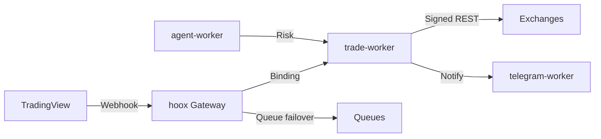

# ⚡ HOOX — Ultra Low Latency Edge Trading on Cloudflare Workers

<div align="center">


[](https://www.typescriptlang.org/)
[](https://bun.sh)
[](https://workers.cloudflare.com/)
[](https://www.npmjs.com/package/@jango-blockchained/hoox-cli)
[](docs/devops/development/testing.md)
[](LICENSE-CODE)
[](https://github.com/jango-blockchained/hoox-setup/actions/workflows/ci.yml)

🌐 **Site:** [hoox.sh](https://hoox.sh) · 🚀 **Install:** [hoox.sh/install](https://hoox.sh/install) · 📚 **Docs:** [docs.hoox.sh](https://docs.hoox.sh) · 📄 **Paper:** [papers/hoox-arxiv-paper-core.pdf](papers/hoox-arxiv-paper-core.pdf)

</div>

> **Edge-native algorithmic trading.** Free, open-source framework on Cloudflare Workers. Ten V8 isolates over Service Bindings — median production signal-to-ack **~22 ms**, 330+ PoPs. No servers. Typical retail load fits the free tier.

Install paths and commands below match **[hoox.sh/install](https://hoox.sh/install)** (CLI first).

---

## 📦 Install

Every path to a live deployment: install the CLI, clone when you need the full mesh, run locally with Docker, ship to Cloudflare’s edge, operate via CLI, TUI, or dashboard.

### ✅ Prerequisites

|     | Tool                                                   | Notes                                                          |
| --- | ------------------------------------------------------ | -------------------------------------------------------------- |
| 🧅  | **[Bun](https://bun.sh) ≥ 1.2**                        | Required — CLI is a Bun bundle; it will **not** run under Node |
| ☁️  | **[Cloudflare account](https://dash.cloudflare.com/)** | Free tier is enough for typical retail volume                  |
| 🔧  | **Git**                                                | Workspace / submodules                                         |
| 🐳  | **Docker + Compose**                                   | Optional — local mesh / self-host                              |

```bash
# Install Bun
curl -fsSL https://bun.sh/install | bash
```

---

### 1️⃣ 🧅 Via Bun — global CLI (recommended) ⭐

Install [`@jango-blockchained/hoox-cli`](https://www.npmjs.com/package/@jango-blockchained/hoox-cli). Global install gives you the `hoox` command; you still need a cloned workspace for deploy and dev.

```bash
bun add -g @jango-blockchained/hoox-cli
hoox --version

git clone --recursive https://github.com/jango-blockchained/hoox-setup.git && cd hoox-setup
hoox onboard
```

- 🔄 Run `hoox update` to self-update the CLI and check wrangler versions
- ⌨️ Alias: `hx`

---

### 2️⃣ 📦 Via npm (still requires Bun)

Published on npm as `@jango-blockchained/hoox-cli`, but **`npm install -g` alone will not produce a working binary**. Shebang and bundle target are Bun-only.

```bash
curl -fsSL https://bun.sh/install | bash
bun add -g @jango-blockchained/hoox-cli

# Alternative (downloads package; still need Bun to execute):
# npm install -g @jango-blockchained/hoox-cli

hoox onboard
```

---

### 3️⃣ 🧬 From source (full monorepo)

Canonical path for contributors and operators who need the full worker mesh. Workers are **Git submodules** — without `--recursive` they are empty directories.

```bash
git clone --recursive https://github.com/jango-blockchained/hoox-setup.git hoox-trading
cd hoox-trading
bun install
hoox onboard
hoox check health
```

If you already cloned without submodules:

```bash
git submodule update --init --recursive
# or: hoox clone --all
```

---

### 4️⃣ 🐳 Docker — local dev

Mirrors production service-binding topology. Only `hoox` (gateway) and `dashboard` expose host ports.

```bash
docker compose --profile workers up      # workers only
docker compose --profile dashboard up    # dashboard + deps
docker compose --profile full up         # full stack

# Via CLI
hoox dev start --runtime docker
```

| 🏷️ Service   | 🔗 URL                |
| ------------ | --------------------- |
| 🚪 Gateway   | http://localhost:8787 |
| 🖥️ Dashboard | http://localhost:8794 |

- Profiles: `workers` · `dashboard` · `full`
- Optional: `.env.local` for exchange keys and Telegram token
- Native alternative: `hoox dev start --runtime native`

---

### 5️⃣ 🏭 Docker — production / self-hosted

For demos, local testing, or air-gapped runs. **Not** a full substitute for Cloudflare edge — Durable Objects, Vectorize, and Workers AI are unavailable self-hosted.

```bash
bun run docker:prod

# Manual
docker build -f Dockerfile.prod . --tag hoox:prod
docker run -p 8080:8080 -e HOOX_SERVER_API_KEY=your-key hoox:prod

# Native multi-worker server (from monorepo)
bun run server.js
```

- 🔑 Self-hosted gateway requires `HOOX_SERVER_API_KEY` for authenticated requests
- ⚡ Production recommendation on edge: `hoox deploy all --auto`

---

### 6️⃣ ☁️ Deploy to Cloudflare (production) ⭐

Onboard provisions D1, KV, secrets, and deploys in dependency order. Dashboard goes to **Workers via OpenNext** (not Pages).

```bash
hoox onboard
hoox deploy all --auto
hoox deploy telegram-webhook
hoox deploy update-internal-urls
hoox deploy kv-config
hoox check health
```

Non-interactive:

```bash
hoox onboard --token cfut_xxx --account xxx --preset full
```

📖 Guides: [Installation](https://docs.hoox.sh/docs/enduser/getting-started/installation) · [Deploy](https://docs.hoox.sh/docs/devops/setup-and-operations)

---

### 7️⃣ 🪄 Init & setup (step-by-step)

Split onboarding when you need granular control: `init` writes `wrangler.jsonc` and collects secrets; `setup` generates keys, applies D1 schema, pushes secrets, deploys dashboard.

```bash
hoox init
hoox setup
hoox check setup
hoox deploy all --auto
```

- 🖥️ `hoox init --self-hosted` configures a VPS deployment without Cloudflare dependency
- ▶️ Resume interrupted wizard: `hoox onboard --resume`
- ⚡ Aliases for one-shot: `hoox bootstrap` · `hoox quickstart`

---

## 🏁 Quick path (edge)

```text
🚀 hoox onboard  →  🛰️ hoox deploy all --auto  →  ✨ live on edge
```

Or, after global CLI install + recursive clone of this repo:

```bash
bun add -g @jango-blockchained/hoox-cli
git clone --recursive https://github.com/jango-blockchained/hoox-setup.git && cd hoox-setup
hoox onboard
hoox deploy all --auto
hoox check health
```

---

## 🎛️ Interfaces — CLI · TUI · Dashboard

Same stack, three surfaces. CLI for automation/CI, TUI for terminal ops, dashboard for visual monitoring and risk.

### 💻 CLI

Primary operator interface. Running `hoox` with no arguments launches the TUI when a workspace exists.

| Command                            | Purpose                              |
| ---------------------------------- | ------------------------------------ |
| 🚀 `hoox onboard`                  | Recommended bootstrap (init + setup) |
| 🛰️ `hoox deploy all --auto`        | Workers + dashboard + wiring         |
| 🛠️ `hoox dev start`                | Local native or Docker               |
| 💚 `hoox check health`             | Post-deploy verification             |
| 📈 `hoox monitor trades`           | Live trade stream                    |
| ⏱️ `hoox perf fastpath run --n 50` | Latency probes                       |
| 🔍 `hoox trace events`             | Workers Observability                |
| 🩹 `hoox repair check`             | Diagnose & fix                       |
| 🔄 `hoox update`                   | Self-update CLI                      |
| 🐚 `hoox completion`               | bash / zsh / fish                    |

Full reference: [docs CLI](https://docs.hoox.sh/docs/enduser/reference/cli-commands) · [packages/cli/README.md](packages/cli/README.md) · [hoox.sh/cli](https://hoox.sh/cli)

### 🖥️ TUI

```bash
hoox tui
# repo root: ./hoox-tui
# packages/tui: bun run dev | bun run build && bun run start
```

### 📊 Dashboard

```bash
hoox dev dashboard          # or: hoox dashboard dev  → localhost:3000
hoox deploy dashboard       # or: hoox dashboard deploy
docker compose --profile dashboard up   # localhost:8794
```

Production URL: `https://<your-subdomain>.workers.dev` (set during onboard). Needs `hoox`, `d1-worker`, and `agent-worker` for full functionality.

---

## 🏗️ Architecture (brief)

| 📐 Metric               | 📊 Value                  |
| ----------------------- | ------------------------- |
| ⚡ Median signal-to-ack | ~22 ms                    |
| 🌍 Edge locations       | 330+                      |
| 🧩 Isolates             | 10                        |
| 🔗 Internal calls       | &lt;1 ms Service Bindings |

| 🧩 Worker            | 🎯 Role                   |
| -------------------- | ------------------------- |
| `hoox`               | 🚪 Gateway & WAF          |
| `trade-worker`       | 💹 Exchange execution     |
| `agent-worker`       | 🤖 AI risk (cron)         |
| `telegram-worker`    | 📣 Alerts & copilot       |
| `d1-worker`          | 🗄️ Data layer             |
| `email-worker`       | 📧 Email signals          |
| `web3-wallet-worker` | 🪙 DeFi                   |
| `analytics-worker`   | 📉 Analytics Engine       |
| `report-worker`      | 📑 PDF reports            |
| `dashboard`          | 🖥️ Next.js command center |

Only gateway and dashboard are public. Everything else is binding-only.



---

## 📚 Docs & research

|                 |                                                                                 |
| --------------- | ------------------------------------------------------------------------------- |
| 🚀 Install UI   | [hoox.sh/install](https://hoox.sh/install)                                      |
| 📖 Product docs | [docs.hoox.sh](https://docs.hoox.sh)                                            |
| ⏱️ Quick start  | [5-minute guide](https://docs.hoox.sh/docs/enduser/getting-started/quick-start) |
| 📄 Paper        | [`papers/hoox-arxiv-paper-core.pdf`](papers/hoox-arxiv-paper-core.pdf)          |
| ✍️ Essays       | [`.paragraph/`](.paragraph/)                                                    |
| 🎨 Brand        | [`brand/`](brand/)                                                              |
| 🤝 Contributing | [`CONTRIBUTING.md`](CONTRIBUTING.md)                                            |

---

## ♾️ Free forever. Open source.

HOOX is free to use, self-host, and modify — **no paid core**, no artificial limits on the open mesh. Deploy the full edge-native stack on Cloudflare’s free tier for typical retail volume. Code is **Apache-2.0**; docs and papers are **CC BY 4.0**. Built for traders and operators who want production-grade infrastructure without a vendor lock-in tax. Optional enterprise features live outside this repository.

---

## 🔒 Security, cost & disclaimer

🛡️ Zero-trust mesh: internal workers have no public HTTP. Secrets inject into V8 isolates. Free-tier capable for typical retail volume.

⚠️ **Disclaimer.** Educational and research use. Trading involves substantial risk of loss. Not financial advice. See [DISCLAIMER.md](DISCLAIMER.md) and [LICENSE](LICENSE).

Open core: **Apache-2.0** (code) · **CC BY 4.0** (docs/papers).

---

<div align="center">

**🔋 Batteries included**  
Fully powered by Cloudflare infrastructure  
**🔥 Bleeding-edge tech**

`bun add -g @jango-blockchained/hoox-cli` · [hoox.sh/install](https://hoox.sh/install)

</div>

---

_Cloudflare® is a trademark of Cloudflare, Inc. TradingView® and Pine Script™ are trademarks of TradingView, Inc. This project is independent and not affiliated with or endorsed by either company._
