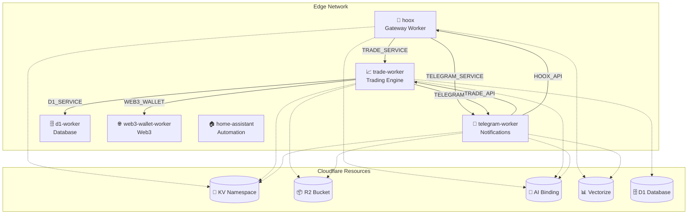

# 🔄 Hoox - Cloudflare Edge Worker Platform

<div align="center">

[](https://www.typescriptlang.org/)
[](https://bun.sh)
[](https://workers.cloudflare.com/)
[](https://github.com/jango-blockchained/hoox-setup/actions)
[](https://opensource.org/licenses/MIT)
[](https://github.com/jango-blockchained/hoox-setup)

</div>

> 🚀 A modular, service-oriented worker platform on Cloudflare Edge, featuring AI integration, vector embeddings, and automated trading capabilities.

## ✨ Features

| Feature                 | Description                                                |
| ----------------------- | ---------------------------------------------------------- |
| 🔗 **Service Bindings** | Inter-worker communication via Cloudflare service bindings |
| 🤖 **AI Integration**   | Workers AI for LLM-powered responses & embeddings          |
| 📊 **Vectorize**        | Semantic search with vector embeddings                     |
| 🗄️ **D1 Database**      | SQLite at the edge for persistent storage                  |
| 📦 **R2 Storage**       | Zero-egress object storage for reports & uploads           |
| 🔐 **KV Storage**       | Fast key-value caching & session management                |
| 📱 **Telegram Bot**     | Automated notifications & commands                         |
| 📈 **Trading Engine**   | Multi-exchange CEX trading automation                      |
| 🏠 **Home Automation**  | Home Assistant integration                                 |
| 🌐 **Dynamic Routing**  | Configurable API routes without code changes               |

## 🏗️ Architecture



## 🏁 Quick Start

```bash
# Clone with submodules
git clone --recurse-submodules https://github.com/jango-blockchained/hoox-setup.git
cd hoox-setup

# Install dependencies
bun install

# Initialize the platform
bun run scripts/manage.ts init

# Deploy workers
bun run scripts/manage.ts workers deploy

# Run tests
bun test
```

## 📁 Project Structure

```
.
├── config.toml              # Central configuration
├── scripts/              # Management CLI
│   └── manage.ts        # Main CLI tool
├── src/                # Shared utilities
│   └── utils/          # Type definitions & helpers
└── workers/            # Individual workers
    ├── hoox/          # 🔐 Gateway worker
    ├── trade-worker/    # 📈 Trading engine
    ├── telegram-worker/ # 💬 Notifications
    ├── d1-worker/     # 🗄️ Database
    ├── web3-wallet/   # 🌐 Web3
    └── home-assistant/# 🏠 Automation
```

## 🔧 Configuration

### `config.toml`

```toml
[global]
cloudflare_api_token = "cfut_..."
cloudflare_account_id = "..."
subdomain_prefix = "cryptolinx"

[workers.hoox]
enabled = true
path = "workers/hoox"
secrets = ["WEBHOOK_API_KEY"]

[workers.trade-worker]
enabled = true
path = "workers/trade-worker"
secrets = ["API_SERVICE_KEY"]

[workers.telegram-worker]
enabled = true
path = "workers/telegram-worker"
secrets = ["TELEGRAM_BOT_TOKEN"]
```

## 🧪 Testing

```bash
# Test all workers
bun test

# Test specific worker
cd workers/hoox && bun test

# Test with coverage
bun test --coverage
```

### Test Coverage

| Worker             | Tests | Coverage |
| ------------------ | ----- | -------- |
| 🔐 hoox            | 27    | 81.19%   |
| 📈 trade-worker    | 93    | 82.44%   |
| 💬 telegram-worker | 24    | 41.34%   |
| 🗄️ d1-worker       | 6     | 82.35%   |
| 🌐 web3-wallet     | 7     | 82.76%   |
| 🏠 home-assistant  | 9     | 37.37%   |

## 🌐 API Endpoints

### hoox (Gateway)

| Endpoint   | Method | Description             |
| ---------- | ------ | ----------------------- |
| `/`        | POST   | Process trading signals |
| `/test-ai` | GET    | Test AI integration     |

### trade-worker

| Endpoint       | Method | Description       |
| -------------- | ------ | ----------------- |
| `/webhook`     | POST   | Execute trades    |
| `/process`     | POST   | Process requests  |
| `/api/signals` | POST   | Log signals to D1 |

### telegram-worker

| Endpoint   | Method | Description        |
| ---------- | ------ | ------------------ |
| `/webhook` | POST   | Telegram webhooks  |
| `/process` | POST   | Send notifications |

## 🔐 Security

- ✅ API key validation via secret bindings
- ✅ IP allow-listing (TradingView)
- ✅ Internal key authentication
- ✅ Telegram secret token verification

## 🤝 Contributing

Contributions are welcome! Please:

1. Fork the repository
2. Create a feature branch
3. Add tests for new functionality
4. Ensure all tests pass
5. Submit a PR

## 📄 License

MIT License - See [LICENSE](LICENSE) for details.

## 🙏 Acknowledgments

- [Cloudflare Workers](https://workers.cloudflare.com/)
- [Bun](https://bun.sh)
- [TradingView](https://tradingview.com/)

---

<div align="center">

Built with 🔥 on Cloudflare Edge

</div>
