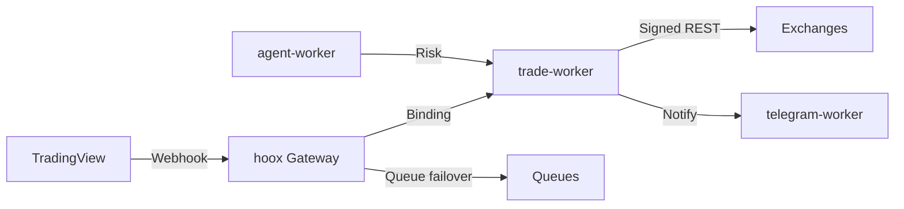

# HOOX

**Ultra-low-latency edge trading framework, built on Cloudflare Workers.**

HOOX is a production-grade, open-source algorithmic trading stack. Signals are validated and executed inside V8 isolates colocated with exchange APIs, delivering a median signal-to-ack latency of **~22 ms** from **330+** global points of presence. No servers, no vendor lock-in.

<div align="center">


[](https://www.typescriptlang.org/)
[](https://bun.sh)
[](https://workers.cloudflare.com/)
[](https://www.npmjs.com/package/@jango-blockchained/hoox-cli)
[](docs/devops/development/testing.md)
[](LICENSE-CODE)
[](https://github.com/jango-blockchained/hoox-setup/actions/workflows/ci.yml)

**Site:** [hoox.sh](https://hoox.sh) · **Install:** [hoox.sh/install](https://hoox.sh/install) · **Docs:** [docs.hoox.sh](https://docs.hoox.sh) · **Paper:** [papers/hoox-arxiv-paper-core.pdf](papers/hoox-arxiv-paper-core.pdf)

</div>

---

## Install

The CLI is distributed as a Bun package. Bun is required — the CLI is a Bun bundle and will not run under Node.

```bash
# 1. Install Bun (if you don't have it)
curl -fsSL https://bun.sh/install | bash

# 2. Install the CLI globally
bun add -g @jango-blockchained/hoox-cli

# 3. Clone the workspace (workers are git submodules — use --recursive)
git clone --recursive https://github.com/jango-blockchained/hoox-setup.git
cd hoox-setup

# 4. Bootstrap: provisions D1, KV, secrets, and deploys in dependency order
hoox onboard
```

`hoox onboard` is the recommended path. It writes `wrangler.jsonc`, collects secrets, generates keys, applies the D1 schema, pushes secrets, and deploys the dashboard. Alias: `hx`.

### Prerequisites

| Tool                   | Notes                                          |
| ---------------------- | ---------------------------------------------- |
| **Bun ≥ 1.2**          | Required. CLI is Bun-only.                     |
| **Cloudflare account** | Free tier is enough for typical retail volume. |
| **Git**                | For the workspace and submodules.              |
| **Docker + Compose**   | Optional — local mesh or self-host.            |

### Other install paths

**From source (full monorepo).** Canonical path for contributors and operators who need the full worker mesh.

```bash
git clone --recursive https://github.com/jango-blockchained/hoox-setup.git hoox-trading
cd hoox-trading
bun install
hoox onboard
hoox check health
```

If you cloned without submodules: `git submodule update --init --recursive` (or `hoox clone --all`).

**Local dev with Docker.** Mirrors the production Service Binding topology. Only `hoox` (gateway) and `dashboard` expose host ports.

```bash
docker compose --profile workers up      # workers only
docker compose --profile dashboard up    # dashboard + deps
docker compose --profile full up         # full stack
# or: hoox dev start --runtime docker
```

| Service   | URL                   |
| --------- | --------------------- |
| Gateway   | http://localhost:8787 |
| Dashboard | http://localhost:8794 |

**Production / self-hosted.** For demos, local testing, or air-gapped runs. Not a full substitute for the Cloudflare edge — Durable Objects, Vectorize, and Workers AI are unavailable self-hosted.

```bash
bun run docker:prod
# or manually:
docker build -f Dockerfile.prod . --tag hoox:prod
docker run -p 8080:8080 -e HOOX_SERVER_API_KEY=your-key hoox:prod
```

The self-hosted gateway requires `HOOX_SERVER_API_KEY` for authenticated requests.

**Deploy to Cloudflare (production).** Onboard provisions infrastructure; deploy ships the workers.

```bash
hoox onboard
hoox deploy all --auto
hoox deploy telegram-webhook
hoox deploy update-internal-urls
hoox deploy kv-config
hoox check health
```

Non-interactive: `hoox onboard --token cfut_xxx --account xxx --preset full`.

Guides: [Installation](https://docs.hoox.sh/docs/enduser/getting-started/installation) · [Deploy](https://docs.hoox.sh/docs/devops/setup-and-operations)

---

## Quick path (edge)

```bash
bun add -g @jango-blockchained/hoox-cli
git clone --recursive https://github.com/jango-blockchained/hoox-setup.git && cd hoox-setup
hoox onboard
hoox deploy all --auto
hoox check health
```

---

## Interfaces — CLI · TUI · Dashboard

The same stack, three surfaces. CLI for automation and CI, TUI for terminal operations, dashboard for visual monitoring and risk.

### CLI

The primary operator interface. Running `hoox` with no arguments launches the TUI when a workspace exists.

| Command                         | Purpose                              |
| ------------------------------- | ------------------------------------ |
| `hoox onboard`                  | Recommended bootstrap (init + setup) |
| `hoox deploy all --auto`        | Workers + dashboard + wiring         |
| `hoox dev start`                | Local native or Docker               |
| `hoox check health`             | Post-deploy verification             |
| `hoox monitor trades`           | Live trade stream                    |
| `hoox perf fastpath run --n 50` | Latency probes                       |
| `hoox trace events`             | Workers observability                |
| `hoox repair check`             | Diagnose and fix                     |
| `hoox update`                   | Self-update the CLI                  |
| `hoox completion`               | bash / zsh / fish                    |

Full reference: [CLI docs](https://docs.hoox.sh/docs/enduser/reference/cli-commands) · [packages/cli/README.md](packages/cli/README.md) · [hoox.sh/cli](https://hoox.sh/cli)

### TUI

```bash
hoox tui
# repo root: ./hoox-tui
# packages/tui: bun run dev | bun run build && bun run start
```

### Dashboard

```bash
hoox dev dashboard          # or: hoox dashboard dev  → localhost:3000
hoox deploy dashboard       # or: hoox dashboard deploy
docker compose --profile dashboard up   # localhost:8794
```

Production URL: `https://<your-subdomain>.workers.dev` (set during onboard). Requires `hoox`, `d1-worker`, and `agent-worker` for full functionality. The dashboard runs on Cloudflare Workers via OpenNext, not Pages.

---

## Architecture

Ten specialized V8 isolates communicate over Cloudflare Service Bindings — direct isolate-to-isolate calls with sub-millisecond overhead, no public internet traversal, no TLS handshakes, no DNS resolution between components.

| Metric               | Value                    |
| -------------------- | ------------------------ |
| Median signal-to-ack | ~22 ms                   |
| Edge locations       | 330+                     |
| Isolates             | 10                       |
| Internal calls       | <1 ms (Service Bindings) |

| Worker               | Role                            |
| -------------------- | ------------------------------- |
| `hoox`               | Gateway & WAF (public)          |
| `trade-worker`       | Exchange execution              |
| `agent-worker`       | AI risk manager (5-min cron)    |
| `telegram-worker`    | Alerts & copilot                |
| `d1-worker`          | Data layer                      |
| `email-worker`       | Email signals                   |
| `web3-wallet-worker` | DeFi / on-chain                 |
| `analytics-worker`   | Analytics Engine                |
| `report-worker`      | PDF reports                     |
| `dashboard`          | Next.js command center (public) |

Only the gateway and dashboard are public. Every other worker is reachable only via Service Bindings.



---

## Docs & research

|              |                                                                                 |
| ------------ | ------------------------------------------------------------------------------- |
| Install UI   | [hoox.sh/install](https://hoox.sh/install)                                      |
| Product docs | [docs.hoox.sh](https://docs.hoox.sh)                                            |
| Quick start  | [5-minute guide](https://docs.hoox.sh/docs/enduser/getting-started/quick-start) |
| Paper        | [`papers/hoox-arxiv-paper-core.pdf`](papers/hoox-arxiv-paper-core.pdf)          |
| Brand        | [`brand/`](brand/)                                                              |
| Contributing | [`CONTRIBUTING.md`](CONTRIBUTING.md)                                            |

---

## Free forever. Open source.

HOOX is free to use, self-host, and modify — no paid core, no artificial limits on the open mesh. Deploy the full edge-native stack on Cloudflare's free tier for typical retail volume. Code is **Apache-2.0**; docs and papers are **CC BY 4.0**. Built for traders and operators who want production-grade infrastructure without a vendor lock-in tax.

---

## Security, cost & disclaimer

Zero-trust mesh: internal workers have no public HTTP. Secrets are injected into V8 isolates at runtime. Free-tier capable for typical retail volume.

**Disclaimer.** Educational and research use. Trading involves substantial risk of loss. Not financial advice. See [DISCLAIMER.md](DISCLAIMER.md) and [LICENSE](LICENSE).

Open core: **Apache-2.0** (code) · **CC BY 4.0** (docs/papers).

---

_Cloudflare® is a trademark of Cloudflare, Inc. TradingView® and Pine Script™ are trademarks of TradingView, Inc. This project is independent and not affiliated with or endorsed by either company._
