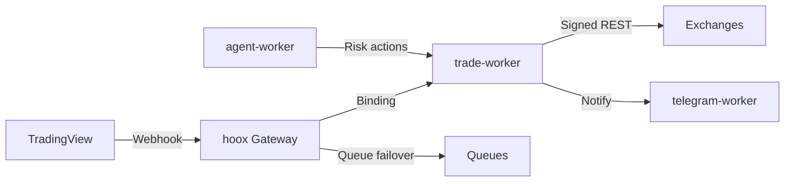

# HOOX — Ultra Low Latency Edge Trading on Cloudflare Workers

<div align="center">

[](https://www.typescriptlang.org/)
[](https://bun.sh)
[](https://workers.cloudflare.com/)
[](docs/devops/development/testing.md)
[](https://creativecommons.org/licenses/by/4.0/)
[](https://github.com/jango-blockchained/hoox-setup)
[](https://github.com/jango-blockchained/hoox-setup/actions/workflows/ci.yml)

**Docs:** [docs.hoox.sh](https://docs.hoox.sh) · [Paper (arXiv)](papers/hoox-arxiv-paper-core.pdf) · [GitHub](https://github.com/jango-blockchained/hoox-setup)

</div>

> **Edge-native algorithmic trading.** HOOX is a free, open-source trading and automation framework built entirely on Cloudflare Workers. Ten specialized V8 isolates communicate via Service Bindings to deliver a median production signal-to-ack latency of **22 ms** across 330+ global points of presence (N = 16,104 terminal acknowledgments, 2025–2026). No servers. $0 on the free tier.

---

## The Edge Advantage

An edge-native architecture that collapses the traditional signal-to-execution path. All inter-component communication occurs through Cloudflare Service Bindings with sub-millisecond overhead—no public internet, no TLS handshakes, no DNS between microservices.

**Key production metrics**

| Metric                  | Value                |
| ----------------------- | -------------------- |
| Median signal-to-ack    | ~22 ms (direct path) |
| Edge locations          | 330+                 |
| Cooperating V8 isolates | 10                   |
| Internal call latency   | <1 ms                |
| Smart Placement gain    | 30–60% RTT reduction |
| Monthly infrastructure  | $0 (free tier)       |

### Execution

- **Edge-Native Trading**: Workers are Smart Placed at the Cloudflare PoP nearest major exchange APIs (Binance, Bybit, MEXC).
- **Microsecond Bindings**: Direct V8-to-V8 calls replace HTTP entirely.
- **Durable Object Deduplication**: SQLite-backed IdempotencyStore with TTL + alarm cleanup. Duplicate webhooks are dropped even across cold starts. Trace IDs provide end-to-end visibility.
- **Guaranteed Delivery**: Cloudflare Queues with 30 s → 15 min exponential backoff as automatic failover.

### Intelligence & Risk

- **Autonomous AI Risk Manager** (`agent-worker`): 5-minute cron. Maintains portfolio state, manages trailing stops, enforces drawdown kill-switches, and routes through a 5-provider LLM gateway with Vectorize RAG over trade history.
- **Multi-Provider AI Gateway**: Workers AI (primary), OpenAI, Anthropic, Google AI, Azure OpenAI with automatic health-checked failover, SSE streaming, vision, and reasoning support.

### Security & Resilience

- **Zero Trust Mesh**: `trade-worker` and `d1-worker` have no public endpoints. They are reachable exclusively via Service Bindings from the gateway.
- **KV-Persisted Rate Limiting**: 10 trades/min survives cold starts with in-memory fallback.
- **WAF + Secret Injection**: IP allow-listing and hardware-bound secrets at the edge. API keys never leave the V8 isolate.

---

## Real-World Latency (The Latency Race)

A reproducible, hop-level decomposition contrasting the edge-native path with a conventional single-region VPS deployment.

**HOOX (nearest Cloudflare PoP)**

1. Webhook → nearest PoP +4 ms
2. Gateway (WAF + validate) +3 ms
3. Service Binding (direct isolate) +1 ms
4. Exchange order submission +14 ms

**Total: ~22 ms**

**Traditional single-region VPS**

1. Public internet transit +82 ms
2. TLS + ingress proxy +38 ms
3. App / container hop +27 ms
4. Regional return to exchange +93 ms

**Total: ~240 ms** (≈11× slower to order submission)

_Illustrative benchmark: nearest Cloudflare PoP to Binance EU API vs. a fixed Frankfurt VPS. Full methodology and tooling (`hoox perf fastpath`) are in the repository and paper. Fast-path synthetic probes measure internal mesh; production metrics capture the complete signed path to exchange acknowledgment._

---

## Core Principles

Five architectural principles that directly address well-documented failure modes of traditional VPS trading stacks:

1. **Ultra Low Latency** — Milliseconds decide outcomes. Smart Placement + colocated V8 isolates deliver sub-50 ms global median latency.
2. **Service Bindings** — Direct function calls inside the isolate. <1 ms, zero public surface between services.
3. **Autonomous AI** — Risk management that runs itself on a deterministic 5-minute cron with multi-LLM fallback.
4. **Zero Trust** — Internal workers have literally zero public HTTP endpoints. Secrets live only in the V8 runtime.
5. **Fault Tolerance** — Failure is local. Queues, idempotency, and circuit breakers keep trading alive when individual components are unavailable.

---

## Architecture & Services

HOOX decomposes a complete trading stack into ten cooperating Workers forming a zero-trust microservice mesh. The gateway is the only public ingress for TradingView webhooks. All downstream work uses Service Bindings.

| Worker               | Role                       | Key Responsibilities                                        | Trigger         |
| -------------------- | -------------------------- | ----------------------------------------------------------- | --------------- |
| `hoox`               | Gateway & Firewall         | Validation, WAF, rate limit, idempotency, routing           | Webhook         |
| `trade-worker`       | Execution Engine           | Multi-exchange (Binance/Bybit/MEXC) order placement, sizing | Binding / Queue |
| `agent-worker`       | AI Risk Manager            | 5-min cron: trailing stops, kill-switch, LLM summaries      | Cron            |
| `telegram-worker`    | Notifications & AI Copilot | Alerts, RAG-powered `/search`, `/ask`, `/latest`            | Binding         |
| `d1-worker`          | Data Layer                 | All D1 SQLite access, history, aggregates                   | Binding         |
| `email-worker`       | Email Ingress              | Mailgun / direct JSON signal parsing                        | Webhook         |
| `web3-wallet-worker` | DeFi Execution             | ethers.js swaps and contract calls                          | Binding         |
| `analytics-worker`   | Observability              | Analytics Engine time-series events                         | Binding         |
| `report-worker`      | Compliance Reports         | Twice-daily PDF via Browser Rendering                       | Cron            |
| `dashboard`          | Command Center             | Next.js 16 real-time UI (OpenNext)                          | Public          |

Only `hoox` and `dashboard` expose public endpoints. State is durably maintained in globally replicated D1, KV, R2, and Vectorize. Idempotency is enforced at the Durable Object layer.

A formal seven-stage signal lifecycle is described in the paper.



Full topology, figures, and listings: see `papers/figures/` and the arXiv paper.

---

## HOOX vs Traditional Deployments

| Dimension           | HOOX (Edge)                         | Traditional VPS        |
| ------------------- | ----------------------------------- | ---------------------- |
| Median latency      | ~22 ms (Smart Placement)            | 180–300+ ms            |
| Cold start          | <5 ms (V8 isolate)                  | 30–60 s                |
| Internal calls      | <1 ms Service Bindings              | HTTP + TLS + DNS       |
| Public endpoints    | Gateway only (zero-trust mesh)      | Multiple open services |
| Infrastructure cost | $0 (free tier sufficient)           | $10–100+/mo + ops      |
| Scaling             | 330+ PoPs automatically             | Manual region choice   |
| AI fallback         | 5 providers, automatic              | Single provider        |
| Idempotency         | SQLite DO + TTL (cold-start safe)   | Custom / none          |
| Retry               | Built-in Queues (30s–15min backoff) | Manual or fragile      |
| Observability       | Analytics Engine (free, per-event)  | Custom logging         |

---

## Data Primitives

The data layer is built from six Cloudflare edge primitives chosen for complementary latency, durability, and cost characteristics.

- **D1 (Global SQLite)** — Primary store for trades, positions, and audit data. R2 offloads verbose logs to protect write quotas.
- **KV** — Sub-millisecond runtime config, kill-switch, rate-limiter state, and live routing tables. Global propagation without redeploy.
- **R2** — Zero-egress object storage for PDF reports, system logs, and archives.
- **Vectorize** — 384-dimensional embeddings for semantic retrieval powering the Telegram AI copilot.
- **Analytics Engine** — Unlimited time-series writes for latency, errors, and trade metrics.
- **Queues** — At-least-once delivery with exponential backoff.

All are available within the Workers free tier. Typical retail volumes (<100 k requests/day) run at zero marginal cost.

---

## AI Gateway

A hardened multi-provider LLM gateway with automatic failover:

1. Workers AI (Llama 3.1 / Mistral) — primary
2. OpenAI (GPT-4o family)
3. Anthropic (Claude 3.5 Sonnet)
4. Google AI (Gemini 1.5)
5. Azure OpenAI

**Capabilities**: SSE streaming, vision (URL/base64), extended reasoning, Vectorize RAG (384-d), usage tracking, pre-built prompt templates.

**Agent endpoints** (via gateway or direct when bound):

- `POST /agent/chat`
- `POST /agent/vision`
- `POST /agent/reasoning`
- `GET /agent/usage`
- `GET /agent/prompts`

---

## Tooling & Developer Experience

- **CLI** — 16 command groups, 50+ subcommands (`hoox onboard`, `hoox deploy`, `hoox infra`, `hoox db`, `hoox monitor`, `hoox repair`, `hoox perf`, `hoox trace`...).
- **TUI** — Interactive terminal (`hoox` with no arguments) with hot-reload for all workers.
- **Testing** — 124+ test files, ~4,500 assertions (Bun native). Includes 10 live tests against real Cloudflare resources.
- **Local dev** — `hoox dev start` (native wrangler or Docker Compose).

---

## Quick Start

```bash
# 1. Clone with submodules (required)
git clone --recursive https://github.com/jango-blockchained/hoox-setup.git hoox-trading
cd hoox-trading

# 2. Install + bootstrap
bun install
hoox onboard
```

### Deploy

```bash
# Deploy in correct order
hoox deploy all --auto

# Post-deploy wiring
hoox deploy telegram-webhook
hoox deploy update-internal-urls
hoox deploy kv-config
```

See the [5-Minute Quick Start](https://docs.hoox.sh/docs/enduser/getting-started/quick-start) and [Installation Guide](https://docs.hoox.sh/docs/enduser/getting-started/installation) for credential setup, secret injection, and first signal testing.

**Local development** (optional): `hoox dev start` or `./hoox-tui`.

---

## Worker Submodules

This repository uses Git submodules. Clone recursively or run:

```bash
git submodule update --init --recursive
```

| Worker                                                                                | Repository                         |
| ------------------------------------------------------------------------------------- | ---------------------------------- |
| hoox (gateway)                                                                        | jango-blockchained/hoox            |
| trade-worker                                                                          | jango-blockchained/trade-worker    |
| agent-worker                                                                          | jango-blockchained/agent-worker    |
| telegram-worker                                                                       | jango-blockchained/telegram-worker |
| d1-worker                                                                             | jango-blockchained/d1-worker       |
| email-worker, web3-wallet-worker, analytics-worker, report-worker, pyne-worker (exp.) | —                                  |

---

## Research & Reproducibility

HOOX is engineered as a single-author research artifact with full accompanying academic material:

- Core paper: `papers/hoox-arxiv-paper-core.pdf` (abstract, architecture, 12-month evaluation, latency taxonomy, threat model)
- Extended listings, ADRs, and per-worker deep dives in `papers/`
- Reproducible tooling: `hoox perf fastpath`, k6 load tests, live test suite

> “A modular, production-ready algorithmic trading framework for Cloudflare Workers. Open source. Free forever.”

---

## Security, Costs & Disclaimer

**Zero Trust by construction.** Internal workers have no public surface. Secrets are injected at the V8 isolate level. All responses carry strict security headers.

**Free tier capable.** The entire system (10 Workers + storage + AI + Browser Rendering) runs inside Cloudflare's free allowances for typical retail volumes. See the paper and docs for exact quotas and observed usage.

**Disclaimer.** HOOX is provided for educational and research purposes only. Algorithmic trading involves substantial risk of loss. Nothing herein is financial advice. Users are solely responsible for compliance and all trading decisions. See [DISCLAIMER.md](DISCLAIMER.md) and [LICENSE](LICENSE).

Open core under CC BY 4.0 (docs/papers) and Apache-2.0 (code). Enterprise features exist outside this repository.

---

<div align="center">

**Trade at the speed of light.**

</div>

---

_Cloudflare® and the Cloudflare logo are trademarks of Cloudflare, Inc. TradingView® and Pine Script™ are trademarks of TradingView, Inc. This project is independent and not affiliated with or endorsed by either company._
