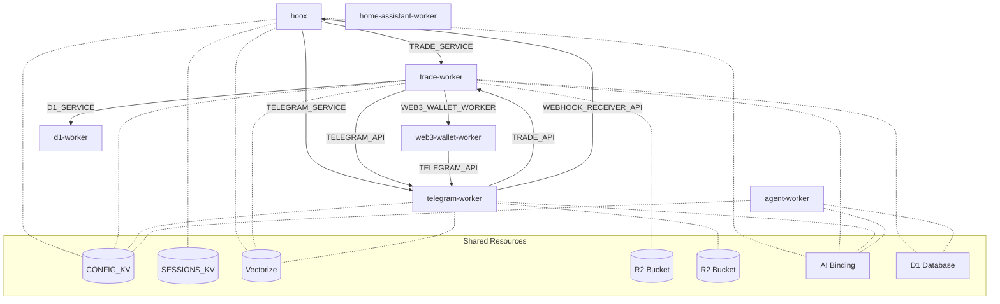

# Hoox Worker Project

[](https://www.typescriptlang.org/)
[](https://bun.sh)
[](https://workers.cloudflare.com/)
[](https://developers.cloudflare.com/)
[](https://creativecommons.org/licenses/by/4.0/)

This project contains a collection of Cloudflare Workers managed by a unified TypeScript-based CLI tool, designed to work together via service bindings and other Cloudflare platform features.

## Prerequisites

- **Bun:** This project uses Bun as the JavaScript runtime and package manager. Follow the installation instructions at [https://bun.sh/](https://bun.sh/).
- **Node.js:** While Bun is the primary runtime, some Node.js APIs might be used (especially by underlying Wrangler commands). Ensure you have a recent LTS version installed.
- **Cloudflare Account:** You need a Cloudflare account ID and an API token with appropriate permissions (e.g., Workers, D1, R2, KV, Vectorize, AI, Secrets).
- **Wrangler:** Ensure the Cloudflare Wrangler CLI is installed and authenticated (`npm install -g wrangler && wrangler login`).
- **Cloudflare Worker Subdomain:** Ensure you have configured your desired Workers subdomain (e.g., `your-subdomain.workers.dev`) in your Cloudflare account settings under Workers & Pages > Overview.
- **Cloudflare Resources:** Depending on the workers you enable, you might need to pre-create D1 databases, R2 buckets, KV namespaces, or Vectorize indexes using Wrangler commands before running the setup/deploy steps.

## Installation

To install the project with all its submodules, clone the repository using:

```bash
# Clone the repository with submodules
git clone --recurse-submodules https://github.com/yourusername/worker.git

# Or if you've already cloned the repository without submodules:
git submodule update --init --recursive
```

This ensures that all necessary submodules are properly initialized and updated.

## Project Structure

```
.
├── .cursor/
├── .keys/                # Stores local API keys (gitignored)
│   └── local_keys.env
├── docs/                 # Project documentation (optional)
├── scripts/              # Management scripts
│   └── manage.ts         # The main CLI tool
├── src/                  # Shared utility code
│   └── tui/
│   └── utils/
├── workers/              # Individual Cloudflare Worker projects
│   ├── d1-worker/        # Example D1 database interaction worker
│   │   ├── src/
│   │   ├── test/
│   │   └── wrangler.jsonc
│   ├── home-assistant-worker/
│   │   └── ...
│   ├── telegram-worker/
│   │   └── ...
│   ├── trade-worker/
│   │   └── ...
│   ├── web3-wallet-worker/
│   │   └── ...
│   ├── hoox/ # Gateway worker using service bindings
│   │   └── ...
│   └── ...               # Other workers
├── .eslintrc.json
├── .gitignore
├── .gitmodules
├── .install-wizard-state.json
├── .prettierrc.json
├── bun.lockb             # Bun lockfile
├── bunfig.toml
├── config.toml           # Central configuration file
├── config.toml.example
├── hoox-tui              # Possibly a related TUI project?
├── LICENSE
├── package-lock.json
├── package.json          # Project dependencies (incl. workspace config)
├── README.md             # This file
├── TASKPLAN.md           # Project task tracking
└── tsconfig.json         # TypeScript configuration
```

## Configuration (`config.toml`)

This file is the central place to configure global settings and individual workers.

```toml
# config.toml Example

[global]
# Required global settings (wizard prompts if missing)
cloudflare_api_token = "YOUR_CLOUDFLARE_API_TOKEN"
cloudflare_account_id = "YOUR_CLOUDFLARE_ACCOUNT_ID"
subdomain_prefix = "your-unique-prefix" # Used for resource naming conventions, etc.

# Optional: Path to a .env file for loading additional env vars for the management script
# dotenv_path = ".env"

[workers.d1-worker] # Example worker entry
enabled = false # Set to false to disable this worker during bulk operations
path = "workers/d1-worker" # Relative path to the worker directory
# Secrets this worker requires (will be prompted for during setup/wizard)
secrets = ["INTERNAL_KEY"] # Example
# Environment variables to set during deployment (URLs for service bindings are NOT needed here)
# vars = { SOME_CONFIG_VALUE = "abc" }
# Deployed URL (populated automatically by 'workers deploy')
# deployed_url = "..."

[workers.trade-worker]
enabled = true
path = "workers/trade-worker"
secrets = [
    "INTERNAL_KEY",
    "MEXC_API_KEY", "MEXC_API_SECRET",
    "BINANCE_API_KEY", "BINANCE_API_SECRET"
]
# vars = { DEFAULT_LEVERAGE = "20" }

[workers.telegram-worker]
enabled = true
path = "workers/telegram-worker"
secrets = [
    "INTERNAL_KEY",
    "TELEGRAM_BOT_TOKEN",
    "TELEGRAM_CHAT_ID_DEFAULT",
    "TELEGRAM_WEBHOOK_SECRET"
]
# vars = {}

[workers.hoox]
enabled = true
path = "workers/hoox"
secrets = ["WEBHOOK_API_KEY", "INTERNAL_KEY"]
# vars = {}

# ... other worker configurations ...
```

### Key Management (`.keys/`)

- The `.keys/` directory stores sensitive API keys locally, primarily intended for **local development**.
- `local_keys.env`: Used for local development secrets (e.g., testnet keys). This file is gitignored. Create it manually or use `manage.ts keys generate`. The format is simple `KEY_NAME=VALUE` pairs.
- The `manage.ts secrets update-cf` command reads values from `local_keys.env` to upload them as Cloudflare secrets, which is useful for populating secrets needed for local development (`wrangler dev`).
- **Production Secrets:** Manage production secrets directly in the Cloudflare dashboard or using `wrangler secret put`. Do not commit production secrets.

## Initial Setup (Wizard)

For the first-time setup, use the interactive wizard:

```bash
bun install
bun run scripts/manage.ts init
```

The wizard will guide you through:

1.  **Dependency Check:** Verifies `bun` and `wrangler` are installed.
2.  **Global Settings:** Prompts for your Cloudflare Account ID, API Token, and a unique subdomain prefix if not found in `config.toml`.
3.  **Worker Selection:** Lists workers found in the `workers/` directory and asks which ones to enable in `config.toml`.
4.  **Resource Check/Creation (Basic):** May prompt to create essential resources like KV namespaces if needed by core functionality (check wizard implementation for details).
5.  **Configuration Save:** Writes the selected worker configurations and global settings to `config.toml`.
6.  **Secret Configuration:** For each enabled worker, checks the `secrets` array defined in `config.toml`.
    - It attempts to find the secret value in `process.env` or `.keys/local_keys.env`. If found, it offers to upload it using `wrangler secret put` (useful for `wrangler dev`). If not found, it prompts you to enter it for upload.
    - **Production Secrets:** Ensure production secrets are set directly in Cloudflare.
7.  **Initial Deployment (Optional):** Asks if you want to deploy the enabled workers immediately.

The wizard uses `.install-wizard-state.json` to save progress, allowing you to resume if interrupted.

## Management CLI (`scripts/manage.ts`)

Use `bun run scripts/manage.ts <command>` for ongoing management.

**Commands:**

- `init`
  - Runs the interactive first-time setup wizard (see above).

- `workers setup`
  - Configures all _enabled_ workers based on `config.toml`.
  - Updates `wrangler.jsonc` files (name, account ID, vars, bindings defined in the worker's README/source).
  - Prompts for missing secrets (checking env/local keys first) and uploads them using `wrangler secret put`.
  - Runs D1 migrations if a worker has a `migrations/` directory and a D1 binding.

- `workers deploy`
  - Deploys all _enabled_ workers using `wrangler deploy`.
  - Captures the deployed URL and saves it back to `config.toml` under the worker's `deployed_url` key.

- `workers dev <workerName>`
  - Starts a local development server for the specified worker using `wrangler dev`.
  - **Note:** Local development involving **Service Bindings** requires special setup. You might need to run multiple workers concurrently or mock the bindings. See [Cloudflare Docs](https://developers.cloudflare.com/workers/platform/bindings/service-bindings/local-development/).

- `workers status`
  - Displays a summary of all workers defined in `config.toml`, showing their enabled/disabled status, path, deployed URL (if known), and counts of vars/secrets.

- `workers test [workerName]`
  - Runs tests using `bun test` within the specified worker's directory (or all enabled workers if `workerName` is omitted). Assumes tests are in a `test/` subdirectory.
  - Supports `--coverage` and `--watch` flags passed to `bun test`.

- `keys generate <keyName>`
  - Generates a new secure random key and saves it to `.keys/local_keys.env`.

- `keys get <keyName>`
  - Retrieves and prints the value of a key from `.keys/local_keys.env`.

- `keys list`
  - Lists all keys stored in `.keys/local_keys.env`.

- `secrets update-cf <keyName> <workerName>`
  - Updates a Cloudflare secret for a specific worker, reading the value from `.keys/local_keys.env`.
  - Useful for setting secrets required by `wrangler dev` for local development.

## Development

To run a worker locally during development:

1.  Ensure the worker is enabled in `config.toml`.
2.  Make sure any necessary secrets are available for local development:
    - Place them in `.keys/local_keys.env` and use `bun run scripts/manage.ts secrets update-cf <keyName> <workerName>` to upload them to Cloudflare.
    - Or, define them directly in a `.dev.vars` file within the worker's directory (this overrides Cloudflare secrets during `wrangler dev`).
3.  Run the local development server:
    ```bash
    bun run scripts/manage.ts workers dev <workerName>
    ```
4.  If the worker uses Service Bindings, consult the Cloudflare documentation for local development strategies.

## Testing

To run tests for all workers, use:

```bash
bun run tests
```

This will run tests for each worker in the `workers` directory.

### Skipping Failing Tests

If you need to run the test suite while ignoring failing tests (for CI/CD or development purposes), you can use:

```bash
SKIP_FAILING_TESTS=true bun run tests
```

This will continue running the test suite even if some tests fail, marking failed workers in the output but still allowing the overall process to complete successfully.

### Adding New Tests

Each worker should have its tests in a `test` directory. For basic functionality tests, consider adding a `basic.test.ts` file with simple validation tests that don't depend on complex mocks.

### Legacy Testing Commands

Run tests using the management script:

```bash
# Test a specific worker
bun run scripts/manage.ts workers test trade-worker

# Test all enabled workers
bun run scripts/manage.ts workers test

# Run tests with coverage for all enabled workers
bun run scripts/manage.ts workers test --coverage
```

## Deployment

1.  Ensure workers are configured correctly (`bun run scripts/manage.ts workers setup`).
2.  Deploy all enabled workers:
    ```bash
    bun run scripts/manage.ts workers deploy
    ```

## Worker Intercommunication

This project uses Cloudflare Workers service bindings for intercommunication between workers. The following diagram and table show how the workers are connected.

### Intercommunication Diagram



### Worker Communication Table

| Worker | Outbound Connections | Inbound Connections | Shared Resources |
|--------|----------------------|---------------------|------------------|
| hoox | TRADE_SERVICE → trade-worker<br>TELEGRAM_SERVICE → telegram-worker | telegram-worker | CONFIG_KV<br>SESSIONS_KV<br>VECTORIZE_INDEX<br>AI |
| trade-worker | D1_SERVICE → d1-worker<br>TELEGRAM_API → telegram-worker<br>WEB3_WALLET_WORKER → web3-wallet-worker | hoox<br>telegram-worker | CONFIG_KV<br>REPORTS_BUCKET<br>VECTORIZE_INDEX<br>AI<br>D1 Database |
| telegram-worker | TRADE_API → trade-worker<br>WEBHOOK_RECEIVER_API → hoox | trade-worker<br>web3-wallet-worker | CONFIG_KV<br>UPLOADS_BUCKET<br>VECTORIZE_INDEX<br>AI |
| web3-wallet-worker | TELEGRAM_API → telegram-worker | trade-worker | Browser |
| d1-worker | | trade-worker | D1 Database |
| home-assistant-worker | | | CONFIG_KV |
| agent-worker | | | CONFIG_KV<br>AI<br>D1 Database |

### Payload Types and Communication Patterns

Workers communicate using standardized payload interfaces defined in `src/utils/worker-definitions.ts`, including:

- **TradePayload**: Used for CEX trading operations
- **DexTradePayload**: Used for DEX operations like swaps and liquidity management
- **Web3TransactionPayload**: Used for blockchain transactions
- **WebhookPayload**: Common structure for incoming webhook data
- **StandardResponse**: Consistent response format across workers

These shared type definitions ensure type safety and consistent data structures when passing information between workers through service bindings.

## Contributing

Contributions are welcome! Please follow standard fork/branch/PR procedures.

# Shared Modules

## worker-definitions.ts

The project uses a shared `worker-definitions.ts` module located in `src/utils/` which contains common type definitions, interfaces, and constants used across multiple workers. This helps ensure consistency and type safety when passing data between workers.

Key components in the shared module include:

- **Payload interfaces** for different worker types (CEX, DEX, Telegram, etc.)
- **Response formats** for standardizing API responses
- **Constants** for valid values used by multiple workers
- **Validation interfaces** to maintain consistent validation patterns

When adding new functionality that spans multiple workers, add the shared types to this module instead of duplicating definitions across individual workers.

## TypeScript Status

This project is in the process of being fully typed with TypeScript. 

For development work:
- Run `npm run typecheck` to check all files including tests
- Run `npm run typecheck:prod` to check only production files (excluding tests)

Current TypeScript status:
- Core worker functionality has been typed
- Some specialized Cloudflare Worker bindings may show type errors
- Test files have more type errors that are being addressed

When working on this codebase:
1. Keep improving types as you work on files
2. Focus on fixing production code types first
3. Ensure all new code has proper TypeScript types

We've prioritized operational functionality over perfect typing, so some TypeScript errors may remain while the system functions properly.

## TypeScript Implementation Progress

This project uses TypeScript to provide better type safety and developer experience. Our TypeScript implementation is being gradually improved, with the following progress:

- ✅ Core utility modules have been converted to TypeScript
- ✅ Fixed common type issues in the trade and webhook workers
- ✅ Improved shared type definitions in worker-definitions.ts
- ✅ Added proper configuration in tsconfig.json and tsconfig.prod.json
- 🔄 Some aspects of test files still need to be typed
- 🔄 Script files have some remaining TypeScript issues to resolve

### TypeScript Tips for Contributors

1. Use `import type { ... }` syntax for importing types to avoid runtime dependencies
2. Use the `.ts` extension in import paths when importing TypeScript files (enabled by `allowImportingTsExtensions`)
3. Run `npm run typecheck:prod` to check production file types before submitting PRs
4. Fix TypeScript errors progressively as you work on files

The `src/utils/worker-definitions.ts` file contains shared types used across workers.

### Building Despite TypeScript Errors

The project can be built despite TypeScript errors using:

```
npm run build-ignore-errors
```

This is useful for deployment when you need to build the project but still have some TypeScript errors that are being addressed progressively.

### Cloudflare Worker Specific Types

This project uses several Cloudflare-specific types:

1. `@cloudflare/workers-types` - Base type definitions for Workers
2. Custom types in `worker-definitions.ts` for things like:
   - VectorizeMatches
   - DexWebhookPayload
   - TradePayload
   - Web3TransactionPayload

### Known TypeScript Issues

There are some known TypeScript issues that we're working to address:

1. Vectorize API type mismatches in the telegram-worker
2. Headers type incompatibilities between different versions of `Headers`
3. Request/Response construction with service bindings
4. Import paths with .ts extensions

These issues will be fixed gradually as the codebase evolves.

## Dynamic Routing System

The `hoox` worker includes a dynamic routing system that allows for configurable API endpoints without code changes. This system enables flexible routing of incoming requests to various backend services.

### Key Components

1. **Route Configuration**: Routes are stored in KV and can be managed via an admin API or UI interface. Each route specifies:
   - Target worker service
   - Path within the worker
   - Authentication requirements
   - Allowed HTTP methods
   - Optional transforms for requests/responses
   - Documentation metadata

2. **Admin Interface**: An admin UI is available at `/admin/ui` for managing routes through a web interface.

3. **API Documentation**: Automatically generated documentation is available at:
   - `/docs/api` - HTML documentation
   - `/docs/api/openapi` - OpenAPI specification

### Example Configuration

```json
{
  "routes": {
    "/api/trade": {
      "worker": "TRADE_SERVICE",
      "path": "/webhook",
      "requiresAuth": true,
      "methods": ["POST"],
      "description": "Process trading signals",
      "tags": ["trade"]
    },
    "/api/notify": {
      "worker": "TELEGRAM_SERVICE",
      "path": "/process",
      "requiresAuth": true,
      "methods": ["POST"],
      "description": "Send notifications"
    },
    "/api/ha/:action": {
      "worker": "HOME_ASSISTANT_SERVICE",
      "path": "/process",
      "requiresAuth": true,
      "methods": ["POST"],
      "description": "Control home automation"
    }
  }
}
```

### Testing Dynamic Routing

The dynamic routing system includes comprehensive tests that can be run using:

```bash
# Run all dynamic routing tests
./workers/hoox/scripts/run-tests.sh

# Run all hoox tests
./workers/hoox/scripts/run-tests.sh --all

# Run a specific hoox test file
./workers/hoox/scripts/run-tests.sh test/dynamic-routing.test.ts
```

These tests cover:
- Route management and configuration
- Dynamic request routing with path parameters
- Authentication and validation
- Admin UI functionality
- API documentation generation
- Integration tests for the entire request flow

### Enabling Dynamic Routing

Dynamic routing is enabled by default. If needed, you can toggle it using the KV flag `routing:dynamic:enabled` (set to `true` or `false`).