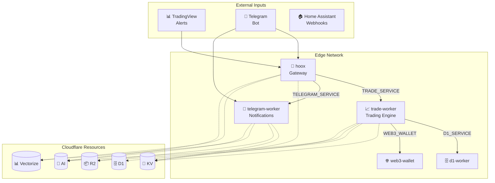

# 🔄 Hoox - Cloudflare Edge Worker Platform

<div align="center">

[](https://www.typescriptlang.org/)
[](https://bun.sh)
[](https://workers.cloudflare.com/)
[](https://github.com/jango-blockchained/hoox-setup/actions)
[](https://github.com/jango-blockchained/hoox-setup/actions)
[](https://opensource.org/licenses/MIT)
[](https://github.com/jango-blockchained/hoox-setup)

**[Live Demo](https://hoox.cryptolinx.workers.dev)** · **[Documentation](docs/README.md)** · **[Report Bug](https://github.com/jango-blockchained/hoox-setup/issues)**

</div>

> 🔄 Hoox is a modular, high-performance algorithmic trading and automation framework built entirely on Cloudflare Workers. It uses distributed microservices to process signals, execute trades, and manage state with near-zero latency worldwide.

## ✨ Features

| Feature                 | Description                                                |
| ----------------------- | ---------------------------------------------------------- |
| 🔗 **Service Bindings** | Inter-worker communication via Cloudflare service bindings |
| 🤖 **AI Integration**   | Workers AI for LLM-powered responses & embeddings          |
| 📊 **Vectorize**        | Semantic search with vector embeddings                     |
| 🗄️ **D1 Database**      | SQLite at the edge for persistent storage                  |
| 📦 **R2 Storage**       | Zero-egress object storage for trade reports               |
| 🔐 **KV Storage**       | Fast key-value caching & session management                |
| 📱 **Telegram Bot**     | Automated notifications & command handling                 |
| 📈 **Trading Engine**   | Multi-exchange automated CEX trading                       |
| 🏠 **Home Automation**  | Home Assistant REST API integration                        |
| 🌐 **Dynamic Routing**  | Configurable API routes without code changes               |

## 🚀 Quick Start

```bash
# Clone with submodules
git clone --recurse-submodules https://github.com/jango-blockchained/hoox-setup.git
cd hoox-setup

# Install dependencies
bun install

# Initialize the platform (interactive wizard)
bun run scripts/manage.ts init

# Deploy all workers
bun run scripts/manage.ts workers deploy

# Run tests
bun test
```

## ⚙️ Configuration Files

This project uses example files for sensitive configuration. Copy them before editing:

```bash
# Copy the main config example
cp config.toml.example config.toml

# For each worker, copy .dev.vars.example to .dev.vars
cp workers/hoox/.dev.vars.example workers/hoox/.dev.vars
# Repeat for other workers as needed
```

### Available Example Files

| File                          | Purpose                     |
| ----------------------------- | --------------------------- |
| `config.toml.example`         | Main configuration template |
| `config.jsonc.example`        | Alternative JSONC config    |
| `workers/*/.dev.vars.example` | Worker local dev secrets    |

> **Important**: Never commit `.dev.vars` or `config.toml` with real secrets!

## 🏗️ Architecture



## 📁 Project Structure

```
hoox-setup/
├─�� config.toml              # Central configuration
├── scripts/              # Management CLI
│   └── manage.ts        # Main CLI tool
├── src/                # Shared utilities
│   └── utils/         # Type definitions & helpers
├── workers/            # Worker submodules
│   ├── hoox/         # Gateway worker (81% coverage)
│   ├── trade-worker/  # Trading engine (82% coverage)
│   ├── telegram-worker/ # Notifications (41% coverage)
│   ├── d1-worker/   # Database operations
│   ├── web3-wallet/ # Web3 interactions
│   └── home-assistant/ # Home automation
└── docs/              # Documentation
```

## 📋 Workers Overview

### 🔐 hoox (Gateway)

- **Purpose**: Central webhook processing & routing
- **Features**: IP allow-listing, API key validation, session tracking
- **Endpoints**: `/` (POST), `/test-ai` (GET)

### 📈 trade-worker (Trading Engine)

- **Purpose**: Multi-exchange automated trading
- **Exchanges**: MEXC, Binance, Bybit
- **Features**: Leverage, position tracking, D1 logging, R2 reports

### 💬 telegram-worker

- **Purpose**: Telegram bot & notifications
- **Features**: RAG embeddings, R2 uploads, AI问答

### 🗄️ d1-worker

- **Purpose**: Database operations
- **Features**: Signals storage, response logging

## 🔧 Configuration

### `config.toml`

```toml
[global]
cloudflare_api_token = "cfut_..."
cloudflare_account_id = "..."
subdomain_prefix = "cryptolinx"

[workers.hoox]
enabled = true
path = "workers/hoox"
secrets = ["WEBHOOK_API_KEY"]

[workers.trade-worker]
enabled = true
path = "workers/trade-worker"
secrets = ["API_SERVICE_KEY"]
vars = { DEFAULT_LEVERAGE = "20" }
```

## 🧪 Testing

```bash
# Test all workers
bun test

# Test specific worker
cd workers/hoox && bun test

# Test with coverage
bun test --coverage
```

### Test Coverage Summary

| Worker          | Tests | Coverage |
| --------------- | ----- | -------- |
| hoox            | 27    | 81.19%   |
| trade-worker    | 93    | 82.44%   |
| telegram-worker | 24    | 41.34%   |
| d1-worker       | 6     | 82.35%   |
| web3-wallet     | 7     | 82.76%   |

## 🌐 API Reference

### hoox Endpoints

| Endpoint   | Method | Description             |
| ---------- | ------ | ----------------------- |
| `/`        | POST   | Process trading signals |
| `/test-ai` | GET    | Test Workers AI         |
| `/health`  | GET    | Health check            |

### trade-worker Endpoints

| Endpoint       | Method | Description         |
| -------------- | ------ | ------------------- |
| `/webhook`     | POST   | Execute trades      |
| `/process`     | POST   | Internal processing |
| `/api/signals` | POST   | Log signals to D1   |

## 🔐 Security

- ✅ API key validation via secret bindings
- ✅ IP allow-listing (configurable via KV)
- ✅ Internal key authentication
- ✅ Telegram secret token verification
- ✅ Service binding authentication

## 📝 Example Payloads

### Trading Signal (hoox → trade-worker)

```json
{
  "apiKey": "your-api-key",
  "exchange": "mexc",
  "action": "LONG",
  "symbol": "BTC_USDT",
  "quantity": 0.1,
  "leverage": 20,
  "price": 50000
}
```

### Notification (hoox → telegram-worker)

```json
{
  "apiKey": "your-api-key",
  "message": "⚠️ BTC Signal: LONG at 50000",
  "chatId": 123456789
}
```

## 🤝 Contributing

1. Fork the repository
2. Create a feature branch (`git checkout -b feature/amazing`)
3. Commit your changes (`git commit -m 'Add amazing feature'`)
4. Push to the branch (`git push origin feature/amazing`)
5. Open a Pull Request

## 📄 License

MIT License - See [LICENSE](LICENSE) for details.

## 🙏 Acknowledgments

- [Cloudflare Workers](https://workers.cloudflare.com/)
- [Bun Runtime](https://bun.sh)
- [TradingView](https://tradingview.com/)

---

<div align="center">

Built with 🔥 on Cloudflare Edge · [jango-blockchained](https://github.com/jango-blockchained)

</div>
