# 🚀 Hoox - The Zero-Latency Edge Trading Ecosystem

<div align="center">

[](https://www.typescriptlang.org/)
[](https://bun.sh)
[](https://workers.cloudflare.com/)
[](docs/devops/development/testing.md)
[](https://creativecommons.org/licenses/by/4.0/)
[](https://github.com/jango-blockchained/hoox-setup)
[](https://github.com/jango-blockchained/hoox-setup/actions/workflows/ci.yml)
[](https://github.com/jango-blockchained/hoox-setup/actions/workflows/codeql.yml)

**Comprehensive Docs:** **[Documentation Home](docs/enduser/home.md)** · **[Report a Bug](https://github.com/jango-blockchained/hoox-setup/issues)**

</div>

> **Low-latency edge trading.** Hoox is a free and open-source algorithmic trading and automation framework. Built on **Cloudflare® Workers**, Hoox utilizes a globally distributed, microservice edge architecture. Process signals, execute trades, and manage state with **low latency**, directly from the network edge closest to the exchange.

---

## 🔁 Required clone mode

This repository uses Git submodules for worker repositories. You must clone it recursively:

```bash
git clone --recursive https://github.com/jango-blockchained/hoox-setup.git hoox-trading
```

## 🌟 Why Hoox?

Hoox provides a modern approach to algorithmic trading infrastructure deployment.

- 💸 **Cost-Effective & Open Source:** Hoox leverages Cloudflare®'s free tiers, allowing you to run your trading infrastructure with minimal or no server costs.
- ⚡ **Edge Execution:** Your code runs on Cloudflare®'s Edge, geographically close to exchange API servers (like Binance, Bybit, and MEXC). When a signal fires, Hoox executes with minimal network latency.
- 🛡️ **Built-in Security:** Hoox inherits Cloudflare®'s security features. With a Zero Trust architecture, strict IP Allow-listing, and encrypted internal Service Bindings, your API keys and trading strategies are well-protected.
- 🧠 **Automated Management:** Featuring an embedded risk manager (`agent-worker`), Hoox can monitor your portfolio, manage trailing stops, trigger kill-switches, and send system health summaries.

---

## ⚠️ Disclaimer

Hoox is provided "as-is" for educational and research purposes only. The authors, contributors, and copyright holders make no warranties regarding the software and disclaim all liability for any financial losses resulting from its use.

**No Financial Advice.** Nothing in this repository constitutes financial, investment, or trading advice. Users are solely responsible for their own trading decisions and must evaluate all risks independently.

**Risk of Loss.** Algorithmic trading on centralized and decentralized exchanges involves substantial risk. Past performance is not indicative of future results. You may lose some or all of your invested capital.

**Regulatory Compliance.** Users are responsible for ensuring compliance with applicable laws and regulations in their jurisdiction. Trading activities may be subject to licensing requirements, reporting obligations, or restrictions depending on your location.

**No Warranties.** The software is provided under CC BY 4.0 without warranties of any kind, express or implied, including but not limited to merchantability, fitness for a particular purpose, or non-infringement. See the [LICENSE](LICENSE) and [DISCLAIMER](DISCLAIMER.md) for full details.

---

## ✨ Enterprise-Grade Features

### Core Platform

| Feature                          | Description                                                                                                                                                                                       |
| -------------------------------- | ------------------------------------------------------------------------------------------------------------------------------------------------------------------------------------------------- |
| 🔗 **Service Bindings**          | Microsecond inter-worker communication—no public internet routing, no TLS overhead, no DNS resolution. Workers call each other via internal V8 isolates.                                          |
| 📨 **Async Queues**              | Cloudflare® Queues with exponential backoff retry policy (30s → 15min). Guaranteed delivery survives exchange downtime, API rate limits, and network partitions.                                  |
| 🛡️ **Idempotent Execution**      | Durable Objects with SQLite-backed state prevent duplicate trades on network retries. Every webhook gets a unique trace ID for end-to-end signal tracking.                                        |
| 🤖 **Multi-Provider AI Gateway** | 5 AI providers (Workers AI, OpenAI, Anthropic, Google AI, Azure OpenAI) with automatic fallback chain, health checks, SSE streaming, vision analysis, reasoning models, and usage tracking.       |
| 🧠 **AI Risk Manager**           | `agent-worker` runs on a 5-minute cron: monitors open positions, moves trailing stops, scales out of profitable trades, flips the Global Kill Switch on max drawdown, and sends health summaries. |
| ⚡ **Smart Placement**           | Zero-config latency optimization — Workers automatically run on the edge node closest to exchange API servers. 30-60% latency reduction, $0 cost (free on all plans).                             |
| 🔄 **Real DO Idempotency**       | Durable Object with SQLite-backed persistence, TTL-based dedup, and automatic alarm cleanup. Prevents duplicate trades on network retries across cold starts.                                     |

### Data & Storage

| Feature                    | Description                                                                                                                                                   |
| -------------------------- | ------------------------------------------------------------------------------------------------------------------------------------------------------------- |
| 🗄️ **D1 Edge Database**    | Globally distributed SQLite at the edge. Persistent, atomic storage for trade history, positions, and balances. Preserved write limits via R2 log offloading. |
| 📦 **R2 Object Storage**   | Zero-egress, S3-compatible storage for trade reports, system logs, and user uploads. No bandwidth charges on retrieval.                                       |
| 🔐 **KV Configuration**    | Sub-millisecond global key-value store for dynamic routing, IP allowlists, session state, kill-switch toggles, and live settings—no redeployment required.    |
| 🔎 **Vectorize RAG Index** | Embedded vector database for retrieval-augmented generation. Powers context-aware AI responses and intelligent Telegram bot conversations.                    |
| 📊 **Analytics Engine**    | Time-series analytics dataset for tracking API call latency, error rates, and trade execution metrics across all workers. Free on all plans.                  |

### Trading Infrastructure

| Feature                      | Description                                                                                                                                                |
| ---------------------------- | ---------------------------------------------------------------------------------------------------------------------------------------------------------- |
| 📈 **Multi-Exchange Engine** | Execute across Binance, Bybit, and MEXC with dynamic routing via `CONFIG_KV`. Redirect symbols to different exchanges instantly without code deployment.   |
| 🌐 **DeFi Execution**        | On-chain swap execution via `web3-wallet-worker` with secure mnemonic management and browser rendering for DApp interactions.                              |
| 📧 **Email Signal Parsing**  | Trigger trades from raw email parsing via `email-worker`. Ancillary input channel alongside TradingView webhooks and Telegram commands.                    |
| ⚡ **Rate Limiting**         | KV-backed rate limiter (10 trades/min) survives cold starts. Falls back to in-memory when KV unavailable. Prevents API bans and accidental trade spamming. |
| 📄 **Automated PDF Reports** | Twice-daily PDF portfolio reports via Cloudflare Browser Rendering. Styled HTML → PDF, stored in R2, delivered via Telegram. Free 10 min/day on all plans. |

### Developer Experience

| Feature                | Description                                                                                                                                                                                                                                                          |
| ---------------------- | -------------------------------------------------------------------------------------------------------------------------------------------------------------------------------------------------------------------------------------------------------------------- |
| 📊 **Command Center**  | Next.js 16 dashboard deployed to Cloudflare Workers via OpenNext. Real-time portfolio monitoring, win rates, live positions, and risk settings—no redeployment to change configuration.                                                                              |
| 🖥️ **Interactive TUI** | Terminal-based process manager (`./hoox-tui`) for local development. Hot-reload all 9 workers simultaneously with one command.                                                                                                                                       |
| 🛠️ **CLI Workspaces**  | Bun workspace monorepo managed via `hoox` CLI (15 command groups, 50+ subcommands, 381 tests). Interactive setup wizard, env config, KV sync, D1 ops, health monitoring, repair, and more.                                                                           |
| 🐳 **Docker Support**  | Full local dev environment with Docker Compose. `hoox dev start` prompts for Native vs Docker runtime, offers `--runtime` flag override. Profiles: `workers`, `dashboard`, `full`.                                                                                   |
| 🔗 **Shared Package**  | `@jango-blockchained/hoox-shared` provides a custom router with `:param` path parameter support, `Errors.*` response factories, generic exchange provider factory (`ExchangeRouter`), middleware stack (auth, CORS, logging, rate-limit, validation), and utilities. |

### Security

| Feature                        | Description                                                                                                                                           |
| ------------------------------ | ----------------------------------------------------------------------------------------------------------------------------------------------------- |
| 🔒 **Zero Trust Architecture** | Internal workers (`trade-worker`, `d1-worker`) have zero public endpoints—accessible only via Cloudflare® Service Bindings.                           |
| 🛡️ **WAF Integration**         | IP allowlisting and rate limiting at the Cloudflare edge. Malicious traffic dropped before hitting the gateway worker.                                |
| 🔑 **Secret Injection**        | API keys injected directly into the V8 isolate at runtime. Never stored in plaintext, never logged. Local `.dev.vars` excluded from version control.  |
| 🏴 **Global Kill Switch**      | Instant trading halt via KV toggle. No redeployment, no downtime—immediate effect across all workers on next request cycle.                           |
| 🔐 **Security Headers**        | Full CSP, HSTS, X-Frame-Options, X-Content-Type-Options, Referrer-Policy, and Permissions-Policy on every response. CORS disabled (same-origin only). |

---

## 🚀 Quick Start (Deploy in 5 Minutes)

### Option A: Install from Source (Recommended)

1. **Clone the repository:**

   ```bash
   git clone --recursive https://github.com/jango-blockchained/hoox-setup.git hoox-trading
   cd hoox-trading
   ```

2. **Install dependencies and bootstrap:**

   ```bash
   bun install
   hoox onboard
   ```

### Deploy

**Deploy your entire trading empire to the Cloudflare® Edge!**

```bash
# Deploy all workers + dashboard (correct dependency order)
hoox deploy all --auto

# Post-deploy: set Telegram webhook
hoox deploy telegram-webhook

# Post-deploy: update dashboard service URLs
hoox deploy update-internal-urls

# Post-deploy: apply KV manifest defaults
hoox deploy kv-config
```

> **Local Development:** Want to test before going live? Run `hoox dev start` to launch all workers — choose between Native (wrangler) or Docker (compose) runtime. Use `./hoox-tui` for the interactive terminal UI!

> **Test safety:** The repository injects a global test preload that prevents unit/integration tests from spawning the real `wrangler` CLI by default. To intentionally allow wrangler spawns for live tests, set the environment variable HOOX_TEST_ALLOW_WRANGLER=1 or run live tests via the `test:live` script which opt-ins explicitly.

---

## 📦 Worker Submodules

Hoox uses Git submodules for each worker, allowing independent development and deployment. All workers are part of the [hoox-setup](https://github.com/jango-blockchained/hoox-setup) monorepo.

| Worker                    | Description                                 | Repository                                                                                        |
| ------------------------- | ------------------------------------------- | ------------------------------------------------------------------------------------------------- |
| 🔐 **hoox** (Gateway)     | Webhook entrypoint & firewall               | [jango-blockchained/hoox](https://github.com/jango-blockchained/hoox)                             |
| 📈 **trade-worker**       | Multi-exchange execution engine             | [jango-blockchained/trade-worker](https://github.com/jango-blockchained/trade-worker)             |
| 🧠 **agent-worker**       | AI risk manager & cron jobs                 | [jango-blockchained/agent-worker](https://github.com/jango-blockchained/agent-worker)             |
| 💬 **telegram-worker**    | Telegram notifications & commands           | [jango-blockchained/telegram-worker](https://github.com/jango-blockchained/telegram-worker)       |
| 🗄️ **d1-worker**          | D1 database operations                      | [jango-blockchained/d1-worker](https://github.com/jango-blockchained/d1-worker)                   |
| 🌐 **web3-wallet-worker** | DeFi & on-chain execution                   | [jango-blockchained/web3-wallet-worker](https://github.com/jango-blockchained/web3-wallet-worker) |
| 📧 **email-worker**       | Email signal parsing                        | [jango-blockchained/email-worker](https://github.com/jango-blockchained/email-worker)             |
| 📊 **analytics-worker**   | Analytics & reporting                       | [jango-blockchained/analytics-worker](https://github.com/jango-blockchained/analytics-worker)     |
| 📄 **report-worker**      | Automated PDF reports via Browser Rendering | [jango-blockchained/report-worker](https://github.com/jango-blockchained/report-worker)           |

> **Note:** Clone with `git clone --recursive` to get all submodules, or run `git submodule update --init --recursive` after cloning.

---

## 🛠️ The `@jango-blockchained/hoox-cli` & Workspaces

The Hoox setup is managed via a dedicated, locally linked CLI tool at `packages/cli` (15 command groups, 50+ subcommands, **~124 test files** with **~4,500 assertions** across the monorepo). By utilizing Bun Workspaces, all management commands are available via the `hoox` binary.

### Complete Command Tree

```
hoox                                 Interactive TUI (no args)
├── init                             Setup wizard with AI provider support
├── clone                            Clone worker repos as submodules
├── dev                              Local development (native/docker)
├── deploy                           Deploy workers, dashboard, webhook, KV
├── infra                            Manage D1, KV, R2, Queues, Vectorize, Analytics
├── config                           Config, env vars, KV keys, secrets
│   ├── env                          Declarative 31-key env matrix
│   └── kv                           16-key manifest + apply-manifest
├── check                            Prerequisites, setup, health
├── db                               D1 schema, migrate, query, export, reset
├── monitor                          Health, trades, logs, kill-switch, backup
├── repair                           System check, repair, guided rebuild
├── logs                             Tail worker logs
├── test                             CI pipeline
├── waf                              WAF rules
└── dashboard                        Dashboard operations
```

### Key Workflows

| Workflow    | Commands                                                                                               |
| ----------- | ------------------------------------------------------------------------------------------------------ |
| **Setup**   | `hoox onboard` → `hoox check prerequisites` → `hoox config env init` → `hoox config kv apply-manifest` |
| **Deploy**  | `hoox deploy all --auto` → `hoox deploy telegram-webhook` → `hoox deploy update-internal-urls`         |
| **Operate** | `hoox check health` → `hoox monitor trades` → `hoox monitor kill-switch`                               |
| **Repair**  | `hoox repair check` → `hoox repair infra` → `hoox repair secrets` → `hoox repair rebuild`              |
| **Infra**   | `hoox infra d1 list` → `hoox infra vectorize list` → `hoox infra queues list`                          |

### Features

- **Interactive Setup**: Guided wizard with AI provider integration (OpenAI, Anthropic, Google AI, Home Assistant)
- **Toolchain Validation**: 7 prerequisites checks (bun, git, node, wrangler, Cloudflare auth, Docker, repository)
- **Declarative Env Config**: 31 environment variables across 8 sections with init/show/validate/generate-dev-vars
- **KV Manifest Sync**: 16-key manifest with one-command apply for CONFIG_KV namespace
- **Database Operations**: Schema apply, tracking migrations, read-only queries, export, reset with --remote support
- **Infrastructure as Code**: Provision D1, KV, R2, Queues, Vectorize, Analytics via `hoox infra`
- **Post-Deploy Automation**: Telegram webhook setup, internal URL updates, KV config sync
- **Operational Monitoring**: Worker health probes, recent trades, system logs, queue depth, D1 backup, kill switch
- **Guided Repair**: 5-step system check, per-component repair, interactive full rebuild
- **Health Checks**: Worker /health endpoint probing for all enabled workers
- **Secret Management**: Sync, check, and rotate Cloudflare secrets
- **All commands** support `--json` (machine output) and `--quiet` (minimal output) global flags

---

## 🧅 Performance & Tooling: Powered by Bun

Hoox relies on **Bun** as its primary JavaScript runtime and package manager. Bun is designed as a drop-in replacement for Node.js, providing significantly faster execution, immediate startup times, and built-in tooling for testing, running scripts, and managing dependencies.

- **Super Fast Execution**: Native implementations and the JavaScriptCore engine make script execution near instantaneous.
- **Lightning Fast Installs**: Dependency resolution and installation are optimized for speed, caching, and concurrent fetching.
- **Built-in Test Runner**: Hoox uses `bun test`, giving you natively integrated testing without heavy additional dependencies like Jest or Mocha.
- **TypeScript Out-of-the-Box**: Bun compiles TypeScript on the fly, eliminating the need for slow build steps during development.

---

## 🧪 Testing & Build

All tests use **Bun**'s native test runner (`bun test`). **~124 test files** with **~4,500 individual test assertions** across 5 categories:

| Type            | Files | Assertions | Description                                                   |
| :-------------- | :---: | :--------: | :------------------------------------------------------------ |
| **Unit**        |  92   |   1,458    | Isolated function/component tests per package and worker      |
| **Integration** |   2   |     34     | Cross-component tests (TUI navigation, gateway middleware)    |
| **Security**    |   3   |     40     | Auth bypass, security headers, fuzz testing                   |
| **E2E**         |   2   |     5      | Full-system tests (TUI smoke, CLI lifecycle)                  |
| **Live**        |  10   |     77     | Cloudflare credential-dependent (D1, KV, R2, Queues, API, AI) |

```bash
# Run all tests (excluding live — needs Cloudflare credentials)
bun test

# Security tests
bun run test:security

# Integration tests
bun run test:integration

# E2E tests
bun run test:e2e

# Live tests (requires tests/live/.env)
bun run test:live

# Per workspace
bun run test:cli          # packages/cli/
bun run test:tui          # packages/tui/
bun run test:shared       # packages/shared/
bun run test:workers      # workers/ (all workers)

# Full CI pipeline
bun run test:all          # lint → typecheck → test → live

# Build packages that need it
bun run build             # build:packages + typecheck
bun run build:cli         # packages/cli → dist/
bun run build:tui         # packages/tui → dist/
bun run build:dashboard   # workers/dashboard (Next.js)
bun run build:docs        # pages/docs (Astro)
bun run typecheck         # tsc --noEmit
```

---

## 🏗️ The Microservice Architecture

Hoox is split into distinct, highly specialized micro-workers. If one fails, the others keep running.

```mermaid
graph TB
    %% ── Styling ──────────────────────────────────────────────────────
    classDef external fill:#f5f5f5,stroke:#999,stroke-width:2,color:#333
    classDef waf fill:#fff8e1,stroke:#f9a825,stroke-width:2
    classDef worker fill:#e8f5e9,stroke:#43a047,stroke-width:2,color:#1b5e20
    classDef storage fill:#e3f2fd,stroke:#1e88e5,stroke-width:2,color:#0d47a1
    classDef compute fill:#f3e5f5,stroke:#8e24aa,stroke-width:2,color:#4a148c
    classDef cli fill:#fafafa,stroke:#bdbdbd,stroke-width:1,stroke-dasharray: 4
    classDef dash fill:#fff3e0,stroke:#ef6c00,stroke-width:2,color:#bf360c

    %% ── Layers ───────────────────────────────────────────────────────

    subgraph "🌐 External World"
        TV["📊 TradingView Webhooks"]
        TG["💬 Telegram Bot Commands"]
        EM["📧 Email Signals"]
        subgraph "💱 Exchanges"
            BINANCE["Binance API"]
            BYBIT["Bybit API"]
            MEXC["MEXC API"]
        end
    end

    subgraph "🛡️ Cloudflare® WAF"
        WAF["IP Allowlisting & Rate Limiting"]
    end

    subgraph "⚡ Cloudflare® Edge Network — Workers"
        GW["🔐 hoox<br/>Gateway & Firewall"]
        TW["📈 trade-worker<br/>Execution Engine"]
        AW["🧠 agent-worker<br/>AI Risk Manager"]
        D1W["🗄️ d1-worker<br/>SQL Operations"]
        TGW["💬 telegram-worker<br/>Notifications"]
        W3W["🌐 web3-wallet<br/>DeFi Execution"]
        EMW["📧 email-worker<br/>Email Parser"]
        ANW["📊 analytics-worker<br/>Observability"]
        RPW["📄 report-worker<br/>PDF Reports"]
        DASH["🖥️ Dashboard<br/>Next.js Command Center"]:::dash
    end

    subgraph "💾 Cloudflare® Storage Layer"
        KV[("KV · Config & Kill-Switch<br/>Sub-millisecond reads")]
        DB[("D1 · Trade Database<br/>Global SQLite")]
        R2[("R2 · Object Storage<br/>Reports & Logs")]
        VEC[("Vectorize · RAG Index<br/>AI Embeddings")]
    end

    subgraph "🧮 Cloudflare® Compute Layer"
        AI{{"🤖 Workers AI<br/>LLaMA 3 Inference"}}
        DO{{"🔒 Durable Objects<br/>Idempotency Locks"}}
        Q{{"📨 Queues<br/>Async Delivery · Retry"}}
        BROWSER{{"🌐 Browser Rendering<br/>PDF Generation"}}
        AE{{"📈 Analytics Engine<br/>Time-Series Metrics"}}
    end

    subgraph "🔧 Management Plane — hoox CLI"
        CLI["hoox deploy · hoox infra · hoox config<br/>hoox db · hoox monitor · hoox repair<br/>hoox check · hoox logs · hoox waf"]
    end

    %% ── External → WAF → Gateway ─────────────────────────────────────

    TV -->|"HTTPS + API Key"| WAF
    TG -->|"HTTPS + Bot Token"| TGW
    EM -->|"SMTP/IMAP"| EMW
    WAF -->|"Validated Signals"| GW

    %% ── Dashboard ────────────────────────────────────────────────────

    DASH -->|"Service Binding"| GW
    DASH -.->|"Read Config"| KV

    %% ── hoox Gateway Routing ─────────────────────────────────────────

    GW -->|"⚡ Fast Path · Service Binding"| TW
    GW -->|"📨 Fallback · Queue"| Q
    GW -->|"🔒 Idempotency"| DO
    GW -->|"💬 Notifications"| TGW
    GW -.->|"Config + Rate Limit"| KV
    GW -.->|"Track API Calls"| AE

    %% ── agent-worker (Cron: every 5 min) ─────────────────────────────

    AW -->|"Cron */5 · Evaluate Positions"| TW
    AW -->|"Send Summaries"| TGW
    AW -->|"Query History"| D1W
    AW -->|"Risk Analysis"| AI
    AW -.->|"Portfolio State"| DB
    AW -.->|"Market Data<br/>Price Checks"| BINANCE
    AW -.->|"Market Data<br/>Price Checks"| BYBIT
    AW -.->|"Market Data<br/>Price Checks"| MEXC

    %% ── trade-worker Execution ───────────────────────────────────────

    TW -->|"Service Binding"| D1W
    TW -->|"Service Binding"| TGW
    TW -->|"Service Binding"| ANW
    TW -->|"DeFi Execution"| W3W
    TW -.->|"Read/Write Trades"| DB
    TW -.->|"Read Config"| KV
    TW -.->|"RAG Context"| VEC
    TW -.->|"Offload Logs"| R2
    TW -.->|"Enqueue Retry"| Q
    TW -.->|"AI Analysis"| AI
    TW -.->|"Render Reports"| BROWSER
    TW ==>|"REST · REST<br/>Signed Requests"| BINANCE
    TW ==>|"REST · WebSocket<br/>Signed Requests"| BYBIT
    TW ==>|"REST<br/>Signed Requests"| MEXC

    %% ── telegram-worker ──────────────────────────────────────────────

    TGW -->|"Track Events"| ANW
    TGW -.->|"AI Chat Responses"| AI
    TGW -.->|"Read Config"| KV

    %% ── email-worker ─────────────────────────────────────────────────

    EMW -->|"Track Events"| ANW
    EMW -.->|"Read Config"| KV

    %% ── report-worker (Cron: 06:00 + 18:00) ──────────────────────────

    RPW -->|"Cron · Store PDFs"| R2
    RPW -->|"Send Report Links"| TGW
    RPW -.->|"REST · Render HTML→PDF"| BROWSER

    %% ── CLI Management Plane (dashed to all managed resources) ───────

    CLI -.->|"hoox deploy · hoox check"| GW
    CLI -.->|"hoox deploy · hoox repair"| TW
    CLI -.->|"hoox deploy · hoox repair"| AW
    CLI -.->|"hoox deploy"| D1W
    CLI -.->|"hoox deploy · telegram-webhook"| TGW
    CLI -.->|"hoox deploy"| W3W
    CLI -.->|"hoox deploy"| EMW
    CLI -.->|"hoox deploy"| ANW
    CLI -.->|"hoox deploy"| RPW
    CLI -.->|"hoox deploy"| DASH
    CLI -.->|"hoox db · hoox repair db"| DB
    CLI -.->|"hoox config kv · hoox repair kv"| KV
    CLI -.->|"hoox infra r2"| R2
    CLI -.->|"hoox infra queues"| Q
    CLI -.->|"hoox infra vectorize"| VEC
    CLI -.->|"hoox infra analytics"| AE
    CLI -.->|"hoox infra d1 · hoox repair"| DO

    %% ── Apply styles ─────────────────────────────────────────────────

    class TV,TG,EM,BINANCE,BYBIT,MEXC external
    class WAF waf
    class GW,TW,AW,D1W,TGW,W3W,EMW,ANW,RPW worker
    class KV,DB,R2,VEC storage
    class AI,DO,Q,BROWSER,AE compute
    class CLI cli
```



---

## 📋 The 9 Pillars of Hoox (Workers)

### 🔐 hoox (The Gateway)

The main entry point. It validates incoming TradingView webhooks, verifies API keys, and routes valid signals to the execution engine.

- **WAF Integration**: IP allowlisting and rate limiting are handled via Cloudflare WAF to drop malicious traffic before it hits the worker.
- **Fast Path Execution**: Attempts to execute trades instantly via direct Service Bindings, falling back to queues if necessary.
- **Real DO Idempotency**: Prevents duplicate trades using SQLite-backed Durable Objects with TTL-based dedup and automatic alarm cleanup.
- **KV-backed Rate Limiting**: Rate limiter persists across cold starts using CONFIG_KV, with transparent in-memory fallback.
- **Smart Placement**: Worker runs on edge node closest to exchange API servers — 30-60% latency reduction.
- **Analytics Tracking**: Every API call is tracked via analytics-worker for real-time observability.
- **Trace IDs**: Generates distributed trace IDs for end-to-end signal tracking.

### 📈 trade-worker (The Execution Engine)

The execution module. Routes and executes orders across MEXC, Binance, and Bybit. Handles leverage calculation and size mapping.

- **Dynamic Routing**: Uses an `ExchangeRouter` with `CONFIG_KV` to instantly redirect symbols to different exchanges without code deployment. The `ExchangeRouter` and `IExchangeProvider` types live in the shared package for reusability.
- **Standardized Error Handling**: All error responses use the `Errors.*` factory from `@jango-blockchained/hoox-shared` for consistent JSON error format across every worker.
- **Smart Placement**: Automatically executes on the Cloudflare edge node closest to the exchange's API servers.
- **R2 Log Offloading**: Verbose request and response logs are saved to R2 (`hoox-system-logs`), preserving D1 write limits for critical financial data.

### 🧠 agent-worker (The AI Risk Manager & Multi-Provider AI Gateway)

Runs silently on a 5-minute Cron schedule. It observes open positions, moves trailing stops, scales out of profitable trades, and flips the Global Kill Switch if maximum daily drawdown is reached.

**Enhanced with Multi-Provider AI (Tasks 18-30):**

- **5 AI Providers**: Workers AI, OpenAI, Anthropic, Google AI, Azure OpenAI
- **Automatic Fallback Chain**: Seamless switching between providers on failure
- **Health Checks**: Providers self-report health status for intelligent routing
- **SSE Streaming**: Real-time streaming responses for chat and reasoning
- **Vision Analysis**: Image analysis with URL or base64 input
- **Reasoning Models**: Extended thinking support (OpenAI o1, etc.)
- **Prompt Templates**: Pre-built templates (trading-analyst, risk-assessor, market-scanner)
- **Usage Tracking**: Monitor API usage across all providers

**New Endpoints:**

- `POST /agent/chat` - AI chat with streaming support
- `POST /agent/vision` - Image analysis
- `POST /agent/reasoning` - Extended thinking queries
- `GET /agent/usage` - Usage statistics
- `GET /agent/prompts` - List prompt templates

### 📊 dashboard (The Command Center)

A secure, Cloudflare Workers-powered React dashboard using Next.js 16 + OpenNext. Monitor Win Rates, view live positions, and adjust risk settings on the fly without ever needing to redeploy code.

### 💬 telegram-worker (The Communicator)

Sends instant trade confirmations and AI-generated market summaries straight to your phone.

### 🗄️ d1-worker (The Memory)

Handles all heavy SQL operations, aggregating trade histories and system logs to keep the execution workers incredibly lightweight.

### 🌐 web3-wallet-worker (The On-Chain Bridge)

Ready for DeFi execution. Securely manages mnemonic phrases to execute swaps on decentralized exchanges.

### 📧 email-worker

Ancillary plugin allowing you to trigger trades via raw email parsing.

### 📄 report-worker (The Reporter)

Automated PDF portfolio report generation via Cloudflare Browser Rendering.

- **Cron-Triggered**: Generates reports twice daily (06:00 + 18:00 UTC).
- **Styled HTML→PDF**: Converts portfolio metrics, P&L, win rates, and position data into professional PDF reports.
- **R2 Storage**: Stores all generated PDFs in the `trade-reports` R2 bucket with date-based keys.
- **Telegram Delivery**: Sends report links directly via `telegram-worker` service binding.
- **Free Tier**: Browser Rendering is free at 10 min/day on all Cloudflare plans.

---

## 🔐 Security Architecture

Security is a foundational aspect of the Hoox system.

### Implemented Security Features

| Feature                       | Description                                                                                                                        |
| ----------------------------- | ---------------------------------------------------------------------------------------------------------------------------------- |
| **CORS**                      | Disabled - same-origin only                                                                                                        |
| **X-Frame-Options**           | DENY - prevents iframe embedding                                                                                                   |
| **X-Content-Type-Options**    | nosniff - prevents MIME sniffing                                                                                                   |
| **X-XSS-Protection**          | 1; mode=block                                                                                                                      |
| **Referrer-Policy**           | strict-origin-when-cross-origin                                                                                                    |
| **Permissions-Policy**        | Blocks accelerometer, camera, geolocation, microphone, etc.                                                                        |
| **Strict-Transport-Security** | max-age=31536000; includeSubDomains                                                                                                |
| **Content-Security-Policy**   | default-src 'self'                                                                                                                 |
| **Shared Middleware**         | All headers are applied via `@jango-blockchained/hoox-shared/middleware` `secureHeaders()` factory. Consistent across all workers. |
| **Idempotent Execution**      | Durable Objects prevent duplicate trades                                                                                           |
| **Rate Limiting**             | 10 trades/minute protection                                                                                                        |
| **IP Allow-listing**          | Optional IP filtering via KV                                                                                                       |
| **API Key Auth**              | Secret binding validation                                                                                                          |
| **Kill Switch**               | Global trading pause via KV                                                                                                        |

### Security Layers

1. **Edge-Level**: Cloudflare's DDoS protection, firewall, and WAF
2. **Worker-Level**: IP allow-listing, API key validation, rate limiting
3. **Execution-Level**: Idempotency keys prevent duplicates, kill switches halt trading
4. **Response-Level**: All responses include security headers

- **No Public APIs:** The `trade-worker` and `d1-worker` literally do not exist on the public internet. They can _only_ be accessed internally by the `hoox` gateway via Cloudflare® Service Bindings.
- **Zero Trust Dashboard:** Your UI is secured with authentication and deployed to Cloudflare Workers using the OpenNext adapter for full Next.js feature support.
- **Hardware-Level Secret Injection:** API keys are injected directly into the V8 isolate at runtime. They are never stored in plaintext or logged.
- **Idempotent Execution:** Durable Objects prevent duplicate trades on network retries—no lost ETH from double-spending.
- **Rate Limiting:** Built-in throttling prevents accidental trade spamming.

---

## 🎯 Async Trade Execution (Queues)

Hoox uses Cloudflare® Queues for guaranteed trade delivery:

| Mode                       | Description                                  |
| -------------------------- | -------------------------------------------- |
| `queue_failover` (default) | Try direct execution first, queue on failure |
| `queue_everywhere`         | Always queue trades asynchronously           |

### Configuration

```bash
# Set mode in KV
wrangler kv key put webhooks:queue_mode queue_failover --binding CONFIG_KV --remote
```

### Retry Behavior

- **Attempt 1**: Immediate
- **Attempt 2**: 30 seconds
- **Attempt 3**: 1 minute
- **Attempt 4**: 5 minutes
- **Attempt 5**: 15 minutes
- After max retries: Trade logged to D1 as failed

---

## 💸 Free Tier Costs (Everything is Free!)

Hoox runs entirely on Cloudflare® Workers Free tier:

| Service                | Free Limit                    | Notes                               |
| ---------------------- | ----------------------------- | ----------------------------------- |
| 🟠 Workers             | 100k req/day                  | ~3k trades/day                      |
| 🟠 D1                  | 5M rows read, 100k writes/day | 5GB storage                         |
| 🟠 KV                  | 1GB, 1k ops/day               | Config + rate limiter state         |
| 🟠 R2                  | 10GB/month                    | Trade reports, logs, PDFs           |
| 🟠 Queues              | 10k ops/day                   | ~3k trades/day                      |
| 🟠 Durable Objects     | SQLite-backed only            | Idempotency locks                   |
| 🟠 Workers AI          | 10k neurons/day               | AI summaries, risk analysis         |
| 🟠 Vectorize           | 100 indexes                   | RAG-powered AI responses            |
| 🟠 Browser Rendering   | 10 min/day                    | PDF portfolio reports               |
| 🟠 Analytics Engine    | Unlimited datasets            | Real-time API + trade observability |
| 🟠 Smart Placement     | Unlimited                     | 30-60% latency reduction            |
| 🟠 WAF + Rate Limiting | 1 free rate limit rule        | API protection                      |

---

## 🧪 Testing & Reliability

With money on the line, we test everything.

```bash
# Run the massive test suite powered by Bun
bun test --coverage
```

**Current Test Coverage:**

- **packages/cli**: 381 tests across 26 files — 0 failures (100% pass rate)
- **packages/shared**: unit tests covering shared utilities and exchange router logic
- **packages/tui**: component tests for the OpenTUI terminal interface
- **workers/**: 74 integration tests covering all 9 worker pipelines

> **Note**: Coverage targets >80% for all critical execution paths. See [Testing Standards](docs/devops/development/testing.md) for detailed coverage reports and [Phase E Coverage Report](docs/coverage/PHASE_E_COVERAGE_REPORT.md) for the latest results.

> **Note**: Coverage targets >80% for all critical execution paths. See [Testing Documentation](docs/devops/development/testing.md) for detailed coverage reports.

### 🌐 Live Integration Tests

A full live test suite against **real Cloudflare infrastructure** (no mocks) is available at [`tests/live/`](tests/live/). Covers all services used by hoox:

```bash
# Run all live tests (requires credentials in tests/live/.env)
bun test:live

# Run tests for a specific service
bun test tests/live/d1.test.ts              # D1 SQL database
bun test tests/live/kv.test.ts              # KV namespace
bun test tests/live/r2.test.ts              # R2 object storage
bun test tests/live/queues.test.ts          # Queue messaging
bun test tests/live/ai.test.ts              # Workers AI inference
bun test tests/live/api.test.ts             # Cloudflare REST API
bun test tests/live/secrets.test.ts         # Secret management
bun test tests/live/durable-objects.test.ts # Durable Objects
```

> ⚠ **Warning:** These tests create and destroy real resources. Use a development/staging account, NOT production. Copy [`tests/live/env.template`](tests/live/env.template) to `tests/live/.env` to configure.

---

## 🐳 Local Development (Docker)

Hoox supports local development using Docker. While production deployment targets Cloudflare Workers, Docker allows you to run and test the worker logic locally.

### Prerequisites

- [Docker](https://www.docker.com/) & Docker Compose
- Bun runtime (included in our Docker images)

### Development (Hot-Reload)

Spin up all workers locally with hot-reloading enabled. Changes to your code are reflected instantly without rebuilding the container.

```bash
# Build and start the dev environment
bun run docker:dev

# Optional: validate compose file before boot
docker compose config
```

This launches all workers on the following ports:

| Service         | Port |
| --------------- | ---- |
| Gateway (hoox)  | 8787 |
| Trade Worker    | 8789 |
| Telegram Worker | 8791 |
| D1 Worker       | 8792 |
| Web3 Wallet     | 8793 |
| Dashboard       | 8794 |
| Agent           | 8795 |
| Email           | 8796 |
| Report          | 8797 |
| Analytics       | 8798 |

Note: only `hoox` (8787) and `dashboard` (8794) are published to the host. The
other workers are reachable only via service bindings on the `hoox-net` bridge
network — matching the production Cloudflare Workers Service Bindings topology.

To stop local dev cleanly:

```bash
bun run docker:down
```

### Production Build

Build the optimized production image for local testing.

```bash
# Build the production image
bun run docker:prod
```

**Configuration:**
Ensure your `.env.local` or environment variables are set with your Cloudflare API Token and Account ID:

```bash
CLOUDFLARE_API_TOKEN=your_token_here
CLOUDFLARE_ACCOUNT_ID=your_account_id
```

---

## 🤝 Contribute

Traditional algorithmic trading is often complex and difficult to deploy. Hoox aims to simplify this.

1. Fork the repository
2. Create your feature branch (`git checkout -b feature/new-strategy`)
3. Commit your changes (`git commit -m 'Add new strategy'`)
4. Push to the branch (`git push origin feature/new-strategy`)
5. Open a Pull Request

---

## ✅ Integrated Cloudflare Services

All Cloudflare service integrations are **live** across hoox workers (May 2026):

| Service                     |                   Integration                   |        CLI Mgmt        |             Workers              | Cost |
| --------------------------- | :---------------------------------------------: | :--------------------: | :------------------------------: | :--: |
| **Smart Placement**         |          `placement { mode: "smart" }`          |           —            | hoox, trade, agent, d1, telegram | Free |
| **Durable Objects**         | Real IdempotencyStore w/ SQLite + alarm cleanup |           —            |               hoox               | Free |
| **KV-backed Rate Limiting** |    Survives cold starts, in-memory fallback     |    `hoox config kv`    |               hoox               | Free |
| **Browser Rendering**       |         Automated PDF portfolio reports         |           —            |          report-worker           | Free |
| **Analytics Engine**        |    Time-series tracking via analytics-worker    | `hoox infra analytics` |           all workers            | Free |
| **Workers AI**              |        LLaMA 3 risk analysis & summaries        |           —            |      agent, telegram, hoox       | Free |
| **Vectorize**               |            RAG-powered AI responses             | `hoox infra vectorize` |          telegram, hoox          | Free |
| **D1 Database**             |            Global SQLite at the edge            |       `hoox db`        |         trade, d1, agent         | Free |
| **KV Config**               |          Sub-millisecond config store           |    `hoox config kv`    |           all workers            | Free |
| **Queues**                  |             Async message delivery              |  `hoox infra queues`   |           hoox, trade            | Free |
| **R2 Storage**              |           Zero-egress object storage            |    `hoox infra r2`     |          trade, report           | Free |
| **WAF + Rate Limiting**     |    CLI-managed IP allowlisting + rate rules     |       `hoox waf`       |            zone-level            | Free |

All services run on Cloudflare's **Free plan** — no monthly costs.

---

## 📄 License

Licensed under [Creative Commons Attribution 4.0 International](https://creativecommons.org/licenses/by/4.0/). See [LICENSE](LICENSE) for the full license text and [DISCLAIMER](DISCLAIMER.md) for legal terms.

---

<div align="center">
Built with 🔥 on the Cloudflare® Edge.
</div>

---

_Cloudflare® and the Cloudflare logo are trademarks and/or registered trademarks of Cloudflare, Inc. in the United States and other jurisdictions._
_Pine Script™ and TradingView® are trademarks of TradingView, Inc. This project is an independent effort and is not affiliated with or endorsed by TradingView, Inc._
