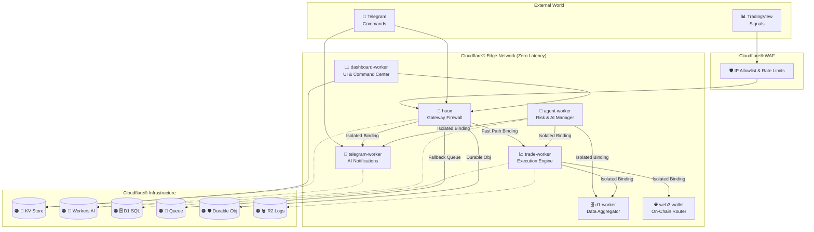

# 🚀 Hoox - The Zero-Latency Edge Trading Ecosystem

<div align="center">

[](https://www.typescriptlang.org/)
[](https://bun.sh)
[](https://workers.cloudflare.com/)
[](https://opensource.org/licenses/MIT)

**[Live Demo](https://hoox.cryptolinx.workers.dev)** · **[Comprehensive Docs](docs/README.md)** · **[Report a Bug](https://github.com/jango-blockchained/hoox-setup/issues)**

</div>

> **Low-latency edge trading.** Hoox is a free and open-source algorithmic trading and automation framework. Built on **Cloudflare® Workers**, Hoox utilizes a globally distributed, microservice edge architecture. Process signals, execute trades, and manage state with **low latency**, directly from the network edge closest to the exchange.

---

## 🌟 Why Hoox?

Hoox provides a modern approach to algorithmic trading infrastructure deployment.

*   💸 **Cost-Effective & Open Source:** Hoox leverages Cloudflare®'s free tiers, allowing you to run your trading infrastructure with minimal or no server costs.
*   ⚡ **Edge Execution:** Your code runs on Cloudflare®'s Edge, geographically close to exchange API servers (like Binance, Bybit, and MEXC). When a signal fires, Hoox executes with minimal network latency.
*   🛡️ **Built-in Security:** Hoox inherits Cloudflare®'s security features. With a Zero Trust architecture, strict IP Allow-listing, and encrypted internal Service Bindings, your API keys and trading strategies are well-protected.
*   🧠 **Automated Management:** Featuring an embedded risk manager (`agent-worker`), Hoox can monitor your portfolio, manage trailing stops, trigger kill-switches, and send system health summaries.

---

## ✨ Enterprise-Grade Features

| Feature                 | Description                                                |
| ----------------------- | ---------------------------------------------------------- |
| 🟠 🔗 **Service Bindings** | Microsecond inter-worker communication—no public internet routing |
| 🟠 🤖 **AI Integration**   | Cloudflare® Workers AI for LLaMA 3 powered summaries & decisions |
| 🟠 🗄️ **D1 Database**      | Globally distributed SQLite at the edge for persistent, atomic storage |
| 🟠 📦 **R2 Storage**       | Zero-egress S3-compatible object storage for trade reports |
| 🟠 🔐 **KV Storage**       | Global, ultra-fast key-value caching for dynamic settings and kill-switches |
| 📈 **Trading Engine**   | Multi-exchange automated execution (CEX & DEX) |
| 📊 **Command Center**   | React-based Dashboard for real-time portfolio monitoring |
| 🖥️ **Interactive TUI**  | Fully integrated Terminal UI (`hoox-tui`) for local process management |
| 🟠 📨 **Queues**           | Async trade execution with guaranteed delivery—survives exchange downtime |
| 🟠 🛡️ **Idempotency**    | Durable Object prevents duplicate trades on network retries |
| ⚡ **Rate Limiting**    | Built-in protection against trade spam (10 trades/min) |

---

## 🚀 Quick Start (Deploy in 5 Minutes)

```bash
# 1. Clone the master repository with all worker submodules
git clone --recurse-submodules https://github.com/jango-blockchained/hoox-setup.git
cd hoox-setup

# 2. Install ultra-fast Bun dependencies
bun install

# 3. Initialize the platform (Interactive CLI Wizard)
bun run scripts/manage.ts init

# 4. Deploy your entire trading empire to the Cloudflare® Edge!
bun run scripts/manage.ts workers deploy
```

> **Local Development:** Want to test before going live? Run `./hoox-tui` to launch the beautiful Terminal UI and run all 8 workers simultaneously on your local machine!
>
---

## 🥟 Performance & Tooling: Powered by Bun

Hoox relies on **Bun** as its primary JavaScript runtime and package manager. Bun is designed as a drop-in replacement for Node.js, providing significantly faster execution, immediate startup times, and built-in tooling for testing, running scripts, and managing dependencies.

- **Super Fast Execution**: Native implementations and the JavaScriptCore engine make script execution near instantaneous.
- **Lightning Fast Installs**: Dependency resolution and installation are optimized for speed, caching, and concurrent fetching.
- **Built-in Test Runner**: Hoox uses `bun test`, giving you natively integrated testing without heavy additional dependencies like Jest or Mocha.
- **TypeScript Out-of-the-Box**: Bun compiles TypeScript on the fly, eliminating the need for slow build steps during development.

---

## 🏗️ The Microservice Architecture

Hoox is split into distinct, highly specialized micro-workers. If one fails, the others keep running.



---

## 📋 The 8 Pillars of Hoox (Workers)

### 🔐 hoox (The Gateway)
The main entry point. It validates incoming TradingView webhooks, verifies API keys, and routes valid signals to the execution engine.
- **WAF Integration**: IP allowlisting and rate limiting are handled via Cloudflare WAF to drop malicious traffic before it hits the worker.
- **Fast Path Execution**: Attempts to execute trades instantly via direct Service Bindings, falling back to queues if necessary.
- **Idempotency**: Prevents duplicate trades using Durable Objects.
- **Trace IDs**: Generates distributed trace IDs for end-to-end signal tracking.

### 📈 trade-worker (The Execution Engine)
The execution module. Routes and executes orders across MEXC, Binance, and Bybit. Handles leverage calculation and size mapping.
- **Dynamic Routing**: Uses an `ExchangeRouter` with `CONFIG_KV` to instantly redirect symbols to different exchanges without code deployment.
- **Smart Placement**: Automatically executes on the Cloudflare edge node closest to the exchange's API servers.
- **R2 Log Offloading**: Verbose request and response logs are saved to R2 (`hoox-system-logs`), preserving D1 write limits for critical financial data.
### 🧠 agent-worker (The Risk Manager)
Runs silently on a 5-minute Cron schedule. It observes open positions, moves trailing stops, scales out of profitable trades, and flips the Global Kill Switch if maximum daily drawdown is reached.
### 📊 dashboard-worker (The Command Center)
A secure, edge-rendered React dashboard. Monitor Win Rates, view live positions, and adjust risk settings on the fly without ever needing to redeploy code.
### 💬 telegram-worker (The Communicator)
Sends instant trade confirmations and AI-generated market summaries straight to your phone.
### 🗄️ d1-worker (The Memory)
Handles all heavy SQL operations, aggregating trade histories and system logs to keep the execution workers incredibly lightweight.
### 🌐 web3-wallet-worker (The On-Chain Bridge)
Ready for DeFi execution. Securely manages mnemonic phrases to execute swaps on decentralized exchanges.
### 🏠 home-assistant-worker & 📧 email-worker
Ancillary plugins allowing you to trigger trades via smart home events or raw email parsing.

---

## 🔐 Security Architecture

Security is a foundational aspect of the Hoox system.

### Implemented Security Features

| Feature | Description |
|---------|-------------|
| **CORS** | Disabled - same-origin only |
| **X-Frame-Options** | DENY - prevents iframe embedding |
| **X-Content-Type-Options** | nosniff - prevents MIME sniffing |
| **X-XSS-Protection** | 1; mode=block |
| **Referrer-Policy** | strict-origin-when-cross-origin |
| **Permissions-Policy** | Blocks accelerometer, camera, geolocation, microphone, etc. |
| **Strict-Transport-Security** | max-age=31536000; includeSubDomains |
| **Content-Security-Policy** | default-src 'self' |
| **Idempotent Execution** | Durable Objects prevent duplicate trades |
| **Rate Limiting** | 10 trades/minute protection |
| **IP Allow-listing** | Optional IP filtering via KV |
| **API Key Auth** | Secret binding validation |
| **Kill Switch** | Global trading pause via KV |

### Security Layers

1. **Edge-Level**: Cloudflare's DDoS protection, firewall, and WAF
2. **Worker-Level**: IP allow-listing, API key validation, rate limiting
3. **Execution-Level**: Idempotency keys prevent duplicates, kill switches halt trading
4. **Response-Level**: All responses include security headers
- **No Public APIs:** The `trade-worker` and `d1-worker` literally do not exist on the public internet. They can *only* be accessed internally by the `hoox` gateway via Cloudflare® Service Bindings.
- **Zero Trust Dashboard:** Your UI is secured behind Cloudflare® Access, requiring rigorous authentication before you can even view the login page.
- **Hardware-Level Secret Injection:** API keys are injected directly into the V8 isolate at runtime. They are never stored in plaintext or logged.
- **Idempotent Execution:** Durable Objects prevent duplicate trades on network retries—no lost ETH from double-spending.
- **Rate Limiting:** Built-in throttling prevents accidental trade spamming.

---

## 🎯 Async Trade Execution (Queues)

Hoox uses Cloudflare® Queues for guaranteed trade delivery:

| Mode | Description |
|------|-------------|
| `queue_failover` (default) | Try direct execution first, queue on failure |
| `queue_everywhere` | Always queue trades asynchronously |

### Configuration
```bash
# Set mode in KV
wrangler kv key put webhooks:queue_mode queue_failover --binding CONFIG_KV --remote
```

### Retry Behavior
- **Attempt 1**: Immediate
- **Attempt 2**: 30 seconds
- **Attempt 3**: 1 minute
- **Attempt 4**: 5 minutes
- **Attempt 5**: 15 minutes
- After max retries: Trade logged to D1 as failed

---

## 💸 Free Tier Costs (Everything is Free!)

Hoox runs entirely on Cloudflare® Workers Free tier:

| Service | Free Limit | Notes |
|---------|-----------|-------|
| 🟠 Workers | 100k req/day | ~3k trades/day |
| 🟠 D1 | 5M rows read, 100k writes/day | 5GB storage |
| 🟠 KV | 1GB, 1k ops/day | Config storage |
| 🟠 R2 | 10GB/month | Trade reports |
| 🟠 Queues | 10k ops/day | ~3k trades/day |
| 🟠 Durable Objects | SQLite-backed only | Idempotency |
| 🟠 Workers AI | 10k neurons/day | AI summaries |

---

## 🧪 Testing & Reliability

With money on the line, we test everything.

```bash
# Run the massive test suite powered by Vitest
bun test --coverage
```

Current Test Coverage stands at **>65% average line coverage** across all critical execution and gateway workers. Built natively on Bun, Hoox features uncompromising TypeScript type safety out of the box—no `as any` escape hatches, just rock-solid code.

---

## 🐳 Self-Hosting (Docker)

Hoox supports a **Hybrid Edge** deployment model. You can run the worker logic entirely on your own infrastructure using Docker, while still leveraging Cloudflare's AI, D1, KV, and R2 for heavy lifting—no code rewrites required.

### Prerequisites

*   [Docker](https://www.docker.com/) & Docker Compose
*   Bun runtime (included in our Docker images)

### Development (Hot-Reload)

Spin up all 8 workers locally with hot-reloading enabled. Changes to your code are reflected instantly without rebuilding the container.

```bash
# Build and start the dev environment
bun run docker:dev
```

This launches all workers on the following ports:

| Service | Port |
|---------|------|
| Gateway (hoox) | 8787 |
| Trade Worker | 8789 |
| Telegram Worker | 8791 |
| D1 Worker | 8792 |
| Web3 Wallet | 8793 |
| Dashboard | 8794 |
| Agent | 8795 |
| Email | 8796 |

### Production (Self-Hosted)

Build and run the optimized production image. This compiles all TypeScript workers into high-performance JavaScript bundles served via a lightweight Bun runtime.

```bash
# Build the production image
bun run docker:prod
```

**Configuration:**
Ensure your `.env.local` or environment variables are set with your Cloudflare API Token and Account ID:

```bash
CLOUDFLARE_API_TOKEN=your_token_here
CLOUDFLARE_ACCOUNT_ID=your_account_id
```

---

## 🤝 Contribute

Traditional algorithmic trading is often complex and difficult to deploy. Hoox aims to simplify this. 

1. Fork the repository
2. Create your feature branch (`git checkout -b feature/new-strategy`)
3. Commit your changes (`git commit -m 'Add new strategy'`)
4. Push to the branch (`git push origin feature/new-strategy`)
5. Open a Pull Request

---

## 🔮 Future Plans: Backtesting & Pinescript Execution

Currently, Hoox relies on external signal generation, and we acknowledge that **TradingView® offers the best backtesting engine** available today for retail and professional traders alike. 

However, our long-term vision includes native, edge-based execution of trading logic. In the future, we plan to implement a **100% fully featured Pinescript parser, converter, and executor**. This will involve an AST (Abstract Syntax Tree) generator and a Python compiler, allowing you to run complex Pinescript strategies natively within the Cloudflare Workers ecosystem (see `PYNESCRIPT.md` for upcoming technical details).

---

## 📄 License
MIT License - Built for the community, by the community. See [LICENSE](LICENSE) for details.

---
<div align="center">
Built with 🔥 on the Cloudflare® Edge.
</div>

---

*Cloudflare® and the Cloudflare logo are trademarks and/or registered trademarks of Cloudflare, Inc. in the United States and other jurisdictions.*
