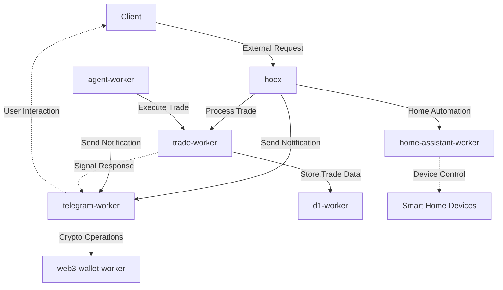

# ENDPOINTS Documentation

## Overview

This document catalogs all exposed endpoints from the various workers in the system. It details the request/response flow between workers and provides both a visual flowchart and tabular representation of available endpoints.

## Architectural Flow



## Endpoint Catalogs by Worker

### hoox

The hoox is the primary entry point for external requests.

| Endpoint | Method | Description | Request Format | Response Format |
|----------|--------|-------------|----------------|-----------------|
| `/` (root) | POST | Main webhook endpoint for processing requests | JSON with `apiKey` and service-specific payloads | JSON with `success`, `error`, and `actions` fields |

Request Example:
```json
{
  "apiKey": "your-api-key",
  "telegram": {
    "chatId": "123456789",
    "message": "Hello from webhook"
  },
  "ha": {
    "action": "light.turn_on",
    "entity_id": "light.living_room"
  }
}
```

Response Example:
```json
{
  "success": true,
  "error": null,
  "message": null,
  "actions": [
    {
      "type": "telegram",
      "success": true,
      "message": "Message sent successfully"
    },
    {
      "type": "ha",
      "success": true,
      "message": "Home Assistant action executed"
    }
  ]
}
```

### telegram-worker

| Endpoint | Method | Description | Request Format | Response Format |
|----------|--------|-------------|----------------|-----------------|
| `/process` | POST | Legacy endpoint for sending notifications | JSON with `requestId`, `internalAuthKey`, and `payload` | JSON with `success` and `result` fields |
| `/webhook` | POST | Handle incoming Telegram updates | Standard Telegram update format | 200 OK response |
| `/test-vectorize` | GET | Testing endpoint (development only) | Query param `q` | JSON with search results |
| `/test-ai` | GET | Testing endpoint (development only) | N/A | JSON with AI response |
| `/test-r2-upload` | POST | Testing endpoint (development only) | File data | JSON response |
| `/test-web3` | GET | Testing endpoint (development only) | Query params `chain` and `address` | JSON with wallet data |

### trade-worker

| Endpoint | Method | Description | Request Format | Response Format |
|----------|--------|-------------|----------------|-----------------|
| `/process` | POST | Process trade orders (internal) | JSON with `requestId`, `internalAuthKey`, and trade payload | JSON with trade result |
| `/webhook` | POST | Alternative entry point for trade orders | JSON with trade details | JSON with trade result |
| `/dex` | POST | Handle DEX (decentralized exchange) trades | JSON with DEX trade details | JSON with trade result |
| `/api/signals` | GET | Retrieve trade signals | Query params for filtering | JSON with signal list |
| `/api/signals` | POST | Create a new trade signal | JSON with signal details | JSON with created signal |
| `/report` | GET | Get R2 reports | Query params for report selection | Report data |
| `/test-ai` | GET | Testing endpoint (development only) | N/A | JSON with AI response |

### home-assistant-worker

| Endpoint | Method | Description | Request Format | Response Format |
|----------|--------|-------------|----------------|-----------------|
| `/` (root) | GET | Health check | N/A | Text response |
| `/process` | POST | Process Home Assistant service calls | JSON with `requestId`, `internalAuthKey`, and HA payload | JSON with service call result |
| `/notify` | POST | Send Telegram notifications from HA context | JSON with notification details | JSON with notification result |

### web3-wallet-worker

| Endpoint | Method | Description | Request Format | Response Format |
|----------|--------|-------------|----------------|-----------------|
| `/` (root) | GET | Initialize wallet and return address | N/A | JSON with wallet address |

### agent-worker

The `agent-worker` runs primarily via Cloudflare® Cron Triggers (`*/5 * * * *`) but exposes REST endpoints for manual intervention.

| Endpoint | Method | Description | Request Format | Response Format |
|----------|--------|-------------|----------------|-----------------|
| `/agent/risk-override` | POST | Manually enforce or release risk locks (e.g., global kill switch) | JSON with `action` and `reason` | JSON confirmation |
| `/agent/status` | GET | Retrieve real-time health of the agent and active trailing stops | N/A | JSON with `status` and active states |

### dashboard

The `dashboard` is a frontend interface that interacts with the `d1-worker` and `CONFIG_KV`. It does not expose public APIs meant for internal service consumption, but rather serves the React application.

### d1-worker

| Endpoint | Method | Description | Request Format | Response Format |
|----------|--------|-------------|----------------|-----------------|
| `/query` | POST | Execute SQL queries against D1 | JSON with query and params | JSON with query results |
| `/batch` | POST | Execute multiple SQL statements | JSON with queries array | JSON with batch results |
| `/api/dashboard/stats` | GET | Retrieve high-level dashboard metrics | N/A | JSON with `totalTrades`, `openPositions`, and recent activity |
| `/api/dashboard/positions` | GET | Retrieve all `OPEN` positions | N/A | JSON array of active positions |
| `/api/dashboard/logs` | GET | Retrieve recent system logs | N/A | JSON array of `system_logs` |
| `/{tableName}` | GET | List records with filtering | Query params for filters | JSON with record list |
| `/{tableName}/{id}` | GET | Get a specific record | N/A | JSON with record data |
| `/{tableName}` | POST | Create a new record | JSON with fields | JSON with created record |
| `/{tableName}/{id}` | PUT | Update an existing record | JSON with updated fields | JSON with update result |
| `/{tableName}/{id}` | DELETE | Delete a record | N/A | JSON with deletion result |

## System Architecture Insights

### Request Flow Analysis

1. **External Requests**: All external requests enter through the hoox, which validates the API key and routes to appropriate service workers.

2. **Inter-Worker Communication**: Workers communicate with each other through internal service bindings, using a common authentication mechanism (`internalAuthKey`).

3. **Data Storage**: Trade signals, conversation history, and other persistent data are stored in D1 database through the d1-worker.

### Current Limitations

1. **Single Entry Point**: The hoox is the only public entry point, which could become a bottleneck.

2. **Hardcoded Functions**: The current architecture relies on hardcoded functions in the hoox to route requests to different services.

## Proposed Architecture Improvements

### Dynamic Routing Solution

Rather than hardcoding functions in the hoox, consider implementing a dynamic routing system:

1. **Configuration-Based Routing**: Store route configurations in KV store that map external webhook paths to internal services.

2. **Service Registry**: Implement a service discovery mechanism where workers register their capabilities.

3. **Middleware Architecture**: Create a middleware-based pipeline in the hoox that can:
   - Validate requests
   - Transform payloads as needed
   - Apply appropriate security measures
   - Route to the correct internal service

Example of a configuration-based router:

```javascript
// Example of a configuration stored in KV
const routeConfig = {
  "/v1/trades": {
    worker: "trade-worker",
    path: "/process",
    requiresAuth: true
  },
  "/v1/notifications": {
    worker: "telegram-worker",
    path: "/process",
    requiresAuth: true
  },
  "/v1/home": {
    worker: "home-assistant-worker",
    path: "/process",
    requiresAuth: true
  }
};

// Router function that uses the config
async function routeRequest(request, env) {
  const url = new URL(request.url);
  const route = routeConfig[url.pathname];
  
  if (!route) {
    return new Response("Not Found", { status: 404 });
  }
  
  // Authentication, validation, etc.
  
  // Forward to appropriate worker
  return env[route.worker].fetch(`http://${route.worker}${route.path}`, {
    method: request.method,
    headers: request.headers,
    body: request.body
  });
}
```

### Scalability Improvements

1. **Multiple Entry Points**: Consider creating dedicated entry points for different types of interactions (e.g., trade API, notification API).

2. **Versioned API**: Implement API versioning in the route paths (e.g., `/v1/trades`, `/v2/trades`).

3. **Event-Driven Architecture**: For non-realtime operations, consider using Cloudflare® Queues to decouple services.

4. **Middleware Composition**: Build a library of reusable middleware functions that can be composed for different routes.

By implementing these improvements, the system can evolve beyond hardcoded functions while maintaining security and providing better scalability and maintainability. 

---

*Cloudflare® and the Cloudflare logo are trademarks and/or registered trademarks of Cloudflare, Inc. in the United States and other jurisdictions.*
