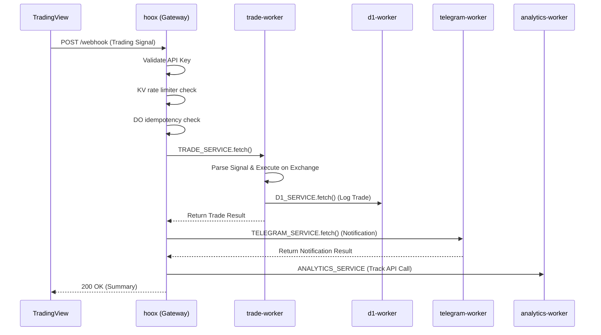
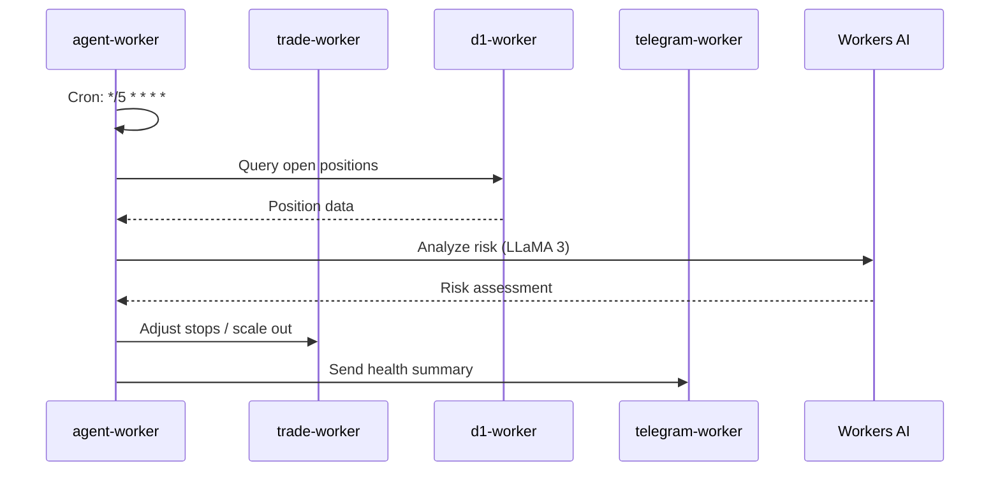
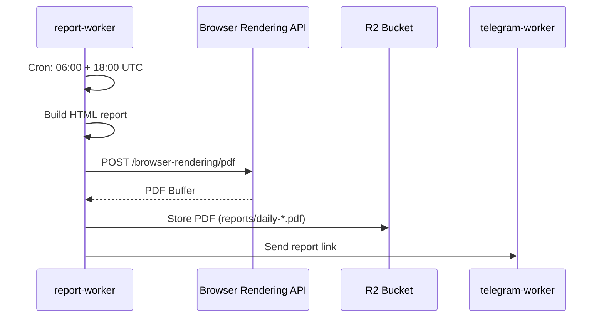
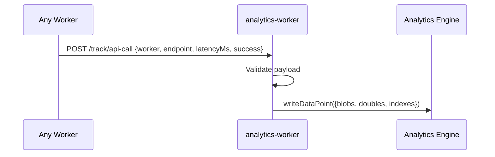

# 🌊 Data Flow

> Deep dive into the data flow across 9 Hoox workers

## 1. Webhook to Trading Flow

Primary flow: TradingView webhook → trade execution → notification → analytics.

## 2. AI Risk Management Flow

Agent-worker runs every 5 minutes to monitor positions and manage risk.

## 3. PDF Report Flow

Report-worker generates PDFs twice daily via Browser Rendering.

## 4. Analytics Flow

Every API call across all workers is tracked for observability.

## 5. Data Persistence

| Storage | Data | Workers |
|---------|------|---------|
| D1 Database | Trade logs, positions, signals | d1-worker, trade-worker, agent-worker |
| KV (CONFIG_KV) | Routing rules, IP lists, rate limiter state | All workers |
| KV (SESSIONS_KV) | Webhook sessions | hoox |
| R2 (trade-reports) | Trade reports, PDFs | trade-worker, report-worker |
| R2 (user-uploads) | User file uploads | telegram-worker |
| R2 (hoox-system-logs) | Verbose exchange logs | trade-worker |
| Vectorize | AI embeddings for RAG | telegram-worker, hoox |
| Analytics Engine | Time-series API metrics | analytics-worker |

## Next Steps

- [System Overview](overview.md)
- [Worker Communication](communication.md)
