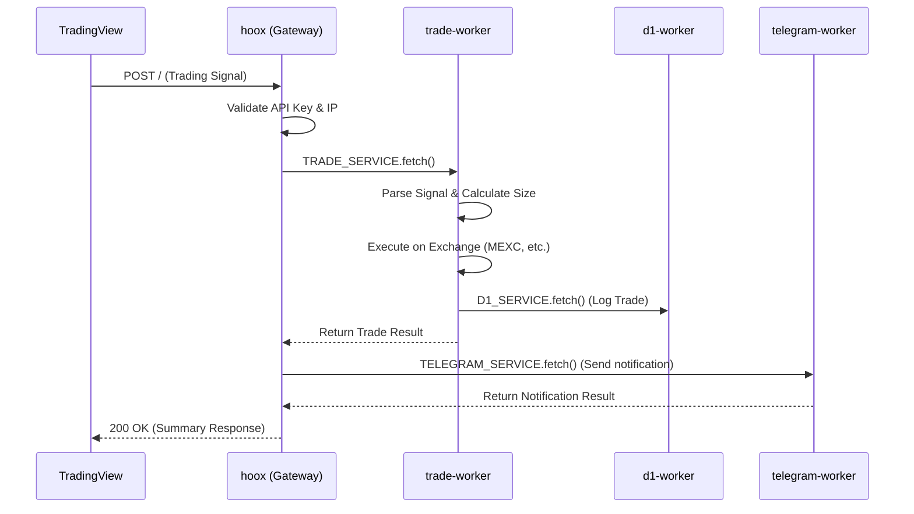
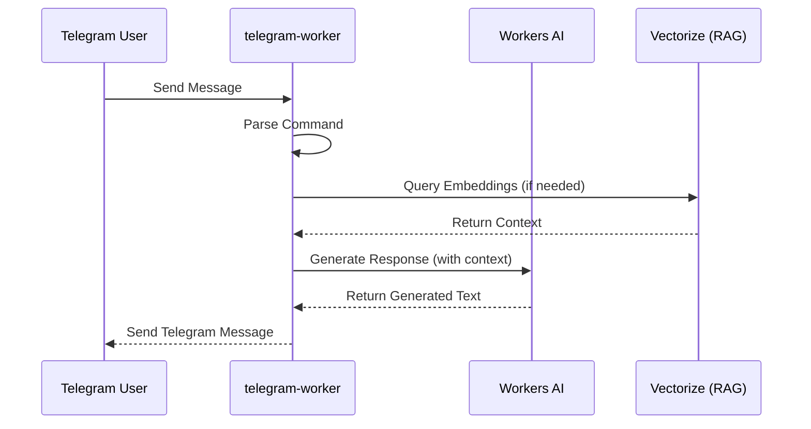

# 🌊 Data Flow

> Deep dive into the data flow across Hoox workers

## 1. Webhook to Trading Flow

The primary data flow starts with an external webhook (e.g., from TradingView) and results in a trade execution and notification.

## 2. Notification & AI Flow

When a user interacts with the Telegram bot or an internal system sends an alert.

## 3. Data Persistence Flow

Hoox uses multiple storage mechanisms:

- **D1 Database**: Relational data (Trade logs, System logs, Positions)
- **KV Store**: Key-Value data (Configurations, Allow-lists, Session data)
- **R2 Storage**: Object storage (Trade reports, User uploads)
- **Vectorize**: Vector embeddings for RAG and AI search.

## Next Steps

- [System Overview](overview.md)
- [Worker Communication](communication.md)
