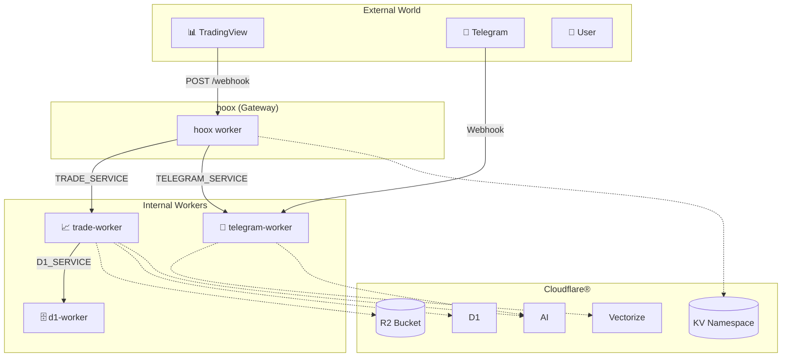

# 🏗️ Architecture Overview

> Understanding the Hoox system design

## High-Level Architecture

Hoox is a **service-oriented** platform where multiple Cloudflare® Workers communicate via:

1. **Service Bindings** - Direct worker-to-worker calls
2. **Shared Resources** - KV, D1, R2, Vectorize

## System Diagram



## Data Flow

### 1. Trading Signal Flow

```
TradingView → hoox → trade-worker → Exchange API
                      ↓
                   d1-worker (log)
                   ↓
                   telegram-worker (notify)
```

### 2. Notification Flow

```
hoox → telegram-worker → Telegram API
         ↓
      Vectorize (RAG)
```

## Component Responsibilities

### hoox (Gateway)

- Validates incoming API keys
- IP allow-listing check
- Session management (KV)
- Routes to internal workers via service bindings
- Returns standardized responses

### trade-worker

- Executes trades on exchanges
- Manages positions & leverage
- Logs to D1 database
- Saves trade reports to R2

### telegram-worker

- Sends Telegram notifications
- Processes incoming commands (/start, /status)
- RAG with Vectorize embeddings
- File uploads to R2

### d1-worker

- Stores trading signals
- Logs trade responses
- Query historical data

## Security Layers

```
┌─────────────────────────────────────┐
│ Layer 1: IP Allow-list (KV config)  │
├─────────────────────────────────────┤
Layer 2: API Key Validation           │
├─────────────────────────────────────┤
Layer 3: Service Binding Auth        │
├─────────────────────────────────────┤
Layer 4: Internal Key Validation      │
└─────────────────────────────────────┘
```

## Shared Resources

| Resource        | Purpose           | Workers   |
| --------------- | ----------------- | --------- |
| CONFIG_KV       | Routing, IP lists | All       |
| SESSIONS_KV     | Session tracking  | hoox      |
| REPORTS_BUCKET  | Trade reports     | trade     |
| VECTORIZE_INDEX | Embeddings        | telegram  |
| D1 Database     | Signal storage    | trade, d1 |

## Worker Communication

### Service Bindings

```typescript
// hoox to trade-worker
const response = await env.TRADE_SERVICE.fetch(url, {
  method: "POST",
  body: JSON.stringify(tradePayload),
});
```

### Environment Bindings

```jsonc
// wrangler.jsonc
{
  "kv_namespaces": [{ "binding": "CONFIG_KV", "id": "..." }],
  "d1_databases": [{ "binding": "D1_SERVICE", "id": "..." }],
}
```

## Scaling Considerations

- **Service Bindings**: Max 100ms latency per call
- **KV**: 1ms typical read
- **D1**: ~5ms query time
- **R2**: ~10ms for large objects

## Performance & Tooling: Powered by Bun 🥟

Hoox relies on **Bun** as its primary JavaScript runtime and package manager. Bun is designed as a drop-in replacement for Node.js, providing significantly faster execution, immediate startup times, and built-in tooling for testing, running scripts, and managing dependencies.

- **Super Fast Execution**: Native implementations and the JavaScriptCore engine make script execution near instantaneous.
- **Lightning Fast Installs**: Dependency resolution and installation are optimized for speed, caching, and concurrent fetching.
- **Built-in Test Runner**: Hoox uses `bun test`, giving you natively integrated testing without heavy additional dependencies like Jest or Mocha.
- **TypeScript Out-of-the-Box**: Bun compiles TypeScript on the fly, eliminating the need for slow build steps during development.

## Next Steps

- [Worker Communication](communication.md)
- [Data Flow](data-flow.md)

---

_Cloudflare® and the Cloudflare logo are trademarks and/or registered trademarks of Cloudflare, Inc. in the United States and other jurisdictions._
