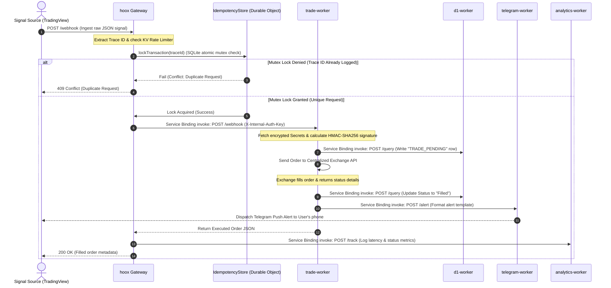
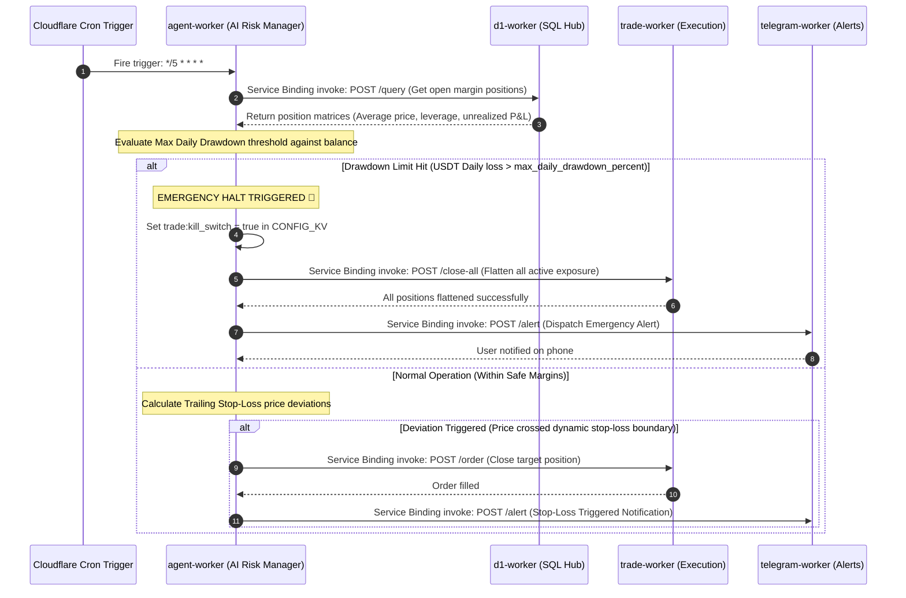
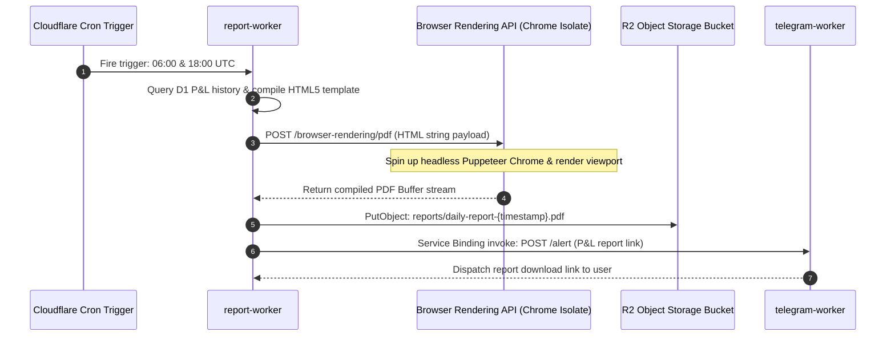
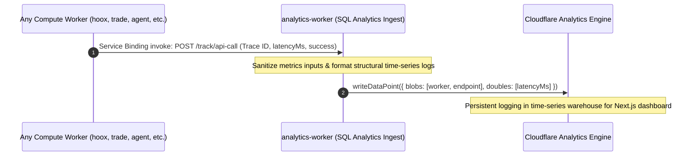

Hoox operates as a highly orchestrated **distributed event loop**. Because execution logic is split into isolated compute nodes, data flows recursively through multiple V8 transitions, asynchronous queues, time-series datasets, and database ledgers.

This document provides complete, low-level technical specifications and Mermaid sequence diagrams for our four primary data routing pipelines: Webhook Trade execution, AI Risk management, PDF browser rendering, and Observability tracking.

---

## 1. Webhook to Trade Execution Flow (High-Speed Path)

This is the primary transaction pipeline. When a trade signal is received, the system validates the payload, locks the trace ID, executes the order at the edge closest to the exchange, records the fill, and alerts the user.

---

## 2. Autonomous AI Risk Monitoring Flow (Cron Cycle)

Running on a strict **5-minute Cron schedule**, the risk management loop queries SQLite records, audits active exposures, calculates trailing stop deviations, and manages emergency halts.

---

## 3. PDF Portfolio Report Rendering Flow

Runs twice daily to automate HTML dashboard rendering, compile PDFs via Puppeteer on the edge, offload to R2 storage, and dispatch download corridors.

---

## 4. Observability & Time-Series Analytics Flow

To maintain complete cross-worker telemetry without blocking critical order threads, Hoox routes analytics data points asynchronously to a dedicated metrics warehouse.

---

## 💾 5. Global Data Persistence Mapping

| Storage Platform | Namespace / Database Name      | Data Payload Details                                           | Associated Compute Workers                  |
| :--------------- | :----------------------------- | :------------------------------------------------------------- | :------------------------------------------ |
| **D1 Database**  | `trade-data-db` (SQLite)       | Executed fills, open position matrices, Drizzle tracking logs. | `d1-worker`, `trade-worker`, `agent-worker` |
| **CONFIG_KV**    | `CONFIG_KV` (Key-Value)        | 16-key global runtime manifest, emergency Kill Switch.         | **All Workers** + Next.js Dashboard         |
| **SESSIONS_KV**  | `SESSIONS_KV` (Key-Value)      | Session access states and API authorization cookies.           | `hoox` Gateway                              |
| **R2 Storage**   | `trade-reports` (S3 Bucket)    | Compiled PDF portfolio reports.                                | `report-worker`                             |
| **R2 Storage**   | `hoox-system-logs` (S3 Bucket) | Verbose JSON exchange API payloads (REST & WebSocket logs).    | `trade-worker`                              |
| **Vectorize**    | `my-rag-index` (Vector DB)     | Semantic chat and history vector embeddings.                   | `telegram-worker`                           |

### 🔗 Next Steps

- **[Bindings Catalog](bindings)** — Check wrangler settings and resource declarations.
- **[Storage Engineering Manual](storage)** — Dive into Drizzle database schemas and SQLite properties.
