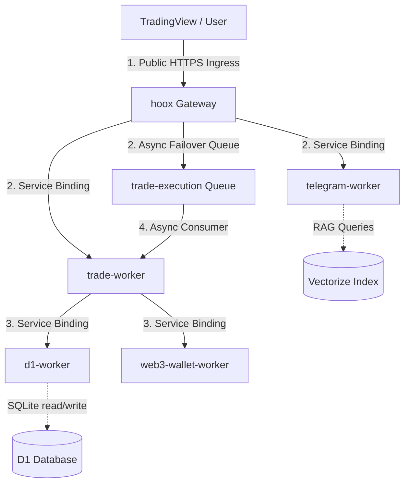

# 🔌 Internal Endpoints Map

This document catalogs all internal REST, service-to-service, and queue endpoints exposed across the Hoox microservice monorepo. Because internal workers have zero public IP footprints and are completely isolated by Cloudflare’s Zero Trust service bindings, this map serves as the primary integration blueprint for routing, debugging, and dashboard interactions.

---

## 🏗️ Interactive Compute & Routing Flow

All external webhooks flow through the public `hoox` gateway, which authenticates payloads and routes them to private workers inside localized V8 engine isolates:

---

## 🗂️ Endpoints Directory by Worker

Every internal HTTP request between V8 isolates must transmit the standard bearer header:
`X-Internal-Auth-Key: <INTERNAL_KEY_BINDING>`

---

### 🔐 1. `hoox` (Gateway Router)

- **Status**: Public Ingress Node
- **Bindings Mounts**: `TRADE_SERVICE`, `TELEGRAM_SERVICE`, `ANALYTICS_SERVICE`, `CONFIG_KV`, `TRADE_QUEUE`

| Route               | Method | Description                                      | Request Shape        | Success Response                |
| :------------------ | :----: | :----------------------------------------------- | :------------------- | :------------------------------ |
| `/webhook`          | `POST` | Primary webhook receiver for TradingView alerts. | `WebhookSignal` JSON | `200 OK` (Orderfilled metadata) |
| `/health`           | `GET`  | Probes gateway, D1 connectivity, and DO status.  | N/A                  | `{"status": "ok"}`              |
| `/telegram-webhook` | `POST` | Processes chat commands pushed from Telegram.    | Telegram Updates     | `200 OK`                        |

---

### 📈 2. `trade-worker` (Execution Engine)

- **Status**: Private Compute Node (No Public URL)
- **Bindings Mounts**: `D1_SERVICE`, `TELEGRAM_SERVICE`, `ANALYTICS_SERVICE`, `CONFIG_KV`

| Route          | Method | Description                                       | Request Shape        | Success Response            |
| :------------- | :----: | :------------------------------------------------ | :------------------- | :-------------------------- |
| `/webhook`     | `POST` | Direct fast-path execution trigger.               | `WebhookSignal` JSON | `200 OK` (Fill detail JSON) |
| `/dex`         | `POST` | Dispatches EVM orders on-chain via web3 wallet.   | DexTrade JSON        | `200 OK` (Tx Hash metadata) |
| `/api/signals` | `GET`  | Retrieves recent signal logs from D1.             | Query params filters | `200 OK` (Array of signals) |
| `/health`      | `GET`  | Probes CPU thread state and exchange connections. | N/A                  | `{"status": "ok"}`          |

---

### 🗄️ 3. `d1-worker` (SQLite Hub)

- **Status**: Private Data Proxy (No Public URL)
- **Bindings Mounts**: `DB` (D1 SQLite database binding)

| Route                  | Method | Description                                               | Request Shape                                     | Success Response                      |
| :--------------------- | :----: | :-------------------------------------------------------- | :------------------------------------------------ | :------------------------------------ |
| `/query`               | `POST` | Executes a single SQL query against the SQLite database.  | `{"query": "SELECT * FROM trades", "params": []}` | `{"success": true, "results": [...]}` |
| `/batch`               | `POST` | Executes multiple transactional SQL operations.           | `{"queries": [{"query": "...", "params": []}]}`   | `{"success": true, "results": [...]}` |
| `/api/dashboard/stats` | `GET`  | Computes aggregated Win Rate, drawdown, and daily totals. | N/A                                               | `{"success": true, "stats": {...}}`   |
| `/{tableName}`         | `GET`  | Lists rows inside a specific SQLite table (with filters). | Query params                                      | `{"success": true, "rows": [...]}`    |

---

### 🧠 4. `agent-worker` (AI Risk Manager)

- **Status**: Private Compute Node (Runs primarily on Cron schedule `*/5 * * * *`)
- **Bindings Mounts**: `TRADE_SERVICE`, `D1_SERVICE`, `TELEGRAM_SERVICE`, `AI`

| Route           | Method | Description                                                | Request Shape                             | Success Response                    |
| :-------------- | :----: | :--------------------------------------------------------- | :---------------------------------------- | :---------------------------------- |
| `/agent/chat`   | `POST` | Starts a conversational market/risk query (SSE supported). | `{"prompt": "...", "stream": true}`       | `text/event-stream` stream          |
| `/agent/vision` | `POST` | Analyzes image bytes using multimodal AI models.           | `{"image": "base64...", "prompt": "..."}` | `{"analysis": "..."}`               |
| `/agent/status` | `GET`  | Returns active trailing stops and current drawdowns.       | N/A                                       | `{"status": "active", "stops": []}` |
| `/health`       | `GET`  | Probes AI model availability and Cron loop timers.         | N/A                                       | `{"status": "ok"}`                  |

---

### 💬 5. `telegram-worker` (Push alerts)

- **Status**: Private Compute Node
- **Bindings Mounts**: `ANALYTICS_SERVICE`, `AI`, `VECTORIZE_INDEX`

| Route     | Method | Description                                           | Request Shape                         | Success Response    |
| :-------- | :----: | :---------------------------------------------------- | :------------------------------------ | :------------------ |
| `/alert`  | `POST` | Sends a push trade fill notification or daily digest. | `{"chatId": "...", "message": "..."}` | `{"success": true}` |
| `/health` | `GET`  | Probes Telegram API connection.                       | N/A                                   | `{"status": "ok"}`  |

---

> **Tip:** Every internal-to-internal transaction automatically inherits the `requestId` trace UUID generated by the gateway. This trace ID is attached as the `X-Request-Id` header, allowing you to trace a single webhook alert across D1 database writes, R2 log outputs, and Telegram alerts instantly!

### 🔗 Next Steps

- **[Astro Docs Site Config](../getting-started/configuration.md)** — Map out your build-time environment configurations.
- **[System Storage Architecture](storage.md)** — Deep dive into R2 logs offloading and Drizzle ORM schemas.
