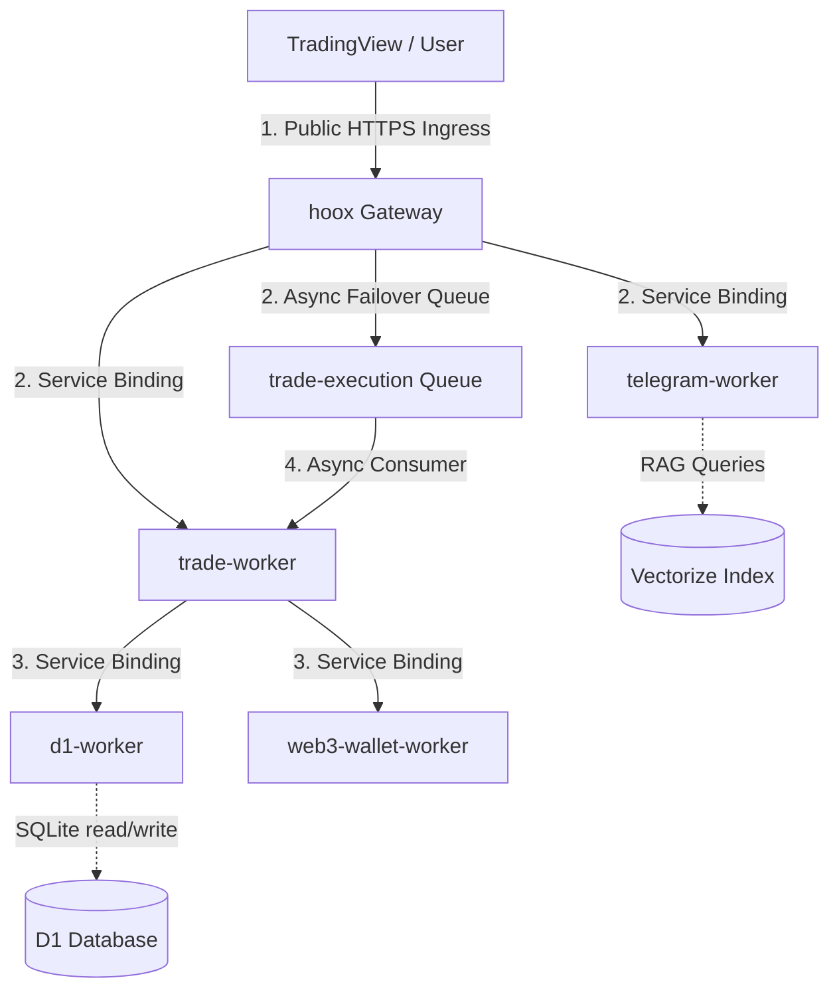

# 🔌 Internal Endpoints Map

> **This document is now a stub focused on the routing flow. For complete endpoint specifications, see [`/docs/devops/api/endpoints`](../api/endpoints).**

This page captures the **architectural context** for routing across the Hoox microservice monorepo — the Mermaid routing diagram, the internal-auth header contract, and the request-trace propagation story. The exhaustive endpoint directory (per-worker route tables, JSON payloads, and success-response examples) lives in the canonical reference.

---

## 🏗️ Interactive Compute & Routing Flow

All external webhooks flow through the public `hoox` gateway, which authenticates payloads and routes them to private workers inside localized V8 engine isolates:



---

## 🔐 Internal Authorization Contract

Every internal HTTP request between V8 isolates **must** transmit the standard bearer header:

```http
X-Internal-Auth-Key: <INTERNAL_KEY_BINDING>
```

This shared secret is provisioned per-worker as an encrypted `wrangler secret` and validated by the `requireInternalAuth` middleware from `@jango-blockchained/hoox-shared/middleware`. Public webhook and dashboard endpoints use payload-embedded API keys or session cookies instead — see the canonical [`/docs/devops/api/endpoints`](../api/endpoints) for the full auth matrix.

---

## 🛰️ Request-Trace Propagation

<Tip>
  Every internal-to-internal transaction automatically inherits the `requestId`
  trace UUID generated by the gateway. This trace ID is attached as the
  `X-Request-Id` header, allowing you to trace a single webhook alert across D1
  database writes, R2 log outputs, and Telegram alerts instantly!
</Tip>

---

### 🔗 Next Steps

- **[Complete API Reference](../api/endpoints)** — The canonical endpoint directory with full request/response examples for every worker.
- **[Service Binding Mesh](communication)** — Deep dive into the Zero-Trust service-binding topology and the public/internal isolation boundary.
- **[System Storage Architecture](storage)** — Review R2 log offloading, D1 SQLite ledger layout, and Vectorize RAG indexes.
