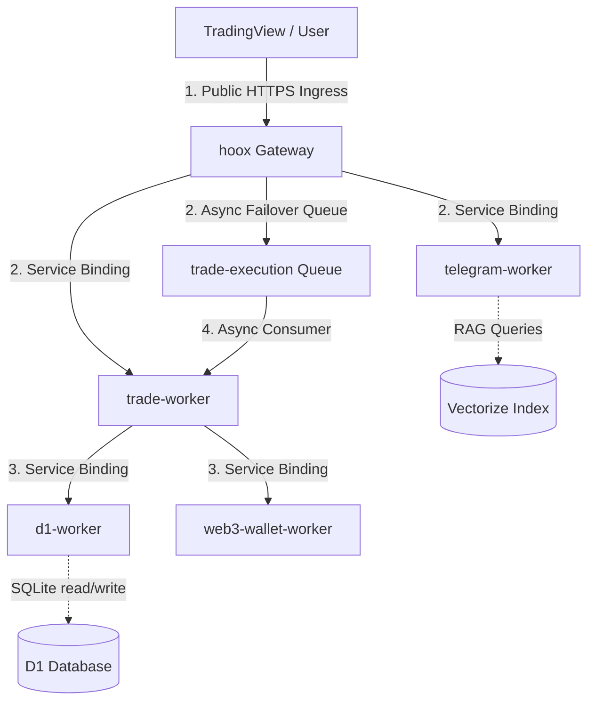

# 🔌 Internal Endpoints Map

<Note>For complete endpoint specifications with request/response examples, see **[`docs/devops/api/endpoints.md`](../api/endpoints)**.</Note>
>
> This document provides architectural context and internal routing flow for the Hoox microservice monorepo.

This document catalogs all internal REST, service-to-service, and queue endpoints exposed across the Hoox microservice monorepo. Because internal workers have zero public IP footprints and are completely isolated by Cloudflare's Zero Trust service bindings, this map serves as the primary integration blueprint for routing, debugging, and dashboard interactions.

---

## 🏗️ Interactive Compute & Routing Flow

All external webhooks flow through the public `hoox` gateway, which authenticates payloads and routes them to private workers inside localized V8 engine isolates:

---

## 🗂️ Endpoints Directory by Worker

<Note>[`docs/devops/api/endpoints.md`](../api/endpoints) for complete endpoint specifications with request/response examples.</Note>

Every internal HTTP request between V8 isolates must transmit the standard bearer header:
`X-Internal-Auth-Key: <INTERNAL_KEY_BINDING>`

---

### 🔐 1. `hoox` (Gateway Router)

- **Status**: Public Ingress Node
- **Bindings Mounts**: `TRADE_SERVICE`, `TELEGRAM_SERVICE`, `CONFIG_KV`, `TRADE_QUEUE`

| Route      | Method | Description                                      | Auth Required      |
| :--------- | :----: | :----------------------------------------------- | :----------------- |
| `/webhook` | `POST` | Primary webhook receiver for TradingView alerts. | API Key in payload |
| `/health`  | `GET`  | Probes gateway, D1 connectivity, and DO status.  | None               |

<Note>See [`docs/devops/api/endpoints.md#ingress-webhook-endpoints`](../api/endpoints#-ingress-webhook-endpoints-workershoox)</Note>

---

### 📈 2. `trade-worker` (Execution Engine)

- **Status**: Private Compute Node (No Public URL)
- **Bindings Mounts**: `D1_SERVICE`, `TELEGRAM_SERVICE`, `ANALYTICS_SERVICE`, `CONFIG_KV`

| Route          | Method | Description                                       | Auth Required     |
| :------------- | :----: | :------------------------------------------------ | :---------------- |
| `/webhook`     | `POST` | Direct fast-path execution trigger.               | Internal auth key |
| `/dex`         | `POST` | Dispatches EVM orders on-chain via web3 wallet.   | Internal auth key |
| `/api/signals` | `GET`  | Retrieves recent signal logs from D1.             | Internal auth key |
| `/health`      | `GET`  | Probes CPU thread state and exchange connections. | None              |

---

### 🗄️ 3. `d1-worker` (SQLite Hub)

- **Status**: Private Data Proxy (No Public URL)
- **Bindings Mounts**: `DB` (D1 SQLite database binding)

| Route                  | Method | Description                                               | Auth Required     |
| :--------------------- | :----: | :-------------------------------------------------------- | :---------------- |
| `/query`               | `POST` | Executes a single SQL query against the SQLite database.  | Internal auth key |
| `/batch`               | `POST` | Executes multiple transactional SQL operations.           | Internal auth key |
| `/api/dashboard/stats` | `GET`  | Computes aggregated Win Rate, drawdown, and daily totals. | Internal auth key |
| `/{tableName}`         | `GET`  | Lists rows inside a specific SQLite table (with filters). | Internal auth key |

<Note>See [`docs/devops/api/endpoints.md#database-service-endpoints`](../api/endpoints#-database-service-endpoints-workersd1-worker)</Note>

---

### 🧠 4. `agent-worker` (AI Risk Manager)

- **Status**: Private Compute Node (Runs primarily on Cron schedule `*/5 * * * *`)
- **Bindings Mounts**: `TRADE_SERVICE`, `D1_SERVICE`, `TELEGRAM_SERVICE`, `AI`

| Route           | Method | Description                                                | Auth Required     |
| :-------------- | :----: | :--------------------------------------------------------- | :---------------- |
| `/agent/chat`   | `POST` | Starts a conversational market/risk query (SSE supported). | Internal auth key |
| `/agent/vision` | `POST` | Analyzes image bytes using multimodal AI models.           | Internal auth key |
| `/agent/status` | `GET`  | Returns active trailing stops and current drawdowns.       | Internal auth key |
| `/health`       | `GET`  | Probes AI model availability and Cron loop timers.         | None              |

<Note>See [`docs/devops/api/endpoints.md#ai-risk--chat-endpoints`](../api/endpoints#-ai-risk--chat-endpoints-workersagent-worker)</Note>

---

### 💬 5. `telegram-worker` (Push alerts)

- **Status**: Private Compute Node
- **Bindings Mounts**: `AI`, `VECTORIZE_INDEX`

| Route     | Method | Description                                           | Auth Required     |
| :-------- | :----: | :---------------------------------------------------- | :---------------- |
| `/alert`  | `POST` | Sends a push trade fill notification or daily digest. | Internal auth key |
| `/health` | `GET`  | Probes Telegram API connection.                       | None              |

---

## 🔍 Quick Endpoint Lookup

For a quick reference table of all endpoints without detailed descriptions, see:
**[`.opencode/context/project-intelligence/lookup/endpoints.md`](../../.opencode/context/project-intelligence/lookup/endpoints)**

---

<Tip>Every internal-to-internal transaction automatically inherits the `requestId` trace UUID generated by the gateway. This trace ID is attached as the `X-Request-Id` header, allowing you to trace a single webhook alert across D1 database writes, R2 log outputs, and Telegram alerts instantly!</Tip>

### 🔗 Next Steps

- **[Complete API Reference](../api/endpoints)** — Full endpoint specifications with request/response examples.
- **[Astro Docs Site Config](../getting-started/configuration)** — Map out your build-time environment configurations.
- **[System Storage Architecture](storage)** — Deep dive into R2 logs offloading and Drizzle ORM schemas.
