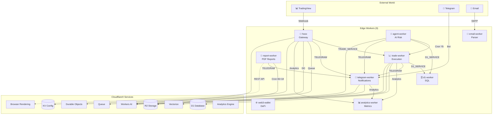

# 🏗️ Architecture Overview

> Understanding the Hoox system design — 9 workers, 12+ Cloudflare services, all on Free plan

## High-Level Architecture

Hoox is a **service-oriented** platform where multiple Cloudflare® Workers communicate via:

1. **Service Bindings** — Direct worker-to-worker calls (microsecond latency)
2. **Shared Resources** — KV, D1, R2, Vectorize, Durable Objects, Queues
3. **Smart Placement** — Workers auto-deploy to edge node closest to exchange APIs

## System Diagram



## Worker Map

| Worker             | Role                     | Cron     | Public | Smart Placement | Observability |
| ------------------ | ------------------------ | -------- | ------ | --------------- | ------------- |
| hoox               | Gateway entry point      | No       | ✅     | ✅              | ✅            |
| trade-worker       | Multi-exchange execution | No       | ❌     | ✅              | ✅            |
| agent-worker       | AI risk manager          | ✅ \*/5  | ❌     | ✅              | ✅            |
| telegram-worker    | Notifications            | No       | ❌     | ✅              | ✅            |
| d1-worker          | Database operations      | No       | ❌     | ✅              | ✅            |
| web3-wallet-worker | DeFi/on-chain            | No       | ❌     | —               | —             |
| email-worker       | Email parsing            | No       | ❌     | —               | —             |
| analytics-worker   | Time-series analytics    | No       | ❌     | —               | —             |
| report-worker      | PDF reports              | ✅ 06+18 | ❌     | ✅              | ✅            |

## Component Responsibilities

### hoox (Gateway)

- Validates API keys + IP allowlist + KV-backed rate limiting
- Real DO idempotency (SQLite-backed, alarm cleanup)
- Routes to internal workers via Service Bindings
- Analytics tracking on every API call

### trade-worker

- Executes trades on Binance, Bybit, MEXC
- Dynamic exchange routing via CONFIG_KV (no redeploy)
- R2 log offloading to preserve D1 write limits
- Smart Placement deploys closest to exchange servers

### agent-worker

- 5-min cron: trailing stops, kill switch, health summaries
- Multi-provider AI gateway (5 providers, fallback chain)
- Vision analysis, reasoning models, SSE streaming

### telegram-worker

- Notifications + command processing
- RAG via Vectorize embeddings
- File uploads to R2, AI-powered responses

### d1-worker

- Centralized SQLite database service
- Signal storage, trade history, position tracking

### report-worker

- Twice-daily PDF reports via Browser Rendering REST API
- HTML→PDF conversion, R2 storage, Telegram delivery

## Security Layers

```
Layer 1: WAF — IP allowlist + rate limiting (edge-level)
Layer 2: API Key Validation — Secret binding comparison
Layer 3: Service Binding Auth — Internal workers zero public endpoints
Layer 4: Internal Key Validation — Worker-to-worker auth header (standardized as INTERNAL_KEY_BINDING across all workers)
Layer 5: Idempotency — DO prevents duplicate trades on retry
```

> **Auth Standardization:** All internal workers (`trade-worker`, `d1-worker`, `agent-worker`, `telegram-worker`) now use the same `INTERNAL_KEY_BINDING` binding name with the shared `requireInternalAuth` middleware from `@jango-blockchained/hoox-shared/middleware`.

## Next Steps

- [Worker Communication](communication.md)
- [Data Flow](data-flow.md)
- [Bindings Reference](bindings.md)
