Hoox is an enterprise-grade, serverless algorithmic trading platform built entirely on **Cloudflare's Edge V8 isolates** and globally distributed resources. By using a modular, service-oriented architecture, Hoox decomposes complex trading processes into ten highly specialized micro-workers.

These workers communicate privately in microseconds, auto-scale globally near exchange servers, and store transaction logs in localized databases—all while running within Cloudflare's $0 free tiers.

---

## 🗺️ High-Level System Architecture

The ecosystem splits public-facing ingress points from private internal compute layers:

```mermaid
graph TB
    %% ── Styling ──────────────────────────────────────────────────────
    classDef external fill:#f5f5f5,stroke:#999,stroke-width:2,color:#333
    classDef waf fill:#fff8e1,stroke:#f9a825,stroke-width:2
    classDef worker fill:#e8f5e9,stroke:#43a047,stroke-width:2,color:#1b5e20
    classDef storage fill:#e3f2fd,stroke:#1e88e5,stroke-width:2,color:#0d47a1
    classDef compute fill:#f3e5f5,stroke:#8e24aa,stroke-width:2,color:#4a148c
    classDef dash fill:#fff3e0,stroke:#ef6c00,stroke-width:2,color:#bf360c

    %% ── Ingress Layer ────────────────────────────────────────────────
    subgraph Ingress["🌐 Public Ingress Layer"]
        TV["📊 TradingView Webhooks"]:::external
        TG["💬 Telegram Bot Commands"]:::external
        EM["📧 Email Signal Senders"]:::external
        WAF["🧱 Cloudflare WAF / Firewall"]:::waf
        GW["🔐 hoox Gateway Isolate"]:::worker
    end

    %% ── Private Compute Layer ────────────────────────────────────────
    subgraph Compute["⚡ Private Internal Edge Compute"]
        TW["📈 trade-worker (Execution Engine)"]:::worker
        D1W["🗄️ d1-worker (SQL Hub)"]:::worker
        AW["🧠 agent-worker (AI Risk Manager)"]:::worker
        TGW["💬 telegram-worker (Notifications)"]:::worker
        EMW["📧 email-worker (Email Parser)"]:::worker
        W3W["🌐 web3-wallet (DeFi Swaps)"]:::worker
        ANW["📊 analytics-worker (observability)"]:::worker
        RPW["📄 report-worker (PDF Generator)"]:::worker
    end

    %% ── Storage & Resource Layer ─────────────────────────────────────
    subgraph Storage["💾 Persistent Edge Storage"]
        KV[("KV Config Namespace")]:::storage
        DB[("D1 SQLite Database")]:::storage
        R2[("R2 Logs & PDF Bucket")]:::storage
        VEC[("Vectorize RAG Index")]:::storage
        DO{{"🔒 Durable Objects mutex"}}:::compute
        Q{{"📨 Queues Queue"}}:::compute
        BR{{"🌐 Browser Rendering Chrome"}}:::compute
    end

    %% ── Flow Connections ─────────────────────────────────────────────
    TV --> WAF
    WAF --> GW
    EM --> EMW
    TG --> TGW

    GW -->|Service Binding| TW
    GW -->|Service Binding| TGW
    GW -->|Service Binding| ANW
    GW -->|Durable Object Lock| DO
    GW -->|Queue Failover| Q

    TW -->|Service Binding| D1W
    TW -->|Service Binding| TGW
    TW -->|Service Binding| ANW
    TW -->|DeFi Execution| W3W
    TW -.->|Config Read| KV
    TW -.->|Write Trade Logs| R2

    D1W -.->|SQLite queries| DB
    TGW -.->|Semantic RAG search| VEC
    TGW -->|Service Binding| ANW

    AW -->|Cron 5m / Position Scale| TW
    AW -->|Service Binding| TGW
    AW -->|Service Binding| D1W

    RPW -->|Cron 2x/day / Render PDFs| BR
    RPW -.->|Save Reports| R2
    RPW -->|Push PDF Link| TGW
```



---

## 📊 Comprehensive Micro-Worker Catalog

| Worker Name            |  Runtime Scope   | Cron Trigger |    Public Routing    |      Smart Placement       | Primary Observability |
| :--------------------- | :--------------: | :----------: | :------------------: | :------------------------: | :-------------------: |
| **`hoox`**             |  Gateway Router  |      No      | **Yes** (`/webhook`) |    **Yes** (Fast path)     | Time-series Telemetry |
| **`trade-worker`**     | Order Execution  |      No      |    No (Isolated)     | **Yes** (Exchange Proxied) |    Execution Logs     |
| **`agent-worker`**     | Risk Management  |  Cron `*/5`  |    No (Isolated)     | **Yes** (Account Auditing) |      Alert Logs       |
| **`telegram-worker`**  |  Alerts & Chat   |      No      |    No (Isolated)     |  **Yes** (Telegram APIs)   |     Command Logs      |
| **`d1-worker`**        |  SQLite Manager  |      No      |    No (Isolated)     |   **Yes** (SQLite Bound)   |     Query Latency     |
| **`report-worker`**    |  Puppeteer PDF   | Cron `06,18` |    No (Isolated)     |  **Yes** (Rendering APIs)  |     Print Status      |
| **`email-worker`**     |   IMAP Parsing   |  Cron `*/5`  |    No (Isolated)     |             No             |   Parse Statistics    |
| **`web3-wallet`**      | DeFi Swap Engine |      No      |    No (Isolated)     |             No             |     Tx Sign Logs      |
| **`analytics-worker`** |  Observability   |      No      |    No (Isolated)     |             No             |    Metrics Dataset    |

---

## 🛡️ The 5-Layer Security Architecture

Security is designed as concentric protective corridors:

```
[ WAF: IP Range Allow-list ] -> [ Gateway: Webhook Passkey ] -> [ Isolation: Service Bindings ] -> [ Worker Auth: INTERNAL_KEY ] -> [ Mutex: Durable Objects ]
```

### Layer 1: Edge-Level Firewall & WAF

Cloudflare’s global WAF drop connections immediately at the edge if:

- The payload does not originate from verified TradingView webhook IP ranges.
- The request rate exceeds threshold ceilings (10 requests/minute).

---

### Layer 2: Webhook Passkey Authentication

The `hoox` gateway validates that the payload `apiKey` string exactly matches the encrypted `webhooks:api_key` stored inside your `CONFIG_KV` namespace. Mismatched signals are instantly dropped with a `401 Unauthorized` response.

---

### Layer 3: Service Binding Encrypted Isolation

Internal workers (`trade-worker`, `d1-worker`, `agent-worker`) expose **zero** public HTTP endpoints. They cannot be targeted or accessed from the public internet. They can only be invoked internally by other V8 isolates using Cloudflare **Service Bindings**.

---

### Layer 4: Standardized Internal Authorization

To prevent internal bypass or privilege escalation, all internal microservice boundaries enforce a strict **bearer authorization check**:

- All internal workers (`hoox`, `trade-worker`, `d1-worker`, `agent-worker`, `telegram-worker`) are bound to the same `INTERNAL_KEY_BINDING` secret.
- Every service-to-service invocation is audited by the shared `requireInternalAuth` middleware from `@jango-blockchained/hoox-shared/middleware`, dropping unauthorized calls.

---

### Layer 5: Durable Object Idempotency Locks

If the network drops after an order fill, TradingView will resend the webhook. The gateway uses a single-threaded **Durable Object** to lock the request trace ID. If the transaction ID has already been logged, the duplicate is dropped before hitting exchange APIs, preventing double-ordering.

---

<Tip>
  Smart Placement is enabled across all critical execution paths. This ensures
  that even though your webhook might hit a Cloudflare edge node in London, the
  actual transaction logic automatically shifts to Frankfurt or Tokyo (wherever
  the exchange APIs reside), eliminating network slippage entirely.
</Tip>

---

## 📊 Codebase Dependency Graph

Hoox ships with an automated **function-level dependency graph extractor** that maps every exported symbol, import, call, type reference, and service binding across all 917 source files and 14 workspaces.

### Generating the Graph

```bash
# From repository root
bun run graph
```

This runs `scripts/extract-graph.ts` (powered by **ts-morph**) and scans 917 source files across all 14 workspaces in **~20–25s**.

During extraction, an **8-phase live progress bar** reports each stage with timing:

```
  [██░░░░░░░░░░░░░░░░░░] 13%  exports: 1667 nodes             10.6s
  [██████████░░░░░░░░░░] 50%  type refs: 2536 edges            1.7s
  [████████████░░░░░░░░] 63%  calls: 445 edges                 9.7s
  [████████████████████] 100% Done                             22.0s

⏱  Total time: 22.0s
```

| File                  | Size   | Format                       | Purpose                                                                  |
| --------------------- | ------ | ---------------------------- | ------------------------------------------------------------------------ |
| `graph-metadata.json` | ~45 KB | JSON                         | Human-authored semantics (tracked in git)                                |
| `graph.json`          | ~2.5 MB | JSON (nodes + edges)        | Machine-readable graph — **generated** via `bun run graph`, not committed |
| `graph.dot`           | ~1.3 MB | Graphviz DOT                | Visual rendering — **generated**, not committed                          |

### Node Types & Color Coding (DOT)

| Shape       | Kind             | Example                     |
| ----------- | ---------------- | --------------------------- |
| `box`       | Function / Const | `executeTrade`, `CONFIG_KV` |
| `note`      | Interface / Type | `TradeRequest`, `Env`       |
| `component` | Class            | `IdempotencyDO`             |
| `Mrecord`   | Enum             | `ExitCode`, `OrderStatus`   |
| Penwidth=2  | Entry Point      | `main`, `export default`    |

Entry points (top-level workspace exports) are highlighted with double borders.

### Edge Color Legend

| Color                    | Edge Kind        | Count |
| ------------------------ | ---------------- | ----- |
| 🔵 Blue `#4A90D9`        | Imports          | 2,524 |
| 🟠 Orange `#FF9800`      | Type references  | 2,536 |
| 🩷 Pink `#E91E63`        | Cross-file calls | 445   |
| 🟢 Green `#4CAF50`       | Extends          | 7     |
| 🌿 Light Green `#8BC34A` | Implements       | 2     |
| 🟣 Purple `#673AB7`      | Service bindings | 11    |
| 🌊 Cyan `#00BCD4`        | Workspace deps   | 11    |

### Rendering to SVG

```bash
# Requires Graphviz installed
dot -Tsvg graph.dot -o graph.svg

# Or paste graph.dot into edotor.net / viz-js.com
```

### Key Extraction Rules

- **Export-only nodes**: Only exported symbols appear in the graph (684 unexported symbols filtered out).
- **Call edge fallback**: Method calls like `router.post` resolve via TypeChecker; when the symbol name (`post`) doesn't match a top-level export, the edge falls back to the target file's first container node.
- **Self-reference filtering**: Calls within the same file are excluded.
- **Deduplication**: Duplicate edges are collapsed into a single entry.
- **Service bindings**: Parsed from each worker's `wrangler.jsonc` configuration.

---

### 🔗 Next Steps

- **[Worker Communication Specifications](communication)** — Deep dive into service bindings, zero-TCP routing, and V8 engines.
- **[Data Flow Maps](data-flow)** — Step-by-step sequence charts of trade executions and cron risk evaluations.
- **[Codebase Dependency Graph](overview#-codebase-dependency-graph)** — Generate a live architecture map of all exports, calls, and bindings.

**Enterprise / Institutional Scale**

For the full bleeding-edge Enterprise architecture (Workers for Platforms multi-tenancy, Workflows, Logpush audit, AI Gateway, Bot Management, etc.) — the commercial layer on top of the open core — see:

- `docs/enterprise/architecture.mdx`
- `docs/enterprise/multi-tenancy.mdx`
- `docs/enterprise/observability-audit.mdx`
- `docs/enterprise/security-compliance.mdx`

See also root `OPEN_CORE.md` and `OPEN_CORE_FEATURE_SPLIT.md`.

These build directly on the current retail architecture while unlocking Cloudflare Enterprise features and 2025-2026 primitives.
