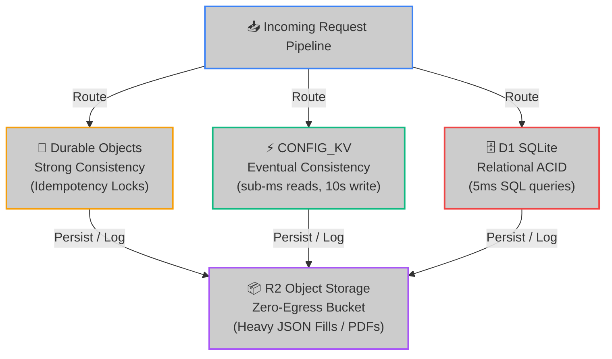

# 💾 Storage & Data Engineering Spec

Hoox operates a **multi-tier edge storage topology** to balance high-speed read/write performance, relational transactional safety, and long-term analytical capacity. By separating high-frequency dynamic states from static parameters and verbose event logs, Hoox ensures that latency remains in the single-digit milliseconds while keeping storage costs at $0/month.

---

## 1. The Multi-Tier Storage Architecture

Hoox segregates data into four distinct edge storage tiers based on consistency, read/write latency, and size constraints:



| Storage primitive   | Engine Technology   | Consistency Model    | Read Latency | Write Latency | Ideal Use Case                                               |
| :------------------ | :------------------ | :------------------- | :----------: | :-----------: | :----------------------------------------------------------- |
| **Durable Objects** | In-Memory Mutex     | Strong Consistency   |  **< 2ms**   |   **< 5ms**   | Atomic transaction locks, high-frequency concurrency dedup.  |
| **Workers KV**      | Distributed Cache   | Eventual Consistency |  **< 1ms**   |   **< 10s**   | Dynamic exchange routing paths, emergency Kill Switch.       |
| **D1 Database**     | Edge SQLite Isolate | Relational ACID      |  **< 5ms**   |  **< 12ms**   | Fills ledger, open positions matrix, margin balance records. |
| **R2 Storage**      | S3 Object Bucket    | Strong (per-object)  |  **< 35ms**  |  **< 50ms**   | Verbose exchange API request/response JSONs, PDF reports.    |

---

## 🗄️ 2. D1 Relational Engine & Drizzle Schema Specs

D1 runs a serverless SQLite engine embedded in the Cloudflare V8 worker isolate thread. This eliminates TCP handshake overhead when executing SQL queries.

### Drizzle ORM Schema Standards

Hoox developers use Drizzle ORM to define strict type safety for D1 SQLite tables. Below is the active specification for our `trades` and `positions` schemas:

```typescript
import { sqliteTable, text, real, integer } from "drizzle-orm/sqlite-core";

// 1. Transactional Trades Ledger Schema
export const trades = sqliteTable("trades", {
  id: text("id").primaryKey(), // UUIDv4
  requestId: text("request_id").notNull(), // Distributed Trace ID
  exchange: text("exchange").notNull(), // "bybit" | "binance" | "mexc"
  symbol: text("symbol").notNull(), // Uppercase symbol: "BTCUSDT"
  action: text("action").notNull(), // "LONG" | "SHORT" | "CLOSE"
  side: text("side").notNull(), // "BUY" | "SELL"
  quantity: real("quantity").notNull(), // Executed contract quantity
  price: real("price").notNull(), // Execution fill price
  fee: real("fee").notNull(), // Exchange transaction fee paid in quote
  orderId: text("order_id").notNull(), // Exchange-provided order identifier
  status: text("status").notNull(), // "Filled" | "Failed"
  createdAt: integer("created_at", { mode: "timestamp" }).default(new Date()),
});

// 2. Real-Time Open Position Matrix Schema
export const positions = sqliteTable("positions", {
  symbol: text("symbol").primaryKey(),
  exchange: text("exchange").notNull(),
  side: text("side").notNull(), // "LONG" | "SHORT"
  size: real("size").notNull(), // Current contract size
  entryPrice: real("entry_price").notNull(), // Volume-weighted average entry price
  leverage: integer("leverage").default(1),
  updatedAt: integer("updated_at", { mode: "timestamp" }).default(new Date()),
});
```

---

## 📦 3. R2 Log Offloading: SQLite Conservation Strategy

SQLite engines are single-writer databases. If write concurrency is too high, transaction queues can lock the thread. To conserve D1 write limits and maintain high performance during high-frequency events:

1. **D1 Relational Logs**: Only high-value financial transactions (the structured fields in the `trades` table above) are written to D1.
2. **R2 Verbose Blobs**: Full, verbose JSON payload exchanges, network headers, and WebSocket stream records are serialized and saved to **R2 Storage** using date-based key paths:
   `logs/bybit/BTCUSDT/2026-05-19/order-18049284739.json`

This offloading strategy reduces D1 SQLite write volumes by **up to 75%**, keeping your database compact, fast, and fully within free-tier limits.

---

## 🔑 4. KV Eventual Consistency & Cache Performance

Cloudflare KV is a highly distributed key-value store optimized for high-read/low-write operations:

- **Eventual Consistency**: When you toggle a setting in KV (e.g. `trade:kill_switch = true`), the change is instantly cached at your local gateway node. However, it takes up to **10 seconds** to propagate to Cloudflare’s other 330+ locations globally.
- **Operational Rule**: KV is perfect for global configurations, allowlists, and emergency kill switches. It is **never** used to track highly dynamic real-time states like position sizes, account drawdowns, or margin balances. High-frequency states must always be routed through D1 or Durable Objects.

---

> **Danger:** Never attempt to run raw migration files directly on your production D1 database without first running a backup. Ensure your database status is fully tracked and synchronized using Drizzle migrations: `hoox db migrate --remote`.

### 🔗 Next Steps

- **[Internal Endpoints Mapping](endpoints.md)** — Map out exposed ports, URLs, and service bindings.
- **[Wrangler Setup & Tooling](../development/local-dev.md)** — Configure Wrangler to bind local D1 and KV instances for dev testing.
