# 🔄 CI/CD Pipeline Automation

Automating your deployment pipeline ensures that every commit pushed to your repository is systematically vetted for code style, type safety, syntax regressions, and unit test coverage before being deployed to your live production trading nodes.

This guide provides the complete specification and production-grade YAML workflow for implementing **GitHub Actions** integration pipelines.

---

## 🏗️ The Continuous Integration & Deployment Pipeline Flow

```mermaid
graph TD
    Push["👾 Git Push: main"] -->|Step 1| Checkout["📥 Checkout submodules"]
    Checkout -->|Step 2| Install["🧅 Bun Install & Cache"]
    Install -->|Step 3| Lint["🔍 Code Formatting & Lint"]
    Lint -->|Step 4| Typecheck["⚙️ tsc Typecheck"]
    Typecheck -->|Step 5| Test["🧪 Bun Test Suite"]
    Test -->|Step 5b| Audit["🔒 bun audit \n(dependency vulns)"]
    Audit -->|Step 6| Deploy["🚀 Sequenced Edge Deployment"]
    Deploy -->|Step 7| Notify["💬 Telegram Notification"]

    SecretScan["🕵️ gitleaks \n(secret scanning)"] -.->|Parallel| Lint
    CodeQL["🔬 CodeQL \n(weekly SAST)"] -.->|Parallel| Lint

    style Push fill:#1e293b,stroke:#3b82f6,stroke-width:2
    style Checkout fill:#1e293b,stroke:#10b981,stroke-width:1
    style Install fill:#1e293b,stroke:#10b981,stroke-width:1
    style Lint fill:#1e293b,stroke:#f59e0b,stroke-width:1
    style Typecheck fill:#1e293b,stroke:#f59e0b,stroke-width:1
    style Test fill:#1e293b,stroke:#f59e0b,stroke-width:1
    style Audit fill:#1e293b,stroke:#ef4444,stroke-width:1
    style SecretScan fill:#1e293b,stroke:#a855f7,stroke-width:1
    style CodeQL fill:#1e293b,stroke:#a855f7,stroke-width:1
    style Deploy fill:#1e293b,stroke:#ef4444,stroke-width:2
    style Notify fill:#1e293b,stroke:#10b981,stroke-width:1
```



---

## 📝 Complete GitHub Actions Workflow (`deploy.yml`)

Create a YAML workflow file inside your repository at `.github/workflows/deploy.yml`:

```yaml
name: "Hoox Production CI/CD Pipeline"

on:
  push:
    branches:
      - main
  pull_request:
    branches:
      - main

concurrency:
  group: ${{ github.workflow }}-${{ github.ref }}
  cancel-in-progress: true

jobs:
  verify-and-deploy:
    name: "Verify & Deploy Stack"
    runs-on: "ubuntu-latest"
    timeout-minutes: 15

    steps:
      # 1. Checkout repository with all worker submodules recursively
      - name: "Checkout Codebase"
        uses: "actions/checkout@v4"
        with:
          submodules: "recursive"
          fetch-depth: 0

      # 2. Install Bun JavaScript runtime environment
      - name: "Setup Bun Runtime"
        uses: "oven-sh/setup-bun@v2"
        with:
          bun-version: "latest"

      # 3. Cache Bun dependency modules to optimize pipeline speeds
      - name: "Cache Workspace Dependencies"
        uses: "actions/cache@v4"
        with:
          path: "~/.bun/install/cache"
          key: "${{ runner.os }}-bun-${{ hashFiles('**/bun.lockb') }}"
          restore-keys: |
            ${{ runner.os }}-bun-

      # 4. Install all monorepo dependencies
      - name: "Install Dependencies"
        run: "bun install"

      # 5. Check formatting and ESLint rules
      - name: "Run Lint Checks"
        run: "bun run lint"

      # 6. Verify TypeScript compile-time type-safety (tsc --noEmit)
      - name: "Run Type Checks"
        run: "bun run typecheck"

      # 7. Execute all unit and integration test assertions (excluding live tests)
      - name: "Run Bun Test Suite"
        run: "bun test"

      # 8. Deploy all database schemas and workers in correct sequence
      - name: "Deploy Entire Edge Stack"
        if: "github.ref == 'refs/heads/main' && github.event_name == 'push'"
        env:
          CLOUDFLARE_API_TOKEN: "${{ secrets.CLOUDFLARE_API_TOKEN }}"
          CLOUDFLARE_ACCOUNT_ID: "${{ secrets.CLOUDFLARE_ACCOUNT_ID }}"
          SUBDOMAIN_PREFIX: "${{ secrets.SUBDOMAIN_PREFIX }}"
        run: |
          # Bootstrap local path binaries
          bun run build:cli

          # Deploy D1 SQL schemas to production
          npx wrangler d1 execute trade-data-db --file=workers/trade-worker/schema.sql --remote --yes

          # Sequentially upload all enabled workers
          ./packages/cli/bin/hoox.js deploy all --auto --quiet

          # Post-deployment: update service bindings URLs globally
          ./packages/cli/bin/hoox.js deploy update-internal-urls --quiet

          # Post-deployment: apply KV manifest configurations
          ./packages/cli/bin/hoox.js deploy kv-config --quiet

          # Post-deployment: update Telegram bot webhook routing path
          ./packages/cli/bin/hoox.js deploy telegram-webhook --quiet
```

---

## 🔒 Managing Secrets & Variable Scopes

To authorize GitHub to interact with your Cloudflare account, navigate to your repository's **Settings > Secrets and variables > Actions** and register the following Action Secrets:

1. **`CLOUDFLARE_API_TOKEN`**: A secure, scoped token with Workers, D1, KV, and DNS write permissions.
2. **`CLOUDFLARE_ACCOUNT_ID`**: Your unique 32-character Cloudflare dashboard hash.
3. **`SUBDOMAIN_PREFIX`**: The subdomain namespace chosen for your deployments.
4. **`GITHUB_TOKEN`**: Auto-provided, used by gitleaks for PR annotations.
5. **`INTERNAL_AUTH_KEY`**, **`HOOX_API_KEY`**, **`LOAD_TEST_BASE_URL`**: Required for nightly k6 load tests (see [Security Overview](../security/overview.md#environment-setup)).

> **Note:** You **never** need to store worker-specific secrets (like Bybit API keys or Telegram Bot tokens) in GitHub Secrets. These are stored directly in Cloudflare's secured key vaults. The CI pipeline only deploys the code logic; the running edge isolates pull their credentials locally from Cloudflare’s hardware-level Secret Store at runtime.

---

## 🧪 Pipeline Caching & Concurrency Controls

- **Concurrency Lock**: The `concurrency` block configured in the YAML ensures that if you push a new commit while a previous deployment pipeline is running, GitHub Actions will **automatically cancel** the older, redundant run to avoid race conditions or double-deploying.
- **Bun Cache**: Caching dependency directories reduces build-time installation overhead from minutes to **under 8 seconds**.

### 🔗 Next Steps

- **[Production Deployment Manual](production.md)** — Audit DNS zones and custom domain routing options.
- **[System Observability & Monitoring](monitoring.md)** — Stream console logs and check analytics datasets.
