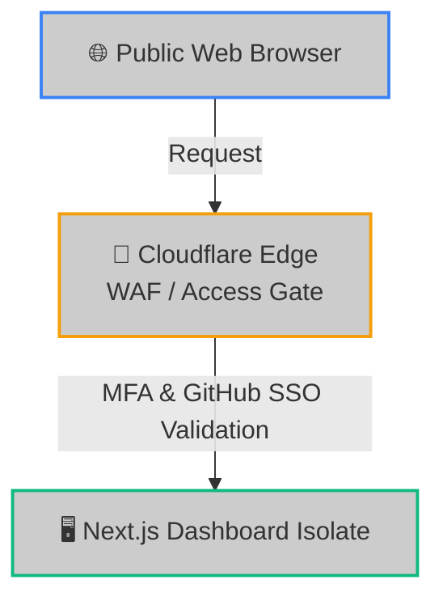

# 🔒 Zero Trust & Security Hardening

While the Hoox dashboard features a highly secure, custom cookie-based authentication middleware, wrapping your dashboard and API endpoints inside **Cloudflare® Zero Trust (Access)** provides an enterprise-grade security perimeter.

By placing your deployment behind Cloudflare Access, you can enforce Multi-Factor Authentication (MFA), restrict access to specific GitHub/Google SSO identities, evaluate device posture, and drop malicious scanner payloads at the DNS level before they ever hit your workers.

---

## 🏗️ The Zero Trust Protective Boundary



- **Zero Public Exposure**: The dashboard isolate does not evaluate public logins directly.
- **MFA Gate**: Users are intercepted by a secure Cloudflare authentication card at the nearest edge PoP.
- **Zero Cost**: Cloudflare's Zero Trust free tier includes up to 50 users, which is more than enough for a personal algorithmic trading desk.

---

## ⚡ 1. Step-by-Step Dashboard Access Setup

### Step 1: Enable Zero Trust on Your Account

1. Log in to the Cloudflare Dashboard and click **Zero Trust** on the sidebar.
2. If this is your first time, follow the onboarding prompts to register a unique **Team Name** (e.g. `alpha-trading.cloudflareaccess.com`).

---

### Step 2: Create a Self-Hosted Application

1. In the Zero Trust dashboard, navigate to **Access > Applications** and click **Add an application**.
2. Select **Self-hosted**.
3. **Application Name**: `Hoox Dashboard Cockpit`.
4. **Session Duration**: Select your preference (e.g. `24 Hours` to prevent constant login prompts).
5. **Application Domain**: Enter the custom domain mapped to your dashboard worker (e.g., `hoox.my-trading-empire.com`).

---

### Step 3: Configure Authorization Policies

1. Click **Next** to proceed to the Policies tab.
2. **Policy Name**: `Allow Admin Only`.
3. **Action**: `Allow`.
4. **Configure Rules**:
   - **Include**: Select **Emails** and enter your personal email address (enables Email OTP).
   - **Include (SSO)**: Alternatively, select **GitHub Org/Teams** or **Google Workspace** to enable SSO integrations.
5. In the **Require** block, you can optionally require a valid **security key (MFA)** or **device posture check** (e.g. verifying that your laptop runs a specific OS version).

---

### Step 4: Map Identity Providers & Save

1. In **Settings > Authentication**, link your desired login providers (Google Workspace, GitHub OAuth, or Email OTP).
2. Save the application.
3. Open your browser and navigate to your custom domain (`https://hoox.my-trading-empire.com`). You will be intercepted by your Cloudflare Access card. Once authorized, you are passed cleanly to your Next.js dashboard.

---

## 🧱 2. Strict WAF Webhook IP Allow-listing

To ensure that **only** TradingView's official servers can fire signals to your `/webhook` entryway:

1. Under your Cloudflare DNS zone dashboard, navigate to **Security > WAF > Custom Rules**.
2. Click **Create Rule**.
3. **Rule Name**: `Restrict /webhook to TradingView IPs`.
4. **Field**: `URI Path` | **Operator**: `equals` | **Value**: `/webhook`.
5. **And**: `IP Source Address` | **Operator**: `is not in` | **Value**: (Paste TradingView's official IP ranges here, which are automatically synced by running the `hoox waf configure --TradingView-only` command).
6. **Action**: **Block** (or **Challenge**).
7. Save. All unauthorized traffic hitting `/webhook` is dropped instantly at the DNS edge, preventing any V8 compute load.

```bash
# Automated WAF setup via CLI
hoox waf configure --TradingView-only
```

---

## ⚙️ 3. Optional: Bypassing Local Dashboard Auth

Once your custom domain is wrapped inside Cloudflare Access, the dashboard's built-in login form (`DASHBOARD_USER`, `DASHBOARD_PASS`) becomes redundant.

To streamline access:

1. Edit the Next.js `middleware.ts` file inside `workers/dashboard/src/`.
2. Toggle the authentication checker to leverage Cloudflare's Access headers:
   ```typescript
   // Next.js Edge Middleware
   export function middleware(request: Request) {
     // Verify the JWT payload injected in headers by Cloudflare Access
     const cfAccessJwt = request.headers.get("Cf-Access-Jwt-Assertion");
     if (cfAccessJwt) {
       // Cloudflare has already authenticated the session. Bypass local login.
       return NextResponse.next();
     }
     // Fallback to local cookie checks...
   }
   ```

### 🔗 Next Steps

- **[Next.js Dashboard worker Profile](../workers/dashboard.md)** — Review OpenNext compilation and asset bindings.
- **[System Observability & Metrics](monitoring.md)** — Setup time-series logging and Analytics Engine tables.
