# 🧪 Testing Framework & QA Standards

To protect live capital and ensure robust order routing, Hoox mandates a rigorous testing pipeline. With money on the line, we verify every contract calculation, rate-limiting gate, and database query.

Our test suite is powered natively by **Bun's high-speed test runner**, comprising **~124 test files** and **~4,500 individual test assertions** split across five diagnostic layers.

---

## 🎚️ The 5 QA Testing Layers

```mermaid
graph TD
    UT["📦 Unit Tests<br/>(~4,000 Assertions)"] -->|Next Layer| IT["🔗 Integration Tests<br/>(34 Assertions)"]
    IT -->|Next Layer| ST["🛡️ Security Tests<br/>(40 Assertions)"]
    ST -->|Next Layer| E2E["🚀 E2E Smoke Tests<br/>(5 Assertions)"]
    E2E -->|Next Layer| LT["🟢 Live Resource Tests<br/>(77 Assertions)"]

    style UT fill:#1e293b,stroke:#3b82f6,stroke-width:2
    style IT fill:#1e293b,stroke:#10b981,stroke-width:2
    style ST fill:#1e293b,stroke:#f59e0b,stroke-width:2
    style E2E fill:#1e293b,stroke:#f59e0b,stroke-width:2
    style LT fill:#1e293b,stroke:#ef4444,stroke-width:2
```



---

## ⚡ Running Tests: CLI Commands

### A. Core Platform Verification (Excluding Live)

```bash
# 1. Run all unit, integration, and E2E smoke tests in parallel
bun test

# 2. Run the suite and output a detailed V8 coverage report
bun test --coverage
```

### B. Workspace-Specific Targeted Runs

To optimize developer feedback loops, you can target specific workspaces or workers:

```bash
# Run CLI commands tests only (packages/cli/)
bun run test:cli

# Run Terminal UI tests only (packages/tui/)
bun run test:tui

# Run shared helper tests only (packages/shared/)
bun run test:shared

# Run all edge workers unit tests (workers/*)
bun run test:workers

# Run a single specific test file with hot-reload watch mode
bun test workers/agent-worker/src/index.test.ts --watch
```

### C. Security & Fuzz Testing

```bash
# Run all security tests (auth bypass, security headers, fuzz)
bun run test:security

# Run specific security test files
bun test tests/security/auth-bypass.test.ts
bun test tests/security/security-headers.test.ts
bun test tests/security/fuzz.test.ts
```

### D. Advanced Integration & Live Runs

```bash
# Run Miniflare 3 gateway integration tests
bun run test:integration

# Run E2E CLI lifecycle smoke tests
bun run test:e2e

# Run live Cloudflare API integration tests (requires tests/live/.env credentials)
bun run test:live --jobs 1

# Run k6 performance/load tests (requires k6 CLI)
bun run test:load
```

---

## 🔒 Type-Safe Mocking Specifications (No `as any`)

To enforce strict TypeScript compiler safety, test files **must never** utilize `as any` to bypass types when mock-binding resources. Always cast stubs using `as unknown as Env`:

```typescript
import { describe, it, expect } from "bun:test";
import type { Env } from "../src/index";

describe("trade-worker Gateway Router Mocking", () => {
  it("should securely mock internal service binding fetchers", async () => {
    // 1. Construct a type-safe mock environment structure
    const mockEnv = {
      INTERNAL_KEY_BINDING: "local_secret_token_183",
      TELEGRAM_SERVICE: {
        fetch: async (url: string, init?: RequestInit) => {
          // Verify auth headers exist
          const headers = init?.headers as Record<string, string>;
          if (headers["X-Internal-Auth-Key"] !== "local_secret_token_183") {
            return new Response(JSON.stringify({ success: false }), {
              status: 401,
            });
          }

          return new Response(
            JSON.stringify({
              success: true,
              messageId: 4829,
            }),
            { status: 200 }
          );
        },
      } as Fetcher,
    } as unknown as Env;

    // 2. Execute assertions
    const res = await mockEnv.TELEGRAM_SERVICE.fetch(
      "https://telegram-worker/alert",
      {
        method: "POST",
        headers: {
          "X-Internal-Auth-Key": "local_secret_token_183",
        },
      }
    );

    const data = await res.json();
    expect(res.status).toBe(200);
    expect(data.success).toBe(true);
    expect(data.messageId).toBe(4829);
  });
});
```

---

## 🚢 Continuous Integration Gates & Coverage Targets

Our GitHub Actions workflows enforce the following quality gates:

1. **TypeScript Type Safety**: All workspaces must compile without errors using `tsc --noEmit`.
2. **Coverage Thresholds**: The monorepo enforces a **minimum 80% coverage threshold** across all core execution paths (`packages/cli`, `packages/shared`, `workers/hoox`, `workers/trade-worker`).
3. **Dependency Audit**: `bun audit` runs after tests to detect known vulnerabilities (informational, doesn't block CI).
4. **Secret Scanning**: `gitleaks` scans all commits for hardcoded secrets on every push/PR (informational).
5. **CodeQL**: Weekly `security-and-quality` analysis for JavaScript/TypeScript.

```bash
# Check your local workspace coverage statistics
bun test packages/shared/ --coverage
```

### 🔗 Next Steps

- **[Security Testing & Hardening](../security/overview.md)** — Auth hardening, security tests, and CI/CD scanning.
- **[Debugging Telemetry Runbook](debugging.md)** — Learn how to trace active V8 memory, tail logs, and audit SQL execution.
- **[Local Development Setup](local-dev.md)** — Configure Wrangler and Docker compose to run testbeds.
