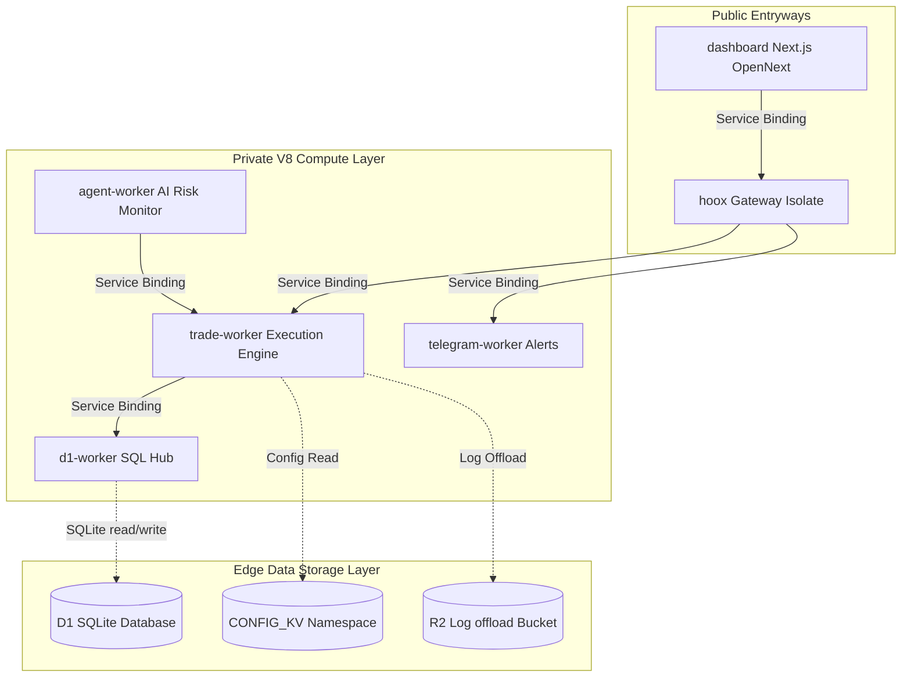

# ⚙️ DevOps Manual

> **Welcome to the Hoox DevOps & System Operations Manual.** This manual is the primary, production-grade reference for system administrators, security engineers, and platform operators responsible for provisioning edge databases, orchestrating secure V8 service bindings, deploying multi-exchange execution workers, auditing secrets, and monitoring system health.

---

## 🗺️ Operator's System Directory

The DevOps manual is structured into five core architectural operational layers:

### 1. 📋 Operations & Setup Runbooks

Complete guides for bootstrapping environments, managing interactive terminal dashboards, and diagnosing local runner configurations:

- **[Operations & Troubleshooting](setup-and-operations.md)** — Core operations manual, 31-key environment variable matrices, and diagnostic codes.
- **[Core Installation Flow](installation-flow.md)** — Guided, step-by-step local machine and edge provision setup.
- **[Terminal UI Cockpit Development](tui.md)** — Code architectures, stores, and operations of the OpenTUI monitor.

### 2. 🏗️ Architectural Specifications

Deep dives into latency structures, isolation parameters, and bindings linkages:

- **[System Topology Overview](architecture/overview.md)** — Architectural layout, regional edge clustering, and scaling limits.
- **[Isolate Communication](architecture/communication.md)** — Deep dive into Service Bindings, zero-TCP routing, and V8 engines.
- **[Data Flow Architecture](architecture/data-flow.md)** — Flowcharts for trade execution, backup queues, and cron risk monitoring.
- **[Bindings Matrix](architecture/bindings.md)** — Exact mapping of D1, KV, Queues, R2, and Service Bindings.
- **[Storage Engineering](architecture/storage.md)** — Persistent storage boundaries, SQLite DDL parameters, and R2 buckets.
- **[Internal Endpoints Map](architecture/endpoints.md)** — Sub-millisecond binding paths and routing maps.
- **[Visual Tokens & Design System](architecture/design-system.md)** — Monochromatic token mappings and visual SVGs catalog.

### 3. ⚙️ Edge Worker Microservices (10 Profiles)

Individual developer profiles for each running isolate, cataloging bindings, custom middlewares, and API formats:

- **[hoox Gateway](workers/hoox.md)** · **[trade-worker](workers/trade-worker.md)** · **[agent-worker](workers/agent-worker.md)** · **[telegram-worker](workers/telegram-worker.md)**
- **[d1-worker](workers/d1-worker.md)** · **[web3-wallet-worker](workers/web3-wallet-worker.md)** · **[email-worker](workers/email-worker.md)** · **[analytics-worker](workers/analytics-worker.md)**
- **[report-worker](workers/report-worker.md)** · **[dashboard (Next.js OpenNext)](workers/dashboard.md)**

### 4. 🚢 Deployment, WAF, & CI/CD Pipelines

Rollout manuals, Access gates, and GitHub Actions telemetry:

- **[Production Deployment](deployment/production.md)** — Wrangler commands, Account provisioning, and production variables.
- **[CI/CD Workflow pipelines](deployment/cicd.md)** — GitHub Actions secrets, syntax tests, and automated edge uploads.
- **[Monitoring & Telemetry](deployment/monitoring.md)** — Live wrangler logs streaming and custom Analytics Engine metrics.
- **[Cloudflare Zero Trust Corridor](deployment/zero-trust.md)** — Setting up Access client corridors, IP firewalls, and WAF rules.

### 💻 5. Developer & API Reference

TypeScript interfaces, compiler settings, Bun test specs, and HTTP schemas:

- **[Wrangler Dev Setup](development/local-dev.md)** · **[Testing Standards](development/testing.md)** · **[Debugging Runbook](development/debugging.md)**
- **[Exposed API Routes](api/endpoints.md)** · **[Request Payloads](api/payloads.md)** · **[Standard Responses](api/responses.md)**
- **[CLI Commands Engine](cli_features.md)** — Command-line argument parsing, binary execution, and JSON flags.

---

'> **Tip:** First time deploying a Hoox workspace to production? Start with the **[Production Deployment Manual](deployment/production.md)** to verify your Cloudflare Account permissions and execute sequential deployments seamlessly.

### 🔗 Quick Links & Offline Reference

- **[End-User Documentation Hub](../home.md)** — Standard setup, cURL webhooks, and TradingView Pine Scripts.
- **[Hoox Git Submodules](https://github.com/jango-blockchained/hoox-setup)** — Central monorepo codebase.
- **[Download Enduser Full PDF Manual](/Enduser-Full-Documentation.pdf)** — Complete concatenated offline guide.

- **[Download DevOps Full PDF Manual](/DevOps-Full-Documentation.pdf)** — Complete concatenated offline DevOps spec.

- **[View Consolidated LLM Context Text](/llm.txt)** — Giant single-file text format for AI/LLM models.
