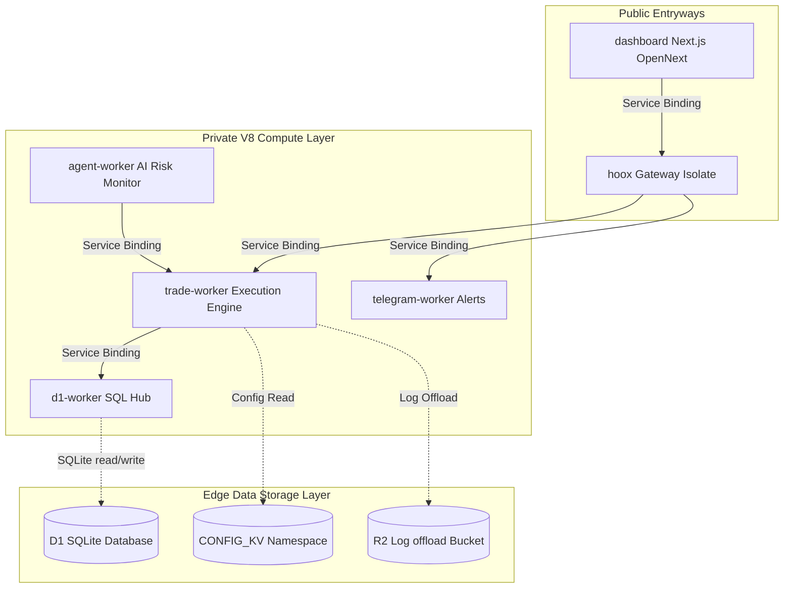

<Tip>
  This manual is the primary, production-grade reference for system
  administrators, security engineers, and platform operators responsible for
  provisioning edge databases, orchestrating secure V8 service bindings,
  deploying multi-exchange execution workers, auditing secrets, and monitoring
  system health.
</Tip>

---

## 🗺️ Operator's System Directory

The DevOps manual is structured into five core architectural operational layers:

### 1. 📋 Operations & Setup Runbooks

Complete guides for bootstrapping environments, managing interactive terminal dashboards, and diagnosing local runner configurations:

- **[Operations & Troubleshooting](setup-and-operations)** — Core operations manual, 31-key environment variable matrices, and diagnostic codes.
- **[Core Installation Flow](installation-flow)** — Guided, step-by-step local machine and edge provision setup.
- **[Terminal UI Cockpit Development](tui)** — Code architectures, stores, and operations of the OpenTUI monitor.

### 2. 🏗️ Architectural Specifications

Deep dives into latency structures, isolation parameters, and bindings linkages:

- **[System Topology Overview](architecture/overview)** — Architectural layout, regional edge clustering, and scaling limits.
- **[Isolate Communication](architecture/communication)** — Deep dive into Service Bindings, zero-TCP routing, and V8 engines.
- **[Data Flow Architecture](architecture/data-flow)** — Flowcharts for trade execution, backup queues, and cron risk monitoring.
- **[Bindings Matrix](architecture/bindings)** — Exact mapping of D1, KV, Queues, R2, and Service Bindings.
- **[Storage Engineering](architecture/storage)** — Persistent storage boundaries, SQLite DDL parameters, and R2 buckets.
- **[Internal Endpoints Map](architecture/endpoints)** — Sub-millisecond binding paths and routing maps.
- **[Visual Tokens & Design System](architecture/design-system)** — Monochromatic token mappings and visual SVGs catalog.

### 3. ⚙️ Edge Worker Microservices (10 Profiles)

Individual developer profiles for each running isolate, cataloging bindings, custom middlewares, and API formats:

- **[hoox Gateway](workers/hoox)** · **[trade-worker](workers/trade-worker)** · **[agent-worker](workers/agent-worker)** · **[telegram-worker](workers/telegram-worker)**
- **[d1-worker](workers/d1-worker)** · **[web3-wallet-worker](workers/web3-wallet-worker)** · **[email-worker](workers/email-worker)** · **[analytics-worker](workers/analytics-worker)**
- **[report-worker](workers/report-worker)** · **[dashboard (Next.js OpenNext)](workers/dashboard)**

### 4. 🚢 Deployment, WAF, & CI/CD Pipelines

Rollout manuals, Access gates, and GitHub Actions telemetry:

- **[Production Deployment](deployment/production)** — Wrangler commands, Account provisioning, and production variables.
- **[CI/CD Workflow pipelines](deployment/cicd)** — GitHub Actions secrets, syntax tests, and automated edge uploads.
- **[Monitoring & Telemetry](deployment/monitoring)** — Live wrangler logs streaming and custom Analytics Engine metrics.
- **[Cloudflare Zero Trust Corridor](deployment/zero-trust)** — Setting up Access client corridors, IP firewalls, and WAF rules.

### 💻 5. Developer & API Reference

TypeScript interfaces, compiler settings, Bun test specs, and HTTP schemas:

- **[Wrangler Dev Setup](development/local-dev)** · **[Testing Standards](development/testing)** · **[Debugging Runbook](development/debugging)**
- **[Exposed API Routes](api/endpoints)** · **[Request Payloads](api/payloads)** · **[Standard Responses](api/responses)**
- **[CLI Commands Engine](cli-features)** — Command-line argument parsing, binary execution, and JSON flags.

---

<Tip>
  First time deploying a Hoox workspace to production? Start with the
  **[Production Deployment Manual](deployment/production)** to verify your
  Cloudflare Account permissions and execute sequential deployments seamlessly.
</Tip>

### 🔗 Quick Links

- **[End-User Documentation Hub](../index)** — Standard setup, cURL webhooks, and TradingView Pine Scripts.
- **[Hoox Git Submodules](https://github.com/jango-blockchained/hoox-setup)** — Central monorepo codebase.
