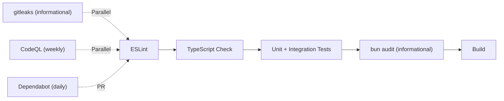

# 🔒 Security Testing & Hardening

## Overview

Security work spans three layers:

1. **Code Hardening** — Fixing auth vulnerabilities (fail-closed middleware, timing-safe comparisons)
2. **Security Testing** — Auth bypass tests, fuzz tests, header verification
3. **CI/CD Scanning** — Dependency auditing, secret detection, CodeQL analysis

---

## 1. Auth Middleware Hardening

### `requireInternalAuth` — Fail-Closed

**File:** `packages/shared/src/middleware/auth.ts`

Previously, `requireInternalAuth()` returned `null` (allowed the request through) when `INTERNAL_KEY_BINDING` was not configured. This meant workers with unconfigured auth keys were wide open.

**Fix:** The middleware now returns `401 Unauthorized` when the key is missing:

```typescript
// Before: auth was optional when key not set
if (!expectedKey) return null;

// After: fails closed
if (!expectedKey) {
  return new Response(
    JSON.stringify({
      success: false,
      error: `Internal auth key ${keyName} not configured`,
    }),
    { status: 401, headers: { "Content-Type": "application/json" } }
  );
}
```

### `timingSafeEqual` — Exported for Cross-Worker Use

**File:** `packages/shared/src/middleware/auth.ts`

The `timingSafeEqual()` function was a private helper used only internally by `requireAuth()` and `requireInternalAuth()`. It's now exported so all workers can use it for constant-time string comparisons.

### Webhook API Key — Timing-Safe Comparison

**File:** `workers/hoox/src/index.ts`

The hoox gateway's webhook API key validation was changed from `===` to `timingSafeEqual()` to prevent timing side-channel attacks:

```typescript
// Before (vulnerable to timing attack):
const isValid = apiKey === expectedKey;

// After (constant-time comparison):
const isValid = timingSafeEqual(apiKey, expectedKey);
```

---

## 2. Auth Coverage by Worker

All workers now have authentication on their internal endpoints:

| Worker                 | Auth Method                                  | Protected Endpoints                                              | Unprotected                                      |
| ---------------------- | -------------------------------------------- | ---------------------------------------------------------------- | ------------------------------------------------ |
| **hoox**               | API key in body (timing-safe) + IP allowlist | `POST /webhook`                                                  | `GET /health`                                    |
| **d1-worker**          | `X-Internal-Auth-Key`                        | `POST /query`, `POST /batch`, `GET /api/*`                       | `GET /health`                                    |
| **trade-worker**       | `X-Internal-Auth-Key`                        | `POST /webhook`, `POST /process`                                 | `GET /health`, `GET /api/signals`                |
| **agent-worker**       | `X-Internal-Auth-Key`                        | All `POST /agent/*`, `GET /agent/status\|config\|models\|health` | `GET /`                                          |
| **analytics-worker**   | `X-Internal-Auth-Key`                        | All `POST /track/*` (5 endpoints)                                | `GET /health`                                    |
| **telegram-worker**    | `X-Internal-Auth-Key`                        | `POST /process`                                                  | `GET /health`, `POST /webhook` (Telegram secret) |
| **email-worker**       | `X-Internal-Auth-Key`                        | `POST /email-signal`                                             | `GET /health`, `POST /webhook` (Mailgun HMAC)    |
| **report-worker**      | `X-Internal-Auth-Key`                        | `GET /report`                                                    | `GET /health`                                    |
| **web3-wallet-worker** | `X-Internal-Auth-Key`                        | `GET /` (wallet address)                                         | `GET /health`                                    |
| **dashboard**          | Session cookie                               | All routes                                                       | `/login`, `/api/auth`, `/_next/*`                |

<Note>
  Health check endpoints (`GET /health`) are intentionally left unauthenticated
  for monitoring systems.
</Note>

---

## 3. Shared Security Headers Middleware

**File:** `packages/shared/src/middleware/security-headers.ts`

A reusable middleware that provides 7 standard security headers following the same pattern as the existing `cors.ts` middleware.

### API

```typescript
// Get headers as a plain object
const headers = secureHeaders({ contentSecurityPolicy: "default-src 'self'" });

// Wrap an existing Response with security headers
const secure = wrapWithSecurityHeaders(response);

// Customize individual headers
const custom = secureHeaders({
  xFrameOptions: "SAMEORIGIN",
  contentSecurityPolicy: "", // Disable CSP
});
```

### Default Headers

| Header                      | Default Value                         |
| --------------------------- | ------------------------------------- |
| `X-Content-Type-Options`    | `nosniff`                             |
| `X-Frame-Options`           | `DENY`                                |
| `X-XSS-Protection`          | `1; mode=block`                       |
| `Referrer-Policy`           | `strict-origin-when-cross-origin`     |
| `Permissions-Policy`        | All features disabled                 |
| `Strict-Transport-Security` | `max-age=31536000; includeSubDomains` |
| `Content-Security-Policy`   | `default-src 'self'`                  |

### Dashboard

**File:** `workers/dashboard/src/middleware.ts`

The dashboard was upgraded from 2 headers (`X-Content-Type-Options`, `X-Frame-Options`) to the full 7-header set via the shared middleware. The `withSecurityHeaders()` wrapper ensures headers are applied on **all** return paths (including early returns for static files, login pages, CSRF errors, and auth failures).

---

## 4. Security Test Suites

### Auth Bypass Tests

**File:** `tests/security/auth-bypass.test.ts`
**Tests:** 12

Validates:

- `requireInternalAuth` returns 401 when key is not configured (fail-closed)
- `requireInternalAuth` returns 401 with missing/wrong auth header
- `requireInternalAuth` passes with valid key
- `timingSafeEqual` correctness: identical strings, different lengths, different same-length strings, empty strings, special characters, long keys

### Security Headers Tests

**File:** `tests/security/security-headers.test.ts`
**Tests:** 9

Validates:

- All 7 default headers are present
- Individual header overrides work
- CSP can be disabled (set to empty string)
- `wrapWithSecurityHeaders` preserves body, status, and existing headers
- Custom options pass through

### Fuzz Tests

**File:** `tests/security/fuzz.test.ts`
**Tests:** 19

Validates:

- Auth enforcement on d1-worker `/query` (valid, missing, wrong key)
- SQL injection attempts via auth headers (`' OR '1'='1`, UNION injection)
- `timingSafeEqual` edge cases: Unicode homoglyphs, null bytes, 10k-char strings, regex special chars, emoji
- Request edge cases: missing Content-Type, GET to POST, OPTIONS preflight, extremely long headers
- Webhook payload edge cases: non-JSON body, empty body, unconfigured key (fail-closed)

### Running Security Tests

```bash
# Run all security tests
bun test tests/security/

# Run specific test files
bun test tests/security/auth-bypass.test.ts
bun test tests/security/security-headers.test.ts
bun test tests/security/fuzz.test.ts
```

---

## 5. CI/CD Security Scanning

### Dependency Audit

**File:** `.github/workflows/ci.yml`

A `bun audit` step runs in CI after unit tests to detect known vulnerabilities in dependencies. It's configured with `continue-on-error: true` so it doesn't block development, but findings are visible in workflow output.

### Secret Scanning

**File:** `.github/workflows/secret-scan.yml`
**Config:** `.gitleaks.toml`

Uses `gitleaks/gitleaks-action@v2` to detect hardcoded secrets (API keys, tokens, passwords) across the full git history. Runs on:

- Push/PR to `main` and `develop`
- Weekly (Sunday)
- Manual trigger via `workflow_dispatch`

Information only (`continue-on-error: true`) — findings don't block CI.

#### Secret Allowlist

The `.gitleaks.toml` allowlists:

- Test files (`.test.`, `.spec.`, `tests/`)
- Example/template files (`.example`, `.env.example`)
- Documentation and changelogs
- Generated files (`dist/`, `.next/`, `coverage/`)
- Lock files (`bun.lock`, `package-lock.json`)
- Placeholder patterns (`__SECRET__`, `YOUR_`, `<USE_WRANGLER_SECRET_PUT>`)

### CodeQL

**File:** `.github/workflows/codeql.yml`

Weekly security analysis with `security-and-quality` query suite for JavaScript/TypeScript.

### Dependabot

**File:** `.github/dependabot.yml`

Daily npm and GitHub Actions dependency checks with automatic PR creation.

---

## 6. CI Pipeline Security Flow



---

## 7. Performance & Load Testing

**File:** `tests/load/`
**Tool:** k6 (separate from bun test)

See the `tests/load/` directory for full documentation.

| Script              | Target                        | Description                    |
| ------------------- | ----------------------------- | ------------------------------ |
| `webhook-flow.js`   | hoox `POST /webhook`          | TradingView alert simulation   |
| `d1-query-load.js`  | d1-worker `POST /query+batch` | Concurrent D1 query patterns   |
| `agent-cron-sim.js` | agent-worker                  | 5-minute cron cycle simulation |
| `system-mixed.js`   | All combined                  | 70/20/10 traffic distribution  |

**CI:** Nightly via `.github/workflows/load-test.yml` (informational thresholds).

---

## 8. Environment Setup

### Required GitHub Secrets

For CI security scanning to work, add these to your repository:

| Secret               | Used By           | Purpose                                 |
| -------------------- | ----------------- | --------------------------------------- |
| `GITHUB_TOKEN`       | `secret-scan.yml` | gitleaks PR annotations (auto-provided) |
| `INTERNAL_AUTH_KEY`  | `load-test.yml`   | Internal worker auth for load tests     |
| `HOOX_API_KEY`       | `load-test.yml`   | Webhook API key for load tests          |
| `LOAD_TEST_BASE_URL` | `load-test.yml`   | Target URL for load tests               |

---

## 9. Related Documentation

- [Testing Framework & QA Standards](../development/testing) — Unit/integration/E2E testing
- [CI/CD Pipeline](../deployment/cicd) — Full deployment pipeline
- [Isolate Communication Spec](../architecture/communication) — Service binding auth
- [Zero Trust Deployment](../deployment/zero-trust) — Cloudflare Access + WAF
- [Internal Endpoints Map](../architecture/endpoints) — All worker endpoints
