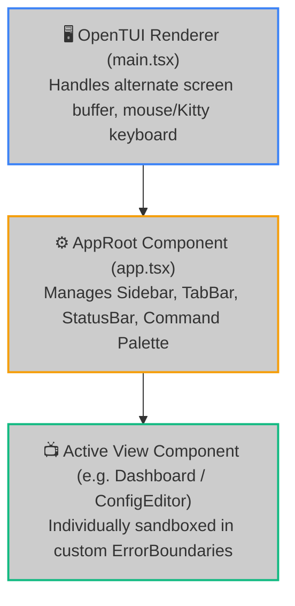
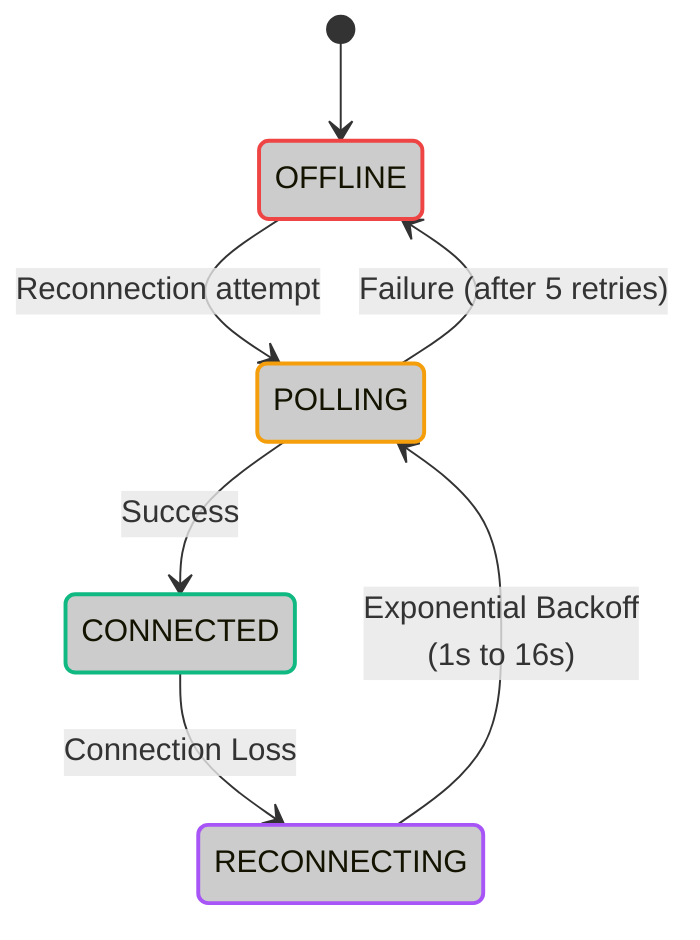

# 🖥️ TUI Code Architecture

The **Hoox Terminal UI (TUI)** is a full-screen, keyboard-driven operations center built natively using **OpenTUI**, React 19, and Zustand state stores. This document outlines the TUI code architecture, directory structure, data flows, and error recovery mechanisms for senior engineers and system operators.

---

## 🏗️ Architectural Blueprint

The cockpit is designed as a modular **Single Page Terminal Application (SPTA)**, structured around three decoupled layers:

---

## 🗃️ Store Architecture & State Flow

TUI state is managed using three specialized **Zustand stores** combined with **Immer middleware** to allow safe, mutating updates to deeply nested state trees:

### 1. UI Store (`src/stores/ui-store.ts`)

- **State Managed**: Active view index, sidebar visibility toggles, active modal overlays (e.g. confirmation dialogs), and the Command Palette fuzzy-search string.
- **Key Actions**: `setView(index)`, `toggleSidebar()`, `pushModal(modal)`, `popModal()`.

### 2. Service Store (`src/stores/service-store.ts`)

- **State Managed**: Real-time worker health matrices, trade logs history, analytics telemetry, log buffers, and the connection status.
- **Key Actions**: `updateWorkerStatus(name, status)`, `addLogEntry(worker, log)`, `addTradeFill(trade)`, `setConnectionState(state)`.

### 3. Config Store (`src/stores/config-store.ts`)

- **State Managed**: UI themes (dark/light), data refresh intervals, Telegram alert routes, and custom keyboard binds.
- **Persistence**: Automatically serialized and saved to disk at `~/.hoox/config.json`.

---

## 🛜 Connection Resilience State Machine

The TUI maintains a strict connection lifecycle to track connectivity to the local API server or remote worker tunnels:

### Exponential Backoff Intervals

If the API connection drops out:

1. The status bar immediately transitions to a yellow/orange pulsing **RECONNECTING** dot.
2. The polling engine schedules reconnect attempts using exponential backoff:
   $$\text{Backoff Interval} = \min(2^{\text{retry\_count}} \times 1000\text{ms}, 16000\text{ms})$$
3. Active views display a subtle `"Stale Data: Last updated Xm ago"` warning badge, allowing the operator to read static stats without freezing the screen layout.
4. After 5 failed attempts, the state transitions to `OFFLINE` (red dot). The engine continues running minimal background checks and restores live statistics automatically as soon as the API recovers.

---

## 📝 Dual-Channel Data Communication

To maintain high performance and low thread overhead:

### 1. REST API (Polling Channel)

- **Frequency**: Configurable in `CONFIG_KV` (default: every 2 seconds).
- **Data Transferred**: Core worker health status checks, database statistics, and configuration files.

### 2. Server-Sent Events (Real-Time Ingestion Channel)

- **Protocol**: HTTP SSE streaming.
- **Data Transferred**: High-frequency real-time logs and exchange trade fills.
- **Memory Buffer Constraints**: To prevent memory leaks during extended sessions in the terminal, the TUI implements strict ring-buffer limits:
  - **Trade Feed**: 500 entries max.
  - **Log Stream**: 1,000 lines max.
  - **Alert Console**: 100 lines max.
  - _When a buffer limit is hit, the oldest entry is automatically dropped._

---

## 🛡️ Double-Layer Crash Protection

Since the TUI is designed to be an enterprise-grade command center, a rendering bug or syntax error in one pane must never crash the entire application.

### Layer 1: Per-View Error Boundaries

Every view (e.g. `WorkerDetail`, `ConfigEditor`) is wrapped inside a custom React `ErrorBoundary` component:

- If a rendering exception occurs within the `ConfigEditor` (e.g. due to a Tree-sitter WASM parsing exception), the error is caught, a clean error panel is displayed inside that specific tab, and a `[Retry]` button is mounted.
- **No Side Effects**: The rest of the terminal, sidebar, and status bar **continue running normally**, ensuring uninterrupted monitoring.

### Layer 2: Process-Level Trap (`CrashRecoveryApp`)

If an uncaught exception or unhandled promise rejection occurs at the root level of the Node/Bun process:

1. The process trap intercepts the signal and prevents a hard exit to a broken shell.
2. Displays a styled Terminal Recovery Screen detailing the error stack.
3. Offers three instant recovery options:
   - **`[Restart]`**: Cleans Zustand stores and performs a fresh reboot.
   - **`[Safe Mode]`**: Disables heavy analytics feeds and WASM syntax highlighting to restore operations in minimal capacity.
   - **`[Report Bug]`**: Automatically exports the error trace and logs to a file at `logs/crash-report.log`.

---

> **Tip:** Adding custom components or views? Ensure all JSX elements comply with OpenTUI's native terminal components (using only lowercase intrinsic tags like `<box>`, `<text>`, and `<list>`). Absolute layout dimensions must be integers representing terminal characters or `"100%"` values.

### 🔗 Next Steps

- **[DevOps Setup & Operations Manual](setup_and_operations.md)** — Complete runbook, variable matrices, and troubleshooting.
- **[Architecture & Edge Topology](architecture/overview.md)** — In-depth architectural outlines and Service Bindings routing maps.
