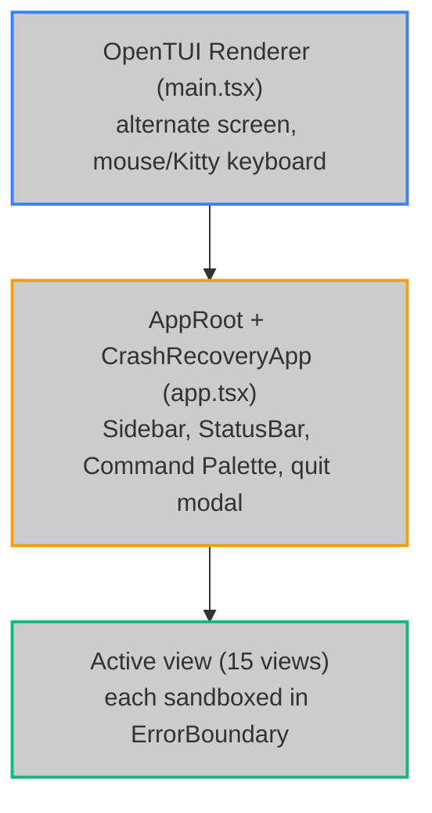

The **Hoox Terminal UI (TUI)** is a full-screen, keyboard-driven operations center built with **OpenTUI**, React 19, and Zustand. This document covers package layout, state, data flows, and crash recovery for engineers.

**Package:** `packages/tui` (`@jango-blockchained/hoox-tui`)  
**Entry:** `src/main.tsx` · **Root:** `src/app.tsx` · **CLI launcher:** `hoox tui`

---

## 🏗️ Architectural Blueprint



### Directory map

```
packages/tui/src/
├── main.tsx                 # createCliRenderer (TUI_FPS / TUI_MOUSE env)
├── app.tsx                  # VIEWS registry, shortcuts, session, SSE kickoff
├── components/
│   ├── views/               # 15 views (+ dashboard/, config-editor/ subpanels)
│   ├── layout/              # sidebar, statusbar
│   ├── shared/              # palette, crash screen, error boundary, …
│   └── ui/                  # dialog / toast wrappers
├── services/
│   ├── cli-bridge/          # typed hoox subprocess bridge
│   ├── hoox-path-service.ts # $HOME/.hoox paths
│   └── tui-storage.ts       # file-backed JSON (no localStorage in Bun)
├── hooks/                   # keyboard, polling, renderer-ref
└── stores/*.test.ts         # unit tests (stores live in hoox-shared)
```

Stores are **not** under `packages/tui/src/stores` for production code — they live in `@jango-blockchained/hoox-shared`:

| Store | Path | Responsibility |
| ----- | ---- | -------------- |
| UI | `packages/shared/src/stores/ui-store.ts` | activeView, sidebar, modal, palette |
| Service | `packages/shared/src/stores/service-store.ts` | workers, trades, logs, alerts, connection, SSE |
| Config | `packages/shared/src/stores/config-store.ts` | theme, refresh interval, notifications, shortcuts |

Session persistence: `$HOME/.hoox/.tui-state/session.json` via shared `restoreSession` / `saveSession`.

### Navigation registry & colors

- View factories, sidebar labels, keyboard shortcuts, and palette **view** commands are defined in `packages/tui/src/view-registry.tsx`.
- Semantic status colors (`ConnectionStatusColor`, `WorkerStatusColor`, `LogLevelColor`, `AlertSeverityColor`) live in `@jango-blockchained/hoox-shared` (`packages/shared/src/colors.ts`). Do not invent local status→hex maps in views.

### Test doubles (no polluting `mock.module`)

Installed once from `packages/tui/src/test-setup.ts` (preload):

| Double | Module | Control |
| ------ | ------ | ------- |
| CLI | `cli-bridge-test-double.ts` | `cliBridgeDouble` / `resetCliBridgeDouble()` |
| HTTP + SSE | `network-test-double.ts` | `setMockApiData` / `setMockApiFailure` / `emitSseEvent` |

View tests must **not** call `mock.module` for `cli-bridge`, shared stores, `api-client`, or `sse`. Override methods on the doubles instead. Edge topology fixtures use `HOOX_GRAPH_METADATA_PATH` (temp file) rather than mocking `fs`.

---

## 🗺️ View registry (15)

Must stay aligned with `ViewId` in `packages/shared/src/types.ts`, sidebar items, `VIEWS` in `app.tsx`, and command palette entries:

| ViewId | Component | Primary data source |
| ------ | --------- | ------------------- |
| `dashboard` | `DashboardView` | `fetchWorkers`, `monitorStatus`, `checkFix`, `agentHealthCheck`, kill-switch |
| `workers` | `WorkersOverview` | store workers + CLI deploy/logs/repair |
| `worker-detail` | `WorkerDetail` | `selectedWorkerId`, `configShow`, `workerLogs` |
| `trade-monitor` | `TradeMonitor` | `tradeStream` (SSE `streamTrades`) |
| `logs-viewer` | `LogsViewer` | `logs` (SSE `streamLogs` + CLI fetch) |
| `service-manager` | `ServiceManager` | deploy/repair/rebuild/kill-switch |
| `config-editor` | `ConfigEditor` | filesystem + `configValidate` |
| `setup-wizard` | `SetupWizard` | wizard steps + `deployAll` |
| `settings` | `SettingsView` | config store + `checkSetup` / `checkFix` |
| `queue-depth` | `QueueDepthView` | `monitorQueueDepth` |
| `kv-viewer` | `KvViewer` | `configKvList` / `configKvGet` |
| `secrets-viewer` | `SecretsViewer` | `configSecretsList` (names only) |
| `ai-chat` | `AiChatView` | `agentChatStream` SSE |
| `db-query` | `DbQueryView` | `validateReadOnlySql` + `dbQuery` |
| `edge-topology` | `EdgeTopology` | monorepo `graph-metadata.json` |

---

## 🌐 Local vs remote mode

`hoox tui` resolves an API base URL and forwards it to the child process:

| Launch | Mode | `HOOX_API_URL` | Status bar |
| ------ | ---- | -------------- | ---------- |
| `hoox tui` | `local` | `HOOX_API_URL` env or `http://localhost:8787` | `[LOCAL] localhost:8787` |
| `hoox tui --remote` | `remote` | `resolveGatewayUrl()` (`HOOX_GATEWAY_URL` / CF account + wrangler subdomain) | `[REMOTE] <gateway-host>` |
| `hoox tui --api-url <url>` | `remote` | explicit URL (strips trailing `/`; overrides `--remote`) | `[REMOTE] <host>` |

Env vars set on the TUI process: `HOOX_API_URL`, `HOOX_TUI_MODE` (`local` \| `remote`).  
Shared `api-client` / `sse` read `HOOX_API_URL` at import time.

### Dev logging

File-backed only (never stdout — would corrupt the alternate screen):

```bash
hoox tui --debug
# or: HOOX_DEBUG=1 / TUI_DEBUG=1
# → $HOME/.hoox/.tui-state/debug.log  (JSON lines; secret-like keys redacted)
```

Wired at startup (`main.tsx`), connection path (`app.tsx`), and CLI bridge execs.

---

## 🛜 Dual-channel + SSE

### Startup sequence (`AppRoot`)

1. Restore session → set view / sidebar  
2. `fetchWorkers()` (HTTP) → on failure only, `cliBridge.monitorStatus()` (CLI fallback)  
3. Fire-and-forget `streamTrades()` + `streamLogs()` (SSE; silent if API down)

### CLI bridge (`src/services/cli-bridge`)

All mutating / diagnostic operator actions go through the `hoox` binary with timeout, abort tags, and structured `CliErrorDetails` sunk to the service store for the status bar expand panel.

Notable methods: `deployAll`, `deployWorker`, `repairWorker`, `rebuild`, `checkHealth`, `checkFix`, `checkSetup`, `monitorStatus`, `monitorKillSwitch`, `monitorQueueDepth`, `workerLogs`, `configShow`, `configValidate`, `configKvList`, `configKvGet`, `configSecretsList`, `dbQuery`, `agentHealthCheck`.

`checkHealthFix` exists on the bridge but is unused by views (dashboard/settings use `checkFix`).

---

## 🛡️ Crash protection

### Layer 1 — per-view `ErrorBoundary`

Every primary view is wrapped. Render failures show Retry without killing sidebar/status.

### Layer 2 — `CrashRecoveryApp`

Process `uncaughtException` / `unhandledRejection` → CrashScreen:

- **Restart** — remount AppRoot  
- **Safe Mode** — remount with `safeMode`  
- **Report Bug** — write `$HOME/.hoox/.tui-state/crash.log`  

---

## 🧪 Verification

```bash
cd packages/tui
bun run typecheck
bun test --preload ./src/test-setup.ts
# from monorepo root:
bun run test:tui
```

E2E smoke (`test/e2e/smoke.test.ts`) requires an interactive TTY; otherwise it skips with a clear reason.

---

## 📊 Graph integration

- **Runtime topology view** reads `graph-metadata.json` (repo root), resolved from CWD walk-up or package-relative path.  
- **Code graph** (`graph.json` / `graph.dot`) is produced by `bun run graph` (`scripts/extract-graph.ts`).  
- All 15 view exports are present as function nodes under `packages/tui:…/views/…`.  
- Regenerate after large refactors: `bun run graph` (~25s). Metadata should include every worker under `workers/*`.

---

## Known limitations (honest)

| Area | Limitation |
| ---- | ---------- |
| Worker Detail DOs | Names inferred from `durableObjectCount` + worker name; no DO listing API |
| Worker Detail config | Falls back to demo-ish keys when `configShow` empty |
| Trade/log live feed | Requires HTTP API + SSE endpoints; offline TUI uses CLI snapshots only |
| `usePolling` hook | Exported but unused — views poll via effects / intervals |
| CLI flags | `--fps` / `--no-mouse` set `TUI_FPS` / `TUI_MOUSE`; renderer reads them in `main.tsx` |
| Graph freshness | Full `graph.json` can lag submodules until `bun run graph` is re-run |

<Tip>
OpenTUI `<text>` children must be strings (or text nodes) — never nest `<text>` inside `<text>`. Prefer sibling `<text>` inside a row `<box>`.
</Tip>

### Next steps

- **[Setup & Operations](setup-and-operations)**  
- **[Architecture overview](architecture/overview)**  
- **[End-user TUI guide](/enduser/guides/tui)**  
