# 🖥️ Next.js Dashboard & OpenNext Isolate

The **Hoox Dashboard** is the web-based command center of the trading platform. Rather than running on a traditional server, the dashboard is a **Next.js 16 application** compiled using the **OpenNext adapter** and hosted natively on Cloudflare Workers. This edge-first layout allows for real-time portfolio monitoring, dynamic form-based settings editing, and interactive kill-switch controls at microsecond speeds.

---

## 🏗️ Next.js to Cloudflare Edge Architecture

When deploying the dashboard, the monorepo uses `@opennextjs/cloudflare` to convert standard Node.js server-side features into Edge-compliant JavaScript:

```mermaid
graph TD
    Src["💻 Next.js 16 App Source"] -->|bun run opennext:build| Bundler["⚙️ Turbopack / Webpack Bundler"]

    Bundler -->|Server-Side Rendering| WorkerJS["📄 .open-next/worker.js"]
    Bundler -->|Static Assets| Assets["📁 .open-next/assets/"]

    WorkerJS -->|wrangler deploy| V8["⚡ Cloudflare V8 Isolate"]
    Assets -->|ASSETS binding| CDN["🌐 Cloudflare Global CDN"]

    style Src fill:#1e293b,stroke:#3b82f6,stroke-width:2
    style Bundler fill:#1e293b,stroke:#f59e0b,stroke-width:2
    style WorkerJS fill:#1e293b,stroke:#10b981,stroke-width:1
    style Assets fill:#1e293b,stroke:#10b981,stroke-width:1
    style V8 fill:#1e293b,stroke:#ef4444,stroke-width:2
    style CDN fill:#1e293b,stroke:#ef4444,stroke-width:2
```



- **Server Isolate** (`.open-next/worker.js`): Handles Server-Side Rendering (SSR), React Server Components (RSC) hydration, API routes, and cookies encryption.
- **Static Assets** (`.open-next/assets/`): Houses all static assets, which are bound to the worker via **ASSETS bindings** to serve static pages at sub-millisecond CDN latency.

---

## ⚡ 1. Declared Wrangler Configurations & Bindings

The dashboard's `wrangler.jsonc` maps out its internal service links to extract D1 databases metrics and agent status updates:

```jsonc
{
  "name": "hoox-dashboard",
  "main": ".open-next/worker.js",
  "compatibility_date": "2026-05-19",
  "compatibility_flags": ["nodejs_compat"],
  "account_id": "debc6545e63bea36be059cbc82d80ec8",
  "assets": {
    "directory": ".open-next/assets",
    "binding": "ASSETS",
  },
  "kv_namespaces": [
    {
      "binding": "CONFIG_KV",
      "id": "c5917667a21745e390ff969f32b1847d",
    },
  ],
  "services": [
    { "binding": "D1_SERVICE", "service": "d1-worker" },
    { "binding": "AGENT_SERVICE", "service": "agent-worker" },
    { "binding": "TELEGRAM_SERVICE", "service": "telegram-worker" },
  ],
  "vars": {
    "D1_SERVICE_URL": "https://d1-worker.hoox.example.com",
    "AGENT_SERVICE_URL": "https://agent-worker.hoox.example.com",
    "TELEGRAM_SERVICE_URL": "https://telegram-worker.hoox.example.com",
  },
  "secrets": [
    "DASHBOARD_USER",
    "DASHBOARD_PASS",
    "SESSION_SECRET",
    "INTERNAL_KEY_BINDING",
  ],
}
```

---

## 🔑 2. Environmental Variables & Encrypted Secrets

- **`DASHBOARD_USER`** & **`DASHBOARD_PASS`**: Administrative credentials required to access the visual panel.
- **`SESSION_SECRET`**: A secure 32-character encryption key used to cryptographically sign session cookies at the edge.
- **`INTERNAL_KEY_BINDING`**: Shared key used to validate calls to the `d1-worker` and `agent-worker` service bindings.

### Local Development Mocking (`.env.local`)

Create a gitignored `.env.local` file inside `workers/dashboard/` for local Next.js runs:

```bash
DASHBOARD_USER=admin
DASHBOARD_PASS=admin_dev_passkey_183
SESSION_SECRET=abandon_abandon_abandon_abandon_32
```

---

## 🎛️ 3. Schema-Driven Settings System

To allow operators to extend the platform's settings without touching React code, the dashboard implements a **schema-driven configuration manager** parsed dynamically from `config.schema.json`:

```json
{
  "sections": [
    {
      "id": "risk",
      "title": "Risk Management",
      "fields": [
        {
          "key": "trade:max_daily_drawdown_percent",
          "label": "Max Daily Drawdown (%)",
          "type": "number",
          "default": 5,
          "category": "risk"
        }
      ]
    }
  ]
}
```

### Form Submission Flow

1. When you save the settings form, the Next.js server actions intercept the payload.
2. The server action iterates over the JSON schema keys and writes the values directly to the bound `CONFIG_KV` namespace.
3. The changes propagate globally to your edge executors in under 10 seconds.

---

## 🚢 4. Production Build & Rollout Runbook

To compile and deploy the Next.js dashboard to Cloudflare:

```bash
# 1. Navigate to the dashboard directory
cd workers/dashboard

# 2. Build the application using OpenNext
bun run opennext:build

# 3. Deploy the compiled bundles to Cloudflare Workers
bun run opennext:deploy
```

> **Warning:** Framer Motion components and interactive visual elements used in Next.js pages **must** declare the `'use client'` directive at the top of the file. Under OpenNext, client-side pages cannot export metadata directly—move metadata definitions to separate `metadata.ts` files!

### 🔗 Next Steps

- **[agent-worker Profile](agent-worker.md)** — Review AI chat streaming and risk evaluation structures.
- **[d1-worker Profile](d1-worker.md)** — Check REST schemas that feed database metrics to the dashboard.
