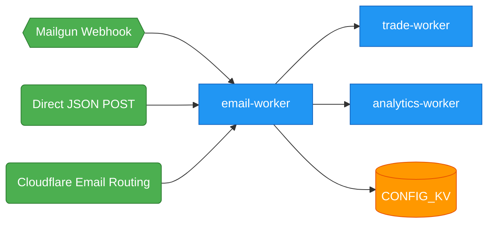

The **`email-worker`** ingests trading signals from email sources, parses them, and forwards them to `trade-worker` for execution. It receives emails via Mailgun webhook (`POST /webhook`) or direct JSON POST (`POST /email-signal`). No IMAP/SMTP polling — Cloudflare Workers edge runtime does not support the Node.js `net`/`tls` modules required for IMAP.

The worker also tracks signal ingestion metrics by forwarding event data to `analytics-worker` via service binding.

---

## ⚡ 1. Endpoints

> **Note:** For the canonical endpoint directory with full request/response examples across all workers, see [`/docs/devops/api/endpoints`](../api/endpoints).

| Endpoint        | Method | Auth                            | Purpose                                      |
| --------------- | ------ | ------------------------------- | -------------------------------------------- |
| `/webhook`      | POST   | Mailgun signature (HMAC-SHA256) | Inbound Mailgun webhook for forwarded emails |
| `/email-signal` | POST   | `X-Internal-Auth-Key` header    | Direct JSON signal ingestion                 |
| `/health`       | GET    | None                            | Health check                                 |

<Note>
  The Mailgun webhook endpoint is `/webhook`, not `/webhook/mailgun`. The direct
  JSON endpoint is `/email-signal`, not `/process`.
</Note>

---

## 🔐 2. Mailgun Signature Verification

When a POST arrives at `/webhook`, the worker validates the Mailgun signature before processing the email body:

1. Reads `Mailgun-Signature`, `Mailgun-Timestamp`, `Mailgun-Token` from request headers
2. Computes HMAC-SHA256 hex digest of `timestamp + token` using `MAILGUN_API_KEY` as the signing key
3. Compares computed digest against the `Mailgun-Signature` header value
4. Returns `401 Unauthorized` if headers are missing or signature does not match

```typescript
const dataToSign = timestamp + token;
const encoder = new TextEncoder();
const key = await crypto.subtle.importKey(
  "raw",
  encoder.encode(apiKey),
  { name: "HMAC", hash: "SHA-256" },
  false,
  ["sign"]
);
const signatureBytes = await crypto.subtle.sign(
  "HMAC",
  key,
  encoder.encode(dataToSign)
);
const expectedSignature = Array.from(new Uint8Array(signatureBytes))
  .map((b) => b.toString(16).padStart(2, "0"))
  .join("");

if (signature !== expectedSignature) {
  return Errors.unauthorized("Invalid signature");
}
```

On success, the worker extracts the email body from the `body-plain` or `stripped-text` field of the Mailgun form-data payload and passes it to the signal parser.

---

## 📨 3. Signal Extraction

Two-phase parsing: JSON first, plaintext fallback.

### Phase 1: JSON Parsing

`parseEmailSignal()` calls `JSON.parse()` on the body text. If the result contains `exchange`, `action`, and `symbol` fields, it returns a structured signal immediately:

```typescript
{
  exchange: "binance",     // normalized lowercase
  action: "buy",           // buy/long → buy | sell/short → sell
  symbol: "BTCUSDT",       // uppercased
  quantity: 100,           // multiplied by quantityMultiplier from KV
  price?: 45000,           // optional
  leverage?: 3             // optional
}
```

### Phase 2: Plaintext Fallback

If JSON parsing fails or required fields are missing, `extractFromPlaintext()` uses keyword matching:

- `extractField()` scans for `keyword:` prefixes (e.g. `exchange:`, `symbol:`, `action:`)
- Coin symbols and action keywords matched via regex from KV config (`coinPattern`, `actionPattern`)
- `normalizeExchange()` resolves exchanges: `binance`, `mexc`, `bybit`
- `normalizeAction()` maps: `buy`/`long` → `buy`, `sell`/`short` → `sell`

Example plaintext email body:

```
exchange: binance
symbol: BTCUSDT
action: buy
quantity: 1.5
```

### Zod Validation

Incoming JSON payloads are validated using Zod schemas:

- `EmailSignalSchema` validates the signal structure (exchange, action as enum, symbol, quantity with default 100, optional price/leverage)
- `WebhookPayloadSchema` validates the wrapper payload (subject, text, body — all optional)
- Invalid payloads return `400 Bad Request` with structured error
- Extra fields are stripped via `.strip()`

### Forwarding

Once parsed, the signal is sent to `trade-worker` via:

```typescript
const response = await serviceFetch(env.TRADE_SERVICE, "/webhook", signal, {
  headers: {
    "X-Internal-Auth-Key": internalKey,
    "X-Source": "email-worker",
  },
});
```

Analytics events are sent non-blocking via `ctx.waitUntil()`:

```typescript
ctx.waitUntil(
  trackAnalytics(env, "/track/signal", {
    data: {
      source: "email-worker",
      type: signal.action,
      symbol: signal.symbol,
      confidence: 0.5,
    },
  })
);
```

### Cloudflare Email Routing

The worker also exposes an `email()` handler that processes incoming emails via Cloudflare Email Routing. When an email arrives, `postal-mime` parses the raw MIME content, extracts the text body, and feeds it through the same `parseEmailSignal()` pipeline. Validated signals are forwarded to `trade-worker` with analytics tracking.

---

## 🔗 4. Bindings

### Service Bindings

| Binding             | Target Worker    | Purpose                                      |
| ------------------- | ---------------- | -------------------------------------------- |
| `TRADE_SERVICE`     | trade-worker     | Forward parsed trading signals for execution |
| `ANALYTICS_SERVICE` | analytics-worker | Track signal ingestion metrics               |

### Send Email Binding

| Binding | Purpose                                           |
| ------- | ------------------------------------------------- |
| `EMAIL` | Cloudflare Email Routing — receive inbound emails |

### KV Namespaces

| Binding     | ID                                 | Purpose                      |
| ----------- | ---------------------------------- | ---------------------------- |
| `CONFIG_KV` | `c5917667a21745e390ff969f32b1847d` | Signal pattern configuration |

---

## 🔑 5. Secrets

All secrets are set via `wrangler secret put <name>`:

| Secret                 | Purpose                                               |
| ---------------------- | ----------------------------------------------------- |
| `INTERNAL_KEY_BINDING` | Shared internal auth key for service-to-service calls |
| `MAILGUN_API_KEY`      | Mailgun webhook signature verification (HMAC-SHA256)  |
| `EMAIL_HOST_BINDING`   | Reserved for future email host configuration          |
| `EMAIL_USER_BINDING`   | Reserved for future email user configuration          |
| `EMAIL_PASS_BINDING`   | Reserved for future email password configuration      |

---

## ⚙️ 6. Environment Variables (Vars)

| Variable            | Value          | Purpose                                       |
| ------------------- | -------------- | --------------------------------------------- |
| `TRADE_WORKER_NAME` | `trade-worker` | Service name of trade-worker (reference only) |

---

## 🗄️ 7. KV Configuration Keys

The worker loads signal parsing patterns from `CONFIG_KV` via `loadSignalPatterns()`:

| KV Key                      | Default                  | Purpose                                        |
| --------------------------- | ------------------------ | ---------------------------------------------- |
| `email:coin_pattern`        | `BTC\|ETH\|SOL`          | Regex for matching asset symbols in email body |
| `email:action_pattern`      | `buy\|sell\|long\|short` | Regex for matching trade action direction      |
| `email:quantity_multiplier` | `1`                      | Coefficient applied to parsed quantity values  |

```typescript
import { KVKeys } from "@jango-blockchained/hoox-shared/kvKeys";

const [coinPattern, actionPattern, quantityMultiplier] = await Promise.all([
  env.CONFIG_KV?.get(KVKeys.KV_EMAIL_COIN_PATTERN).then(
    (v) => v || "BTC|ETH|SOL"
  ),
  env.CONFIG_KV?.get(KVKeys.KV_EMAIL_ACTION_PATTERN).then(
    (v) => v || "buy|sell|long|short"
  ),
  env.CONFIG_KV?.get(KVKeys.KV_EMAIL_QUANTITY_MULTIPLIER).then((v) =>
    v ? parseFloat(v) : 1
  ),
]);
```

---

## 📊 8. Observability

Full observability enabled with 100% head sampling:

```jsonc
{
  "observability": {
    "enabled": true,
    "head_sampling_rate": 1,
    "logs": {
      "enabled": true,
      "head_sampling_rate": 1,
      "persist": true,
      "invocation_logs": true,
    },
  },
}
```

- **Head sampling rate**: 1 (all requests sampled)
- **Log persistence**: Enabled — logs stored for debugging and audit
- **Invocation logs**: Enabled — full invocation records available
- **Smart Placement**: Enabled for 30-60% latency reduction

---

## 🛠️ 9. Configuration (wrangler.jsonc)

```jsonc
{
  "name": "email-worker",
  "main": "src/index.ts",
  "compatibility_date": "2026-04-17",
  "compatibility_flags": ["nodejs_compat"],
  "account_id": "debc6545e63bea36be059cbc82d80ec8",
  "placement": {
    "mode": "smart",
  },
  "observability": {
    "enabled": true,
    "head_sampling_rate": 1,
    "logs": {
      "enabled": true,
      "head_sampling_rate": 1,
      "persist": true,
      "invocation_logs": true,
    },
  },
  "vars": {
    "TRADE_WORKER_NAME": "trade-worker",
  },
  "kv_namespaces": [
    {
      "binding": "CONFIG_KV",
      "id": "c5917667a21745e390ff969f32b1847d",
    },
  ],
  "services": [
    {
      "binding": "TRADE_SERVICE",
      "service": "trade-worker",
    },
    {
      "binding": "ANALYTICS_SERVICE",
      "service": "analytics-worker",
    },
  ],
  "send_email": [
    {
      "name": "EMAIL",
    },
  ],
}
```

Secrets (`INTERNAL_KEY_BINDING`, `MAILGUN_API_KEY`, `EMAIL_HOST_BINDING`, `EMAIL_USER_BINDING`, `EMAIL_PASS_BINDING`) are set via `wrangler secret put <name>` and are not present in the checked-in wrangler.jsonc.

---

## 🧪 10. Development

```bash
# Run email-worker unit tests
bun test workers/email-worker/

# Start local dev server
hoox dev worker email-worker

# Deploy
hoox workers deploy
```

Config tracking: `wrangler.jsonc` is tracked in git.

---

## 🏗️ 11. Architecture Context

The email-worker is one of 10 workers in the Hoox service binding mesh:



- **Mailgun flow**: Inbound email → Mailgun webhook POST → email-worker `/webhook` → trade-worker
- **Direct flow**: Internal tooling → `POST /email-signal` (authenticated) → email-worker → trade-worker
- **Email Routing flow**: Cloudflare Email Routing → `email()` handler → email-worker → trade-worker
- **Analytics**: Every parsed signal sends `{ source, type, symbol, confidence }` to analytics-worker

All active signal ingestion is via webhook, direct POST, or Cloudflare Email Routing.

---

### Next Steps

- **[trade-worker Profile](trade-worker)** — How parsed signals become execution orders
- **[analytics-worker Profile](analytics-worker)** — Signal tracking and observability
- **[Architecture Overview](../architecture/overview)** — Full system architecture and data flow
