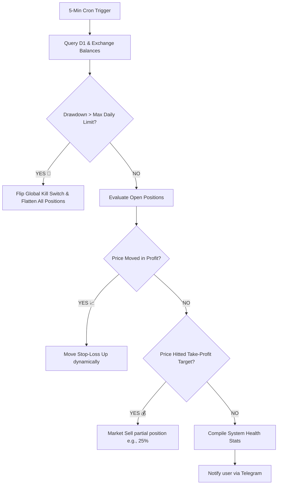

# 🧠 AI Risk Manager & AI Gateway

The **`agent-worker`** is the autonomous central nervous system of the Hoox trading platform. Operating on a continuous **5-minute Cloudflare Cron trigger**, it acts as an intelligent sentinel: it monitors open exchange positions, mathematically scales trailing stop-losses, and deploys a multi-provider fallback AI engine to analyze market conditions, audit risk, and send real-time summaries to your phone.

---

## 🛡️ 1. Automated Risk Protection Engine

Every 5 minutes, `agent-worker` executes a multi-point risk diagnostic loop across all active exchanges:



### A. Trailing Stop-Loss Mathematics

Rather than using static stops that leave profits exposed, the risk engine calculates a **dynamic trailing stop-loss** at the V8 compiler level:

- **The Formula**:
  $$\text{Trailing Stop Price (Long)} = \text{Peak Price} \times (1 - \text{Trailing Deviation \%})$$
- If a LONG trade entry is at $\$100$ and has a $2\%$ trailing deviation, the initial stop-loss is placed at $\$98$.
- If the market price rallies to a peak of $\$120$, the stop-loss is automatically adjusted up to $\$117.60$.
- If the price declines from $\$120$ down to $\$117.60$, the stop is triggered at the exchange level, locking in a $\$17.60$ profit. The stop never moves downward.

---

### B. Scaled Take-Profits (Partial Fills)

To manage extreme market swings, the agent-worker supports multi-target scaling:

- **Target 1 ($3\%$ Profit)**: Automatically flattens $25\%$ of open position size.
- **Target 2 ($5\%$ Profit)**: Flattens another $25\%$ and moves the stop-loss of the remaining $50\%$ to break-even, eliminating downside risk.

---

### C. Max Daily Drawdown & Global Kill Switch

If high volatility causes unexpected stop-outs, the agent-worker aggregates your real-time realized P&L:

1. Calculates cumulative daily loss:
   $$\text{Daily Drawdown \%} = \frac{\text{Starting Daily Balance} - \text{Current Balance}}{\text{Starting Daily Balance}} \times 100$$
2. If the drawdown exceeds your KV threshold (e.g. `trade:max_daily_drawdown_percent` is `5`), the agent-worker immediately triggers the **Global Kill Switch** by writing `trade:kill_switch = true` to `CONFIG_KV`.
3. Calls the `trade-worker` service binding to submit immediate market close orders, **flattening all active positions across all exchanges** near-instantaneously.

```bash
# Check current Kill Switch status via CLI
hoox monitor kill-switch show

# Manually override to halt all trade processes during extreme macro events
hoox monitor kill-switch on

# Resume operations once conditions stabilize
hoox monitor kill-switch off
```

---

## 🤖 2. Multi-Provider AI Gateway & Reasoning

Behind the scenes, `agent-worker` governs a **Multi-Provider AI Gateway** (supporting 5 major providers) with built-in resilience. If you query the bot for trade advice, market summaries, or risk audits, the gateway processes the request through an automatic fallback chain:

### A. The Resilient Provider Fallback Chain

```
[User Chat Query]
       │
       ▼
[1. Cloudflare Workers AI] (Zero cost, native LLaMA 3) ──► Fail? ──┐
                                                                   │
                                                                   ▼
[2. Anthropic API] (Claude 3.5 Sonnet) ◄───────────────────────────┘
       │
     Fail? ──► [3. Google AI] (Gemini 1.5 Pro) ──► Fail? ──► [4. OpenAI] (GPT-4o)
```

### B. Custom Telemetry & Chat Endpoints

The gateway exposes professional endpoints for secure inter-worker and external integrations:

- `POST /agent/chat` — Accepts user prompts and handles SSE (Server-Sent Events) streaming responses.
- `POST /agent/vision` — Analyzes charts, balance screenshots, or trading signals from Base64 images.
- `POST /agent/reasoning` — Interfaces with advanced reasoning models (like OpenAI `o1` or DeepSeek) to audit trading strategies and margin structures.
- `GET /agent/usage` — Provides detailed token counting and cost metrics across all 5 providers.

---

> **Tip:** You can adjust all AI gateway defaults, Cron check intervals, and trailing deviations in real-time by writing to your KV configurations. No code deployments are ever required to tune your risk profile.

### 🔗 Next Steps

- **[Zero Trust & Secret Security](../guides/secrets-security.md)** — Lock down your AI endpoints and exchange API keys.
- **[TUI Operations Cockpit](../guides/tui.md)** — View live position drawdowns and trailing stops visually in your terminal.
