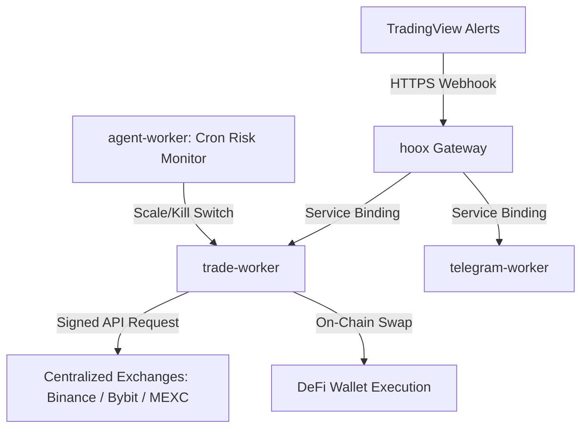

# 🚀 Welcome to the Hoox Developer Hub

> **Hoox** is a free, open-source, zero-latency algorithmic trading framework and automation engine deployed natively to the **Cloudflare® Edge Network**. By utilizing a distributed microservice architecture, Hoox processes trade signals, evaluates risk parameters, executes order routing, and fires Telegram notifications—all within milliseconds and directly from the edge nodes closest to exchange servers.

---

## 🗺️ Choose Your Path

Whether you are a retail algorithmic trader setting up your first automated TradingView strategies, a quantitative analyst exploring low-latency DeFi order routing, or a DevOps engineer maintaining multi-exchange infrastructure, our docs are split into highly focused tracks:

### 1. 🏁 Getting Started

If you are brand new to the Hoox ecosystem, start here to prepare your machine, provision resources, and deploy your first live microservice in under 5 minutes:

- **[Core Installation](getting-started/installation)** — Provision prerequisites (Bun runtime, Cloudflare credentials) and bootstrap a project.
- **[Platform Configuration](getting-started/configuration)** — Declaratively define environment variables, JSON profile templates, and KV keys.
- **[5-Minute Quick Start](getting-started/quick-start)** — Launch local worker runners and execute a simulated webhook trade signal.

### 2. 🧠 Core Concepts

Understand the underlying technology, low-latency edge architecture, and security layers that protect your api keys:

- **[How Hoox Works](concepts/how-hoox-works)** — The end-to-end lifecycle of a trade signal from webhook alert to order confirmation.
- **[Edge-First Architecture](concepts/edge-architecture)** — Why V8 isolates and Cloudflare Workers outperform traditional VPS architectures by 30-60%.
- **[Cloudflare Services Map](concepts/cloudflare-services)** — How D1, KV, R2, Queues, Vectorize, and Browser Rendering are integrated.
- **[Idempotency & Durable Objects](concepts/idempotency)** — Preventing catastrophic double-execution and race conditions during high-frequency events.
- **[Signals & Trade Routing](concepts/signals-and-trades)** — How parameters map from webhook JSON schemas to live exchange payloads.
- **[AI Risk Manager](concepts/ai-risk-manager)** — The 5-minute autonomous risk scanner, trailing-stop mathematician, and account kill-switch.

### 3. 🛠️ Operational Guides

Practical runbooks and blueprints for daily operations, local development, and system health maintenance:

- **[Local Dev & Workspaces](guides/local-development)** — Run, hot-reload, and test workers locally via Bun or Docker container stacks.
- **[Terminal UI Operations](guides/tui)** — Launch and navigate the full-screen 9-view operations cockpit (`./hoox-tui`).
- **[Edge Database Operations](guides/database-ops)** — Manage global SQLite schemas, track drizzle migrations, and run D1 queries.
- **[Secrets & Network Security](guides/secrets-security)** — Secure Cloudflare Zero Trust corridors and encrypt sensitive API credentials.
- **[Infrastructure Management](guides/manage-infra)** — Spin up and inspect KV, Queues, R2, and Vectorize indexes in one command.
- **[Deploying to Production](guides/deploy-workers)** — Roll out code, bind V8 isolates, and deploy Next.js dashboard consoles.
- **[Self-Healing & Repair](guides/repair)** — Diagnose connection dropouts, rotate API keys, and run interactive system repair tools.

### 4. 🎓 Step-by-Step Tutorials

Follow guided, end-to-end tutorials to integrate your trade sources and notification handlers:

- **[TradingView Webhook Integration](tutorials/tradingview-webhook)** — Write customized Pine Script v5 indicators that ping the Hoox webhook receiver.
- **[Telegram Bot Setup](tutorials/telegram-bot)** — Configure real-time order alerts, P&L reports, and secure chat commands.
- **[Email Signal Routing](tutorials/email-signals)** — Configure email parsing services to convert raw inbox alerts into edge trade executions.

### 5. 📖 Reference Material

Deep specifications, schema registries, and command-line manual trees:

- **[CLI Commands Index](reference/cli-commands)** — Complete options, positional arguments, and JSON flag trees for the `hoox` tool.
- **[API Spec & REST Routes](reference/api-endpoints)** — HTTP endpoints, request payloads, response templates, and edge errors list.
- **[Configuration Properties](getting-started/configuration)** — Comprehensive dictionary of all 31 env keys and 16 KV key-value items.

---

## 📥 Offline Reference & AI Context

Download our consolidated specifications or view complete text packages for feeding into LLMs:

- **[Download Enduser Full PDF Manual](/Enduser-Full-Documentation.pdf)** — Complete concatenated offline guide.

- **[Download DevOps Full PDF Manual](/DevOps-Full-Documentation.pdf)** — Complete concatenated offline DevOps spec.

- **[View Consolidated LLM Context Text](/llm.txt)** — Giant single-file text format for AI/LLM models.

---

<Tip>
  Looking for deep engineering plans, DDL SQL schemas, or CI/CD deployment
  workflows? Check out the **[DevOps & Architecture Manual](../devops/index)**
  for developer-centric operator blueprints!
</Tip>
