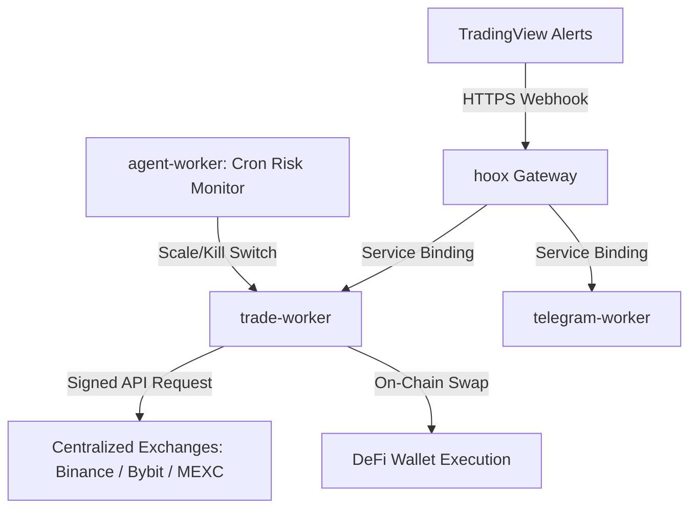

# 🚀 Welcome to Hoox

Hoox is a free, open-source, zero-latency algorithmic trading framework and automation engine deployed natively to the Cloudflare Edge Network. By utilizing a distributed microservice architecture, Hoox processes trade signals, evaluates risk parameters, executes order routing, and fires Telegram notifications—all within milliseconds and directly from the edge nodes closest to exchange servers.

<Tip>
  Choose your track below. **End User** docs cover trading setup, configuration,
  and operations. **DevOps** docs cover architecture, deployment, and
  infrastructure.
</Tip>

## 📖 Documentation Tracks

<CardGroup cols={2}>
  <Card title="📈 End User" icon="user" href="/docs/enduser">
    Trader-facing documentation — getting started, concepts, guides, tutorials,
    and reference.
  </Card>
  <Card title="🔧 DevOps" icon="terminal" href="/docs/devops">
    Operator-facing documentation — architecture, workers, deployment,
    development, and API.
  </Card>
</CardGroup>

## 🏁 Quick Links

- **[Getting Started](enduser/getting-started/installation)** — Install prerequisites and bootstrap your project
- **[5-Minute Quick Start](enduser/getting-started/quick-start)** — Deploy workers and fire your first trade
- **[CLI Commands](enduser/reference/cli-commands)** — Complete CLI reference
- **[GitHub Repository](https://github.com/jango-blockchained/hoox-setup)** — Source code and contributions
